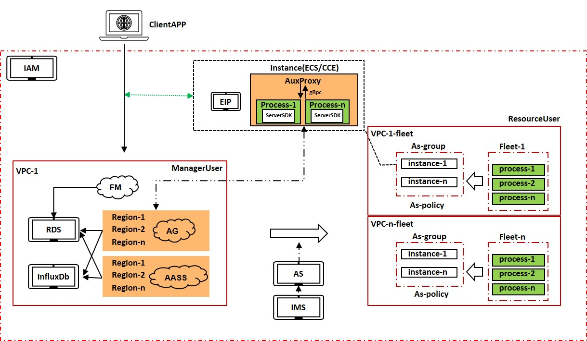

# huaweicloud-solution-GameFlexMatch

Language: **中文** | [English](/README_EN.md)

# 简介

`GameFlexMatch`是一个服务托管解决方案，包含四个服务组件(`Fleetmanager`/`AppGateway`/`AASS`/`AuxProxy`)，可以实现应用的托管、托管应用所需资源的弹性伸缩、应用进程的资源调度管理、应用的灰度发布，多`region`部署时可以实现用户的就近接入，减少时延，以及服务资源的跨地域容灾。可以帮助开发者快速构建稳定、低延时的多人游戏的部署环境，并节省大量的运维成本，支持`Unreal`、`Unity`引擎，`C#`、`C++`以及`gRPC`支持的任何语言的`server`框架部署和运行。

# 逻辑架构

GameFlexMatch平台由五个服务组件组成：

+ [FleetManager](https://gitee.com/HuaweiCloudDeveloper/huaweicloud-solution-gameflexmatch-fleetmanager): 负责应用进程的全局化动态部署及管理，支持配置动态部署策略，基于成本或时延优化应用分布，负责弹性伸缩策略的配置和服务端会话、客户端会话与应用包的管理，服务端应用的灰度发布等
+ [AppGateway](https://gitee.com/HuaweiCloudDeveloper/huaweicloud-solution-gameflexmatch-appgateway): 负责应用进程、会话与客户端连接的管理，通过与`AuxProxy`通信获得应用进程信息，决策进程资源的调度
+ [AASS](https://gitee.com/HuaweiCloudDeveloper/huaweicloud-solution-gameflexmatch-aass): 负责弹性伸缩组和弹性伸缩策略的管理与执行，以及服务端应用资源的监控，实现资源的弹性伸缩
+ [AuxProxy](https://gitee.com/HuaweiCloudDeveloper/huaweicloud-solution-gameflexmatch-auxproxy): 在扩容出的实例中自动拉起，负责应用进程的创建、进程状态的上报以及应用进程的通信
+ [Console](https://gitee.com/HuaweiCloudDeveloper/huaweicloud-solution-gameflexmatch-console): 运维平台，用于监控`GameFlexMatch`的运行状态，以及运维管理`GameFlexMatch`的`fleet`、应用包与用户信息等

## 部署指南
   + 方案基于华为云服务运行，涉及资源包括弹性云服务器(ECS)，镜像服务(IMS)，对象存储服务(OBS)，虚拟私有云(VPC)，云监控服务(CES)等，数据库使用MySql，Redis和InfluxDB 
   + 前后端部署指导详见 [doc/deployment/deployment-guide-CN.md](doc/deployment/deployment-guide-CN.md)
   + 部署过程中必要的参数注解详见 [doc/build/param-annotation.md](/doc/build/param-annotation.md)

## 使用指南
   + console平台的用户指南详见[/doc/user-guide/gameflexmatch-user-guide](doc/user-guide/gameflexmatch-user-guide.md)

## 开发指南
   + 支持GRPC的方式将应用托管到GameFlexMatch，相关接口与接入流程参考[doc/developer/developer_guide.md](doc/developer/developer_guide.md)
   + 应用托管接入示例可参考`/demo`目录

## Reference
   + 管理面API参考文档 [doc/api/FleetManager.yaml](doc/api/FleetManager.yaml)
  
## 其他信息
   + 版本更新记录详见`doc/version/`
   + 平台常见问题参考[doc/user-guide/help/help.md](doc/user-guide/help/help.md)

## 辅助工具
1. 加密工具：提供了GCM与RSA加解密敏感数据的工具，详见`/tools/cipher`
2. 对等连接工具：提供了两个`VPC`创建对等连接的工具，详见`/tools/vpc-peering`