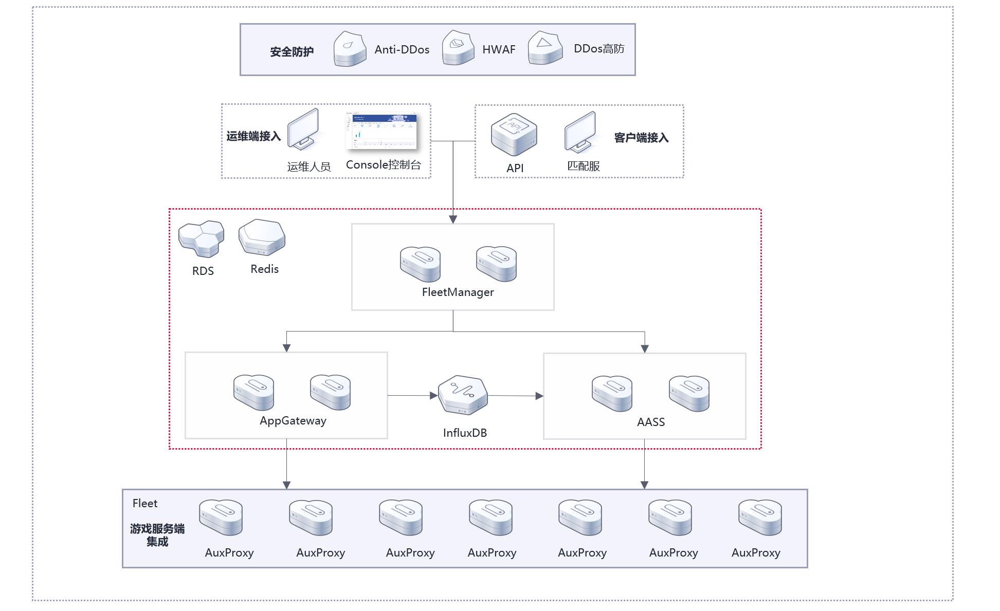

# 目录
- [目录](#目录)
- [1. huaweicloud-solution-gameflexmatch](#1-huaweicloud-solution-gameflexmatch)
- [2. 简介](#2-简介)
- [3. 逻辑架构](#3-逻辑架构)
  - [3.1. 仓库目录](#31-仓库目录)
  - [3.2. 资源规划](#32-资源规划)
  - [3.3. 云账号资源](#33-云账号资源)
  - [3.4. 涉及云服务](#34-涉及云服务)
  - [3.5. 部署指南](#35-部署指南)
    - [3.5.1. 基于发布的应用包进行部署](#351-基于发布的应用包进行部署)
  - [3.6. 使用指南](#36-使用指南)
  - [3.7. 开发指南](#37-开发指南)
  - [3.8. Reference](#38-reference)
  - [3.9. 联系我们](#39-联系我们)


# 1. huaweicloud-solution-gameflexmatch

<div align="center">

**`ZH`** | [`EN`](README_EN.md)

</div>

# 2. 简介

`GameFlexMatch`是一个服务托管解决方案，包含五个服务组件(`Fleetmanager`/`AppGateway`/`AASS`/`AuxProxy`/`Console`)，可以实现应用的托管、托管应用所需资源的弹性伸缩、应用进程的资源调度管理、应用的灰度发布，多`region`部署时可以实现用户的就近接入，减少时延，以及服务资源的跨地域容灾。可以帮助开发者快速构建稳定、低延时的多人游戏的部署环境，并节省大量的运维成本，支持`Unreal`、`Unity`引擎，`C#`、`C++`以及`gRPC`支持的任何语言的`server`框架部署和运行，可以帮助你快速构建与管理游戏战斗服集群。


# 3. 逻辑架构
- [1. huaweicloud-solution-gameflexmatch](#1-huaweicloud-solution-gameflexmatch)
- [目录](#目录)
- [1. huaweicloud-solution-gameflexmatch](#1-huaweicloud-solution-gameflexmatch)
- [2. 简介](#2-简介)
- [3. 逻辑架构](#3-逻辑架构)
  - [3.1. 仓库目录](#31-仓库目录)
  - [3.2. 资源规划](#32-资源规划)
  - [3.3. 云账号资源](#33-云账号资源)
  - [3.4. 涉及云服务](#34-涉及云服务)
  - [3.5. 部署指南](#35-部署指南)
    - [3.5.1. 基于发布的应用包进行部署](#351-基于发布的应用包进行部署)
  - [3.6. 使用指南](#36-使用指南)
  - [3.7. 开发指南](#37-开发指南)
  - [3.8. Reference](#38-reference)
  - [3.9. 联系我们](#39-联系我们)


`GameFlexMatch`平台由五个服务组件组成：

+ [FleetManager](https://gitee.com/HuaweiCloudDeveloper/huaweicloud-solution-gameflexmatch-fleetmanager): 负责应用进程的全局化动态部署及管理，支持配置动态部署策略，基于成本或时延优化应用分布，负责弹性伸缩策略的配置和服务端会话、客户端会话与应用包的管理，服务端应用的灰度发布等
+ [AppGateway](https://gitee.com/HuaweiCloudDeveloper/huaweicloud-solution-gameflexmatch-appgateway): 负责应用进程、会话与客户端连接的管理，通过与`AuxProxy`通信获得应用进程信息，决策进程资源的调度
+ [AASS](https://gitee.com/HuaweiCloudDeveloper/huaweicloud-solution-gameflexmatch-aass): 负责弹性伸缩组和弹性伸缩策略的管理与执行，以及服务端应用资源的监控，实现资源的弹性伸缩，与关键事件的记录
+ [AuxProxy](https://gitee.com/HuaweiCloudDeveloper/huaweicloud-solution-gameflexmatch-auxproxy): 在扩容出的实例中自动拉起，负责应用进程的创建、进程状态的上报以及应用进程的通信
+ [Console](https://gitee.com/HuaweiCloudDeveloper/huaweicloud-solution-gameflexmatch-console): 运维平台，用于监控`GameFlexMatch`的运行状态，以及运维管理`GameFlexMatch`的`fleet`、应用包与用户信息等

## 3.1. 仓库目录
```lua
huaweicloud-solution-gameflexmatch
   doc               -- 文档目录
   |-api             -- 管理面API文档
   |- deployment     -- 方案部署操作文档
   |- dev            -- 应用接入开发文档
   |- user-guide     -- 用户操作指南
   |- img            -- 图片相关
   |- version        -- 版本更新记录
   release           -- 部分脚本文件与配置文件
   sdk               -- 应用接入sdk和demo
   tools             -- 脚本工具目录
```
## 3.2. 资源规划
+ **部署资源**
  
|          资源类型           | 单机部署 | 分布式集群部署 |                       说明                       |
| :-------------------------: | :------: | :------------: | :----------------------------------------------: |
|         云服务器ECS         |    1     |       6        |              用于部署GFM前后端服务               |
|    云数据库RDS for Mysql    |    1     |       1        |              用于存储必要的运行数据              |
| 云数据库GaussDB(for Influx) |    1     |       1        | 用于存储战斗服集群的实时运行数据，以进行弹性伸缩 |
|  分布式缓存服务DCS(Redis)   |    1     |       1        |                 用于存储缓存数据                 |
|       弹性负载均衡ELB       |    0     |       3        |        集群部署时需要，实现流量的智能分发        |

## 3.3. 云账号资源

需要提前准备一个云账号资源，并服务该账号以下权限：
  1. 弹性云服务器所有权限：`ECS FullAccess`
  2. 云容器实例所有权限：`CCI FullAccess`
  3. 统一身份认证服务的只读权限：`IAM ReadOnlyAccess`
  4. 云监控服务只读权限：`CES ReadOnlyAccess`
  5. 云解析服务所有权限：`DNS FullAccess`
  6. 企业项目管理服务只读权限：`EPS ReadOnlyAccess`
  7. 云硬盘的只读权限：`EVS ReadOnlyAccess`
  8. 镜像服务所有权限：`IMS FullAccess`
  9. 对象存储服务管理员：`OBS Administrator`
  10. 容器镜像仓库所有权限：`SWR FullAccess`
  11. 虚拟私有云所有权限：`VPC FullAccess`
  12. EIP服务所有权限：`EIP FullAccess`
  13. 消息通知服务的所有权限：`SMN FullAccess`
  14. 云日志服务所有权限：`LTS FullAccess`
## 3.4. 涉及云服务
该解决方案与华为云深度耦合，在运行过程中涉及到的云服务与用途如下，为保证可以正常使用该解决方案，请保证使用租户包含下列云服务的[必要权限](./README.md#云账号资源)：

|    云服务名称    | 简称  |                      用途                      |
| :--------------: | :---: | :--------------------------------------------: |
|     云服务器     |  ECS  |             用于创建管理战斗服集群             |
|    云容器实例    |  CCI  |             用于创建管理战斗服集群             |
| 统一身份认证服务 |  IAM  |            用于正常访问云服务的鉴权            |
|    云监控服务    |  CES  |       用于获取后端服务组件的相关监控信息       |
|    云解析服务    |  DNS  |          用于创建绑定域名的战斗服集群          |
|     企业管理     |  EPS  |      用于基于企业项目创建不同的战斗服资源      |
|      云硬盘      |  EVS  |        用于获取云硬盘信息，存储必要资源        |
|     镜像服务     |  IMS  |      用于打包应用镜像，快速拉起战斗服集群      |
|   对象存储服务   |  OBS  |          用于存储应用包信息与日志信息          |
|   容器镜像服务   |  SWR  |                  打包容器镜像                  |
|    虚拟私有云    |  VPC  | 包括安全组、子网等信息等，管理战斗服的网络资源 |
|    弹性公网IP    |  EIP  |             为战斗服绑定公网IP地址             |
|   消息通知服务   |  SMN  |        当出现事件告警时，通知到运维人员        |
|    云日志服务    |  LTS  |              采集战斗服的日志信息              |
|   弹性伸缩服务   |  AS   |         用于弹性伸缩能力实现（已弃用）         |

## 3.5. 部署指南
### 3.5.1. 基于发布的应用包进行部署
**应用包目录介绍**
```lua
game-flex-match_release
   |- bin                -- 存放服务的二进制文件的目录
      |- fleetmanager   -- fleetmanager服务组件的二进制文件
      |- appgateway     -- appgateway服务组件的二进制文件
      |- aass           -- aass服务组件的启动二进制文件
      |- auxproxy.zip   -- auxproxy服务组件的压缩文件，需上传至OBS中
      |- dist           -- console控制台编译后的文件目录，用于与nginx一起部署前端
         |- assets      -- 前端代码目录
         |- favicon.png 
         |- index.html 
      |- image_env.sh   -- 用于应用自动打包镜像的脚本，需上传至OBS中
      |- docker_image_env.sh -- 用于应用自动打包容器镜像的脚本，需上传至OBS中
   |- conf
      |- init.yaml      -- 用于安装部署GFM的配置文件，基于该配置文件生成各服务组件的配置文件
      |- private.pem    -- RSA加密的私钥，已默认生成一份，在生产环境中使用建议重新生成  
      |- public.pem     -- RSA加密的公钥，已默认生成一份，在生产环境中使用建议重新生成
      |- tls.crt        -- HTTPS网络的签名证书  
      |- tls.csr        -- 同上
      |- tls.key        -- 同上
      |- workflow       -- 用于存放GFM异步创建的配置文件
         |- create_fleet_workflow.json                -- 基于ECS创建fleet
         |- delete_fleet_workflow.json                -- 基于ECS删除fleet
         |- create_fleet_cci_pod_workflow.json        -- 基于CCI创建fleet
         |- delete_fleet_cci_workflow.json            -- 基于CCI删除fleet
         |- create_build_image_workflow.json          -- 基于ECS创建应用镜像包
         |- create_build_docker_image_workflow.json   -- 基于CCI创建应用镜像包
   |- sac-gfm           -- 辅助快速部署的二进制文件
```

**后端服务部署步骤**
> NOTE：部署过程基于`sac-gfm`脚本进行，脚本的说明请参考：[`ZH`](./doc/deployment/sac-gfm-intro-zh.md)|[`EN`]((./doc/deployment/sac-gfm-intro-en.md))

1. 获取二进制应用包并解压
   + 下载：`wget https://gitee.com/HuaweiCloudDeveloper/huaweicloud-solution-gameflexmatch/releases/download/laster/game-flex-match_release.tar.gz`
   + 解压：`tar -zxvf game-flex-match_release.tar.gz`
   + 进入目录：`cd game-flex-match_release`
2. 修改配置文件
   + 在安装部署时，你可以先了解先各个配置文件的各个参数说明，并根据实际情况进行修改,可以参考：[`ZH`](./doc/deployment/config-intro-zh.md)|[`EN`](./doc/deployment/config-intro-en.md)
   + 配置文件在二进制应用包中可以找到: `./conf/init.yaml`，你可以根据实际情况修改,你也可以在[init.yaml](release/conf/init.yaml)中查看
3. 安装服务组件
   + **FleetManager**: 
   初始化安装：`./sac-gfm install --service fleetmanager`,该步骤将会自动生成`fleetmanager-start.sh`启动脚本
   启动: `./sac-gfm start --service fleetmanager`
   + **AppGateway**: 
   初始化安装: `./sac-gfm install --service appgateway`，该步骤将会自动生成`appgateway-start.sh`启动脚本
   启动: `./sac-gfm start --service appgateway`
   + **AASS**: 
   初始化安装: `./sac-gfm install --service aass`，该步骤将会自动生成`aass-start.sh`启动脚本
   启动: `./sac-gfm start --service aass`
4. 若你想重启或停止该服务组件，以`fleetmanager`为例，你可以:
   `./sac-gfm stop --service fleetmanager`
   `./sac-gfm restart --service fleetmanager`

**前端服务部署步骤**
> NOTE: 前端服务已通过`npm`基于已提供的`./conf/public.pem`公钥进行编译，若您的公钥有更新，需要重新编译；以下所有命令基于`Centos`操作系统，重新编译请参考编译指导: [`ZH`](doc/deployment/build-zh.md#console) | [`EN`](./doc/deployment/build-en.md)
1. 安装`nginx`: `yum install -y nginx`
2. 安装前端应用：`\cp -r -f  ./conf/dist/* /usr/share/nginx/html/`
3. 根据下面指导进行修改`nginx`配置文件：
   打开`nginx`配置文件：`vim /etc/nginx/nginx.conf`
   共有三个地方需要修改
   ```conf
   http {
    ...
    client_max_body_size 6g;   # 1.增加该字段，适配大应用包应用
    ...
    server {
        ... 
        # 2.修改以下IP为后端服务器IP，把 /api 路径下的请求转发给真正的后端服务器
        location /api/ {
            proxy_pass https://{fleetmanager-ip}:31002/;
        }
        # 3.增加该字段，避免刷新后页面不存在的问题
        location / {
            root html;
            try_files $uri /index.html;  # try_files：检查文件； $uri：监测的文件路径； /index.html：文件不存在重定向的新路径
            index index.html;
        }
        ...
    }
   ```
4. 启动`nginx`，直接执行：`nginx`
5. 浏览器输入网址: `http://{前端服务器所在IP地址}:80`
**更新步骤**
如果你想从源码进行编译，可以参考以下步骤: [ZH](./doc/deployment/build-zh.md)|[`EN`](./doc/deployment/build-en.md)

## 3.6. 使用指南
+ `console`平台的快速入门详见: [`ZH`](doc/user-guide/quick-start-zh.md)|[`EN`](doc/user-guide/quick-start-en.md)
+ `console`平台的用户指南详见: [`ZH`](doc/user-guide/user-guide-zh.md)|[`EN`](doc/user-guide/user-guide-en.md)

## 3.7. 开发指南
+ 支持`GRPC`的方式将应用托管到`GameFlexMatch`，相关接口与接入流程参考[`ZH`](doc/dev/developer-zh.md)|[`EN`](doc/dev/developer-en.md)
+ 应用托管接入示例可参考`sdk`目录

## 3.8. Reference
+ 管理面`API`参考文档 [doc/api/FleetManager.yaml](doc/api/FleetManager.yaml)
+ 你可以使用[swagger](https://editor.swagger.io/)进行打开，在菜单栏中选择`File->Import URL`导入API文档进行查看

## 3.9. 联系我们
若你有任何疑问，请联系：hwcloudsolution@163.com