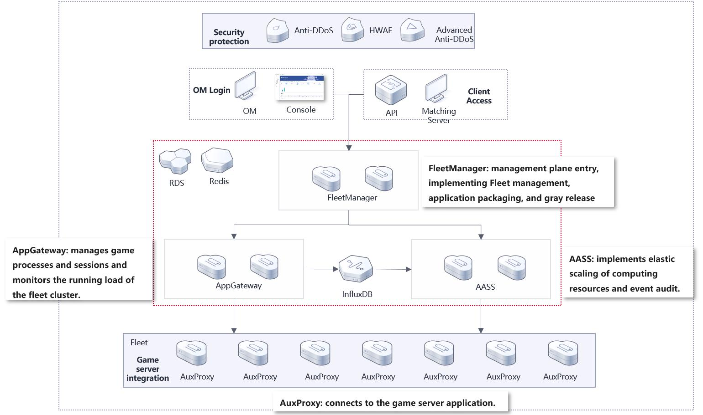

# Content

- [Content](#content)
- [1. huaweicloud-solution-GameFlexMatch](#1-huaweicloud-solution-gameflexmatch)
- [2. Brief Introduction](#2-brief-introduction)
- [3. Logical Architecture](#3-logical-architecture)
  - [3.1. Content](#31-content)
  - [3.2. Resource Planning](#32-resource-planning)
  - [3.3. Cloud Account Resources](#33-cloud-account-resources)
  - [3.4. Involved cloud services](#34-involved-cloud-services)
  - [3.5. Deployment Guide](#35-deployment-guide)
    - [3.5.1. Deploying an Application Based on the Released Application Package](#351-deploying-an-application-based-on-the-released-application-package)
  - [3.6. Usage Guide](#36-usage-guide)
  - [3.7. Development Guide](#37-development-guide)
  - [3.8. Reference](#38-reference)
  - [3.9. Contact Us](#39-contact-us)


# 1. huaweicloud-solution-GameFlexMatch #

Language: [ZH](README.md) | **`EN`**

# 2. Brief Introduction #

`GameFlexMatch`is a service hosting solution that consists of four service components (`Fleetmanager`/`AppGateway`/`AASS`/`AuxProxy`/`Console`), which can implement application hosting, elastic scaling of resources required by hosting applications, resource scheduling and management of application processes, and gray release of applications. Multi-region deployment enables users to access the nearest network, reducing latency and cross-region DR of service resources. 
It helps developers quickly build a stable and low-latency multiplayer game deployment environment and saves a lot of O&M costs.`Unreal Engine`,`Unity`,`C#`,`C++`And also the`gRPC`any language supported`server`Deploy and run the framework. It can help you quickly build and manage game battle suit clusters.

# 3. Logical Architecture #

	

`The GameFlexMatch` platform consists of five service components:

 *  [FleetManager](https://gitee.com/HuaweiCloudDeveloper/huaweicloud-solution-gameflexmatch-fleetmanager): Globally deploys and manages application processes, supports configuration of dynamic deployment policies, optimizes application distribution based on costs or latency, configures auto scaling policies, manages server sessions, client sessions, and application packages, and supports gray release of server applications.
 *  [AppGateway](https://gitee.com/HuaweiCloudDeveloper/huaweicloud-solution-gameflexmatch-appgateway): Manages application processes, sessions, and client connections. `AuxProxy`Obtain application process information through communication, and make decision on scheduling process resources.
 *  [AASS](https://gitee.com/HuaweiCloudDeveloper/huaweicloud-solution-gameflexmatch-aass): Manages and executes AS groups and policies, monitors application resources on the server, and implements elastic resource scaling.
 *  [AuxProxy](https://gitee.com/HuaweiCloudDeveloper/huaweicloud-solution-gameflexmatch-auxproxy): Automatically starts the instance after capacity expansion, which creates application processes, reports process status, and communicates with application processes.
 *  [Console](https://gitee.com/HuaweiCloudDeveloper/huaweicloud-solution-gameflexmatch-console): O&M platform, used for monitoring`GameFlexMatch`Running status and O&M management of the`GameFlexMatch`of the`fleet`2. Application packages and user information

## 3.1. Content
```lua
huaweicloud-solution-gameflexmatch
   doc               -- Document Directory
   |-api             -- Management Plane API Documentation
   |- deployment     -- Service deployment operation documents
   |- dev            -- Application access development documents
   |- user-guide     -- User Operation Guide
   |- img            -- Image related
   |- version        -- Version Update Record
   release           -- Some script files and configuration files
   sdk               -- Application access SDK and demo
   tools             -- Script tool directory
```
## 3.2. Resource Planning


|              Resource Type              | Single-Node System | Distributed Cluster |                                  Description                                  |
| :-------------------------------------: | :----------------: | :-----------------: | :---------------------------------------------------------------------------: |
|                   ECS                   |         1          |          6          |           Used to deploy the frontend and backend services of GFM.            |
|              RDS for MySQL              |         1          |          1          |                        Stores necessary running data.                         |
|   Cloud database GaussDB(for Influx)    |         1          |          1          | for storing real-time operational data clothing cluster, for elastic scaling  |
| Distributed Cache Service (DCS) (Redis) |         1          |          1          |                              Stores cached data.                              |
|        Elastic Load Balance(ELB)        |         0          |          3          | Required in cluster deployment to implement intelligent traffic distribution. |

## 3.3. Cloud Account Resources
You need to prepare a HuaweiCloud account in advance and grant the following permissions to the account:
  1.  All permissions on the ECS:`ECS FullAccess`
  2.  All permissions of CCI:`CCI FullAccess`
  3.  Read-only permission of IAM: `IAM ReadOnlyAccess`
  4.  Cloud Eye read-only permission: `CES ReadOnlyAccess`
  5.  DNS full access: `DNS FullAccess`
  6.  EPS read-only permission: `EPS ReadOnlyAccess`
  7.  EVS disk read-only permission: `EVS ReadOnlyAccess`
  8.  All permissions of IMS: `IMS FullAccess`
  9.  Object storage service administrator: `OBS Administrator`
  10.  All permissions on the container image repository: `SWR FullAccess`
  11.  VPC all permissions: `VPC FullAccess`
  12.  All permissions for EIP: `EIP FullAccess`
  13.  All permissions for SMN: `SMN FullAccess`
  14.  All permissions of LTS: `LTS FullAccess`

## 3.4. Involved cloud services
This solution is deeply coupled with HUAWEI CLOUD. The following cloud services and functions are involved during the running of this solution. To ensure that the tenant can use this solution properly, ensure that the tenant has the necessary [permissions](./README_EN.md#cloud-account-resources) for the following cloud services:

|          Cloud Service Name          |                Abbreviation                 |                                                 Usage                                                 |
| :----------------------------------: | :-----------------------------------------: | :---------------------------------------------------------------------------------------------------: |
|             Cloud Server             |                     ECS                     |                            Used to create a management combat suit cluster                            |
|       Cloud Container Instance       |                     CCI                     |                            Used to create a management combat suit cluster                            |
| Identity and Access Management (IAM) | Authentication for accessing cloud services |
|              Cloud Eye               |                     CES                     |                Used to obtain monitoring information about backend service components.                |
|         Domain Name Service          |                     DNS                     |                      Used to create a battle suit cluster bound to a domain name                      |
|        Enterprise Management         |                     EPS                     |            Used to create different combat uniform resources based on enterprise projects             |
|        Elastic Volume Service        |                     EVS                     |                  Used to obtain EVS disk information and store necessary resources.                   |
|       Image Management Service       |                     IMS                     |              Used to package application images and quickly start a battle suit cluster               |
|        Object Storage Service        |                     OBS                     |                   Used to store application package information and log information                   |
|  SoftWare Repository for Container   |                     SWR                     |                                       Packing Container Images                                        |
|        Virtual Private Cloud         |                     VPC                     | Includes information such as security groups and subnets to manage network resources of combat suits. |
|              Elastic IP              |                     EIP                     |                               Bind a public IP address to a combat suit                               |
|     Simple Message Notification      |                     SMN                     |                                Notifies O&M personnel of event alarms.                                |
|           Log Log Service            |                     LTS                     |                                    Collecting Logs of Battle Suit                                     |
|             Auto Scaling             |                     AS                      |                       Used to implement auto scaling capabilities (deprecated)                        |

## 3.5. Deployment Guide
### 3.5.1. Deploying an Application Based on the Released Application Package

**Introduction to Released the application package directory**

```lua
game-flex-match_release
    |- bin             -- Directory for storing binary files of the service
        |- fleetmanager         -- Binary file of the fleetmanager service component
        |- appgateway           -- Binary file of the appgateway service component
        |- aass                 -- Startup binaries of the aass service component
        |- auxproxy.zip         -- Compressed file of the auxproxy service component, which needs to be uploaded to OBS.
        |- dist                 -- File directory after the console console is compiled, which is used to deploy the frontend together with Nginx.
            |- assets           -- front-end code directory
            |- favicon.png
            |- index.html
        |- image_env.sh         -- Script for automatically packaging images of applications, which needs to be uploaded to OBS.
        |- docker_image_env.sh  -- Script for automatically packaging container images. The script needs to be uploaded to OBS.
    |- conf
        |- init.yaml            -- Configuration file for installing and deploying the GFM. The configuration file of each service component is generated based on the configuration file.
        |- private.pem          -- RSA-encrypted private key. A copy of the private key is generated by default. It is recommended that the private key be generated again in the production environment.
        |- public.pem           -- Public key encrypted by RSA. A copy is generated by default. It is recommended that a new one be generated in the production environment.
        |- tls.crt              -- signature certificate of the HTTPS network
        |- tls.csr              -- same as above
        |- tls.key              -- same as above
        |- workflow             -- Used to store configuration files created asynchronously by the GFM.
            |- create_fleet_workflow.json               -- Creating a Fleet Based on an ECS
            |- delete_fleet_workflow.json               -- Deleting a Fleet Based on an ECS
            |- create_fleet_cci_pod_workflow.json       -- Creating a fleet based on the CCI
            |- delete_fleet_cci_workflow.json           -- Deleting a Fleet Based on the CCI
            |- create_build_image_workflow.json         -- Creating an Application Image Package Based on an ECS
            |- create_build_docker_image_workflow.json  -- Creating an Application Image Package Based on CCI
    |- sac-gfm          -- Binary file to assist rapid deployment
```
**Backend Service Deployment Procedure**
> Note: The deployment is performed based on the `sac-gfm` script. For details about the script, see [`ZH`](./doc/deployment/sac-gfm-intro-zh.md)|[`EN`](./doc/deployment/sac-gfm-intro-en.md).

1. Obtain and decompress the binary application package.
   + Download: `wget https://gitee.com/HuaweiCloudDeveloper/huaweicloud-solution-gameflexmatch/releases/download/laster/game-flex-match_release.tar.gz`
   + Decompression: `tar -zxvf game-flex-match_release.tar.gz`
   + Go to the directory: `cd game-flex-match_release`
2. Modify the configuration file.
   + During installation and deployment, you can learn about the parameters in each configuration file and modify the parameters according to the actual situation. For details, see [`ZH`](./doc/deployment/config-intro-zh.md)|[`EN`](./doc/deployment/config-intro-en.md).
   + The configuration file can be found in the binary application package: `./conf/init.yaml`. You can modify the configuration file according to the actual situation or view it in [init.yaml](release/conf/init.yaml).
3. Install service components.
   + **FleetManager**:
   Installation: `./sac-gfm install --service fleetmanager`. In this step, the startup script `fleetmanager-start.sh` is automatically generated.
   Startup: `./sac-gfm start --service fleetmanager`
   + **AppGateway**:
   Installation: `./sac-gfm install --service appgateway`. In this step, the startup script `appgateway-start.sh` is automatically generated.
   Startup: `./sac-gfm start --service appgateway`
   + **AASS**:
   Installation: `./sac-gfm install --service aass`. In this step, the startup script `aass-start.sh` is automatically generated.
   Startup: `./sac-gfm start --service aass`
4. If you want to restart or stop the service component, for example, `fleetmanager`, you can:
    `./sac-gfm stop --service fleetmanager`
    `./sac-gfm restart --service fleetmanager`

**Front-End Service Deployment Procedure**
> NOTE: Frontend services have been provided via `npm` based on the`./conf/public.pem` public key. If your public key is updated, you need to recompile it. The following commands are based on the `Centos` operating system. For details about recompilation, see Compilation Guide:[`ZH`](doc/deployment/build-zh.md#console) | [`EN`](./doc/deployment/build-en.md).
1.  Installing the `nginx`: `yum install -y nginx`
2.  Run the `\cp -r -f command to install the frontend application. /conf/dist/* /usr/share/nginx/html/`
3.  Modify the `nginx` configuration file as follows:
   Run the `vim /etc/nginx/nginx.conf` command to open the'nginx' configuration file.
    There are three areas that need to be modified:
   ```conf
   http {
    ...
    client_max_body_size 6g;  # 1. Add this field to adapt to large application packages.
    ...
    server {
        ... 
        # 2. Change the following IP address to the IP address of the backend server and forward the request in the /api path to the real backend server.
        location /api/ {
            proxy_pass https://{fleetmanager-ip}:31002/;
        }
        # 3. Add this field to avoid the problem that the page does not exist after refreshing.
        location / {
            root html;
            try_files $uri /index.html; # try_files: Check the file. $uri: indicates the path of the file to be monitored. /index.html: file does not exist redirect to new path
            index index.html;
        }
        ...
    }
   ```
4.  Run the `nginx` command to start `nginx`.
5.  Enter the URL `http://{IP address of the front-end server}:80` in the browser.

**Update Steps**
If you want to compile from source, follow these steps: ['ZH'](./doc/deployment/build-zh.md)||[`EN`](./doc/deployment/build-en.md)

## 3.6. Usage Guide
+ `console` platform quick start is available at: [`ZH`](doc/user-guide/quick-start-zh.md)|[`EN`](doc/user-guide/quick-start-en.md)
+ `console` platform user guide is available at: [`ZH`](doc/user-guide/user-guide-zh.md)|[`EN`](doc/user-guide/user-guide-en.md)

## 3.7. Development Guide
+ Hosting applications to `GameFlexMatch` in `GRPC` mode. For details about the API and access process, see [`ZH`](doc/dev/developer-zh.md)|[`EN`](doc/dev/developer-en.md).
+ For details about the application hosting access example, see the `sdk` directory.

## 3.8. Reference
+ Management Plane `API` Reference Document [doc/api/FleetManager.yaml](doc/api/FleetManager.yaml)
+ You can use [swagger](https://editor.swagger.io/) to open, in the menu bar select `File->Import URL` import API document to view

## 3.9. Contact Us
If you have any questions, please contact: hwcloudsolution@163.com

