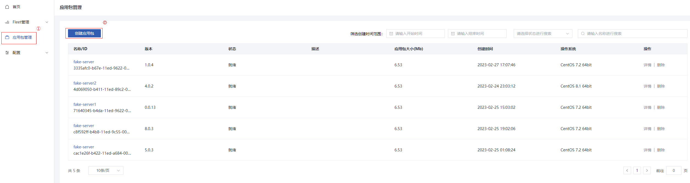
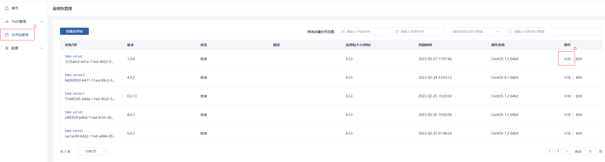
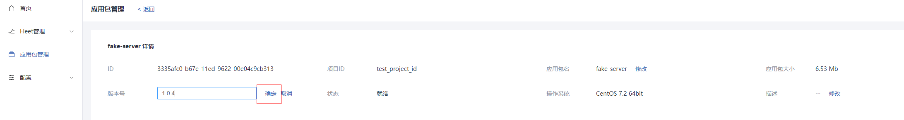
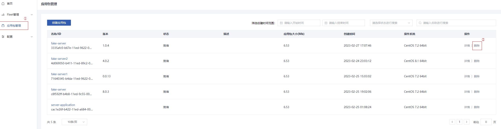

# 应用包管理

## 创建应用包

### 操作场景

您可以将需要托管的应用包上传至`Metaspace`平台，自动化生成安装有监测、上报插件的应用包镜像，并用于fleet创建。您也可以直接绑定华为云`IMS`中已有私有镜像，并快速构建fleet。

### 创建须知

选择通过上传文件或通过`OBS`创建应用包前，请先在当前使用的资源租户下创建好所需的`VPC`和子网。

### 操作步骤

1. 登录`Metaspace`管理控制台。

2. 选择“应用包管理 > 创建应用包”。

3.选择需要的创建方式，配置应用包名称、版本号等参数。重点配置参数说明如下表所示

| 参数     | 解释                                                         | 取值样例         |
| -------- | ------------------------------------------------------------ | ---------------- |
| 应用包名 | 创建的应用包的名称。名称(2~50个字符)，以英文字母开头，并由英文字母、数字、下划线和中划线组成。 | server           |
| 版本号   | 创建的应用包的版本号（1~50个字符）。                         | 1.0.0            |
| VPC      | VPC的id，用于绑定制作镜像的ECS                               | -                |
| 子网     | 子网的id，用于绑定制作镜像的ECS                              | -                |
| 操作系统 | 用于制作镜像的ECS底层操作系统，建议使用CentOS；可以在“华为云控制台>`IMS`>公共镜像中查看“ | CentOS 7.2 64bit |
| OBS桶    | OBS桶名，用于存放应用包文件                                  | metaspace        |
| 存储路径 | OBS应用包文件路径，即对象名                                  | build/server.zip |

4.参数配置完成后，单击”创建“。

5.待应用包状态为”就绪“时，即可用于fleet的创建。

## 修改应用包

### 操作场景

在使用应用包管理的过程中，您可以根据需要修改应用包。应用包可以修改的参数有：名称、版本号、描述。

### 操作步骤

1.登录`Metaspace`管理控制台。

2.选择”应用包管理“。

3.在应用包列表中，需修改的应用包所在行中，单击“ 详情”。

4.单击参数后的”修改“，在输入框后输入需修改的内容。

5.单击”确定“完成修改。

## 删除应用包

### 操作场景

在您不再需要某个应用包时，可以删除该应用包。

### 删除须知

删除前请确认该应用包是否关联有非终止状态的Fleet，若有关联则无法被删除。

### 操作步骤

1.登录`Metaspace`管理控制台。

2.选择”应用包管理“。

3.在应用包列表中，需删除的应用包所在行中，单击“ 删除”。

4.在弹出的对话框中，单击”确定“。