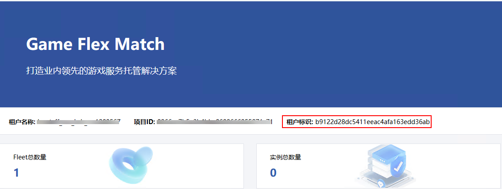

- [1. GameFlexMatch开发者对接指南](#1-gameflexmatch开发者对接指南)
  - [1.1. 术语：](#11-术语)
  - [1.2. 接口对接](#12-接口对接)
  - [1.3. 接口认证](#13-接口认证)
  - [1.4. 管理层接口](#14-管理层接口)
    - [1.4.1. 租户管理面与GameFlexMatch服务的交互接口说明](#141-租户管理面与gameflexmatch服务的交互接口说明)
  - [1.5. 应用层接口](#15-应用层接口)
    - [1.5.1. 租户托管应用与GameFlexMatch服务的交互API说明](#151-租户托管应用与gameflexmatch服务的交互api说明)
  - [1.6. 托管应用集成SDK教程](#16-托管应用集成sdk教程)

# 1. GameFlexMatch开发者对接指南

## 1.1. 术语：

1. 租户: 表示使用华为云服务的企业用户
2. 用户: 表示租户应用的使用者
3. `GameFlexMatch`服务: 表示华为云提供的游戏服务托管平台，简称`GFM`
4. 租户管理面: 表示租户与`GFM`服务交互的应用，比如游戏大厅
5. 租户托管应用: 表示租户托管在`GFM`服务平台上的应用，比如游戏应用
<font color=red>注意：本文关于客户端会话(client session)的流程中所涉及到的接口都是保留接口。</font>

## 1.2. 接口对接
接口对接分为管理层接口和应用层接口:
1. 管理层接口：租户管理面与GFM服务的交互（通过RESTful API交互）。

2. 应用层接口：租户托管应用与GameFlexMatch服务的交互（通过集成SDK交互）整体流程如下：

## 1.3. 接口认证
在调用所有的接口前，需要进行认证校验
1. **获取认证信息：** 构造登录请求，其中密码为`RSA`加密后的登录密码，加密的公钥需与`fleetmanager`部署的后端私钥保持一致，加密脚本可参考`/tools/cipher`，你可以执行：`./sac-gfm cipher --mode encode --method rsa --text {登录密码}`

`POST URL: /v1/user/login`
`Request Body`: 
```json
{
    "username": "admin",
    "password": "cipher-password"
}
```
`Response Body`:
```json
{
    "username": "admin",
    "id": "63da950a-b3ea-11ed-bb27-fa163**********",
    "Auth-Token": "eyJhbGciO*************eXrA",
    "Activation": 1,
    "UserType": 9,
    "total_res_count": 1
}
```
2. **构造请求URL:** 以创建`fleet`接口为例，`URL`为：https://{{fleetmanager}}:31002/v1/{{project-id}}/fleets, 其中`fleetmanager`参数为fleetmanager节点的IP地址，`project_id`为您在控制台首页中看到的`租户标识`:
   
   
3. **构造请求头：** 将第一步`Response`中的`Auth-Token`字段以及字段值加入到请求体的`header`里，即可正常访问`GameFlexMatch`接口业务
## 1.4. 管理层接口
### 1.4.1. 租户管理面与GameFlexMatch服务的交互接口说明
详细接口信息看`API`[接口文档](../api/FleetManager.yaml)，下面对接口做一些说明：
1. **CreateFleet**
创建`fleet`，这里可以通过"`process_configuration`"指定开机之后的启动路径和参数（这些参数是这个`fleet`每个虚拟机都可以拿到的参数）

1. **ShowFleet**
`fleet`创建之后状态是`Activating`，需要通过`ShowFleet`查询改`Fleet`的状态，只有状态变成"`active`"之后才表示这个`Fleet`可用，才可以进行`Server Session`的创建

1. **UpdateFleetInstanceCapacity**
`Fleet`创建之后默认会启动一个虚拟机来启动进程，需要等`Fleet`的状态为`active`，通过这个接口可以修改指定`Fleet`的虚拟机最大值、最少值和期望值

1. **UpdateFleet**
该接口主要是修改`Fleet`的属性，比如打开弹性伸缩，修改实例标签，会话保护策略与保护时长等

1. **CreateScalingPolicy**
`Fleet`创建之后默认不启动弹性伸缩，需要等`Fleet`的状态为`active`，调用`updateFleet` 开启弹性伸缩，然后通过`CreateScalingPolicy`可以配置自己的弹性阈值

1. **CreateServerSession**
可以通过`CreateServerSession`，给`Fleet`创建一个`server session`，如果该`Fleet`有可用的进程，该进程会接收到这个接口的参数
如果指定Fleet当前没有可用的虚拟机可用于分配，该接口会返回失败，如果开启了弹性策略的话，业务可以等待一段时间后再重试。

1. **ShowServerSession**
可以通过`ShowServerSession`，获取指定`ServerSession`的连接信息，也可以为`Server Session`创建`client session`来获取连接信息，`GameFlexMatch`平台通过`client session`对连接做了细致管理，推荐使用
如果`ServerSession`还没`active`的话，访问地址会被隐藏

1. **CreateClientSession `(保留接口)`**
可以通过`CreateSession`，给指定的`Server Session`创建一个`client session`，根据这个`client session`，不同的用户可以连接入服务器上，比如游戏里面，`10`个用户一局游戏，游戏局就是`server session`，而`client session`就表示了不同的用户，这些用户使用相同的服务器连接地址连接入托管服务器；创建`client session`之后，会有`60s`的有效期，超过这个时间之后`client session`会变为不可用

1. **DeleteFleet**
结束后，该接口是提供给用户做最后清理的，该接口可以清理所有指定`fleet`的所有资源

## 1.5. 应用层接口
### 1.5.1. 租户托管应用与GameFlexMatch服务的交互API说明
1. 托管应用的回调API（GameFlexMatch服务会调用的接口）列表如下，三个接口托管服务中需要根据自己的业务逻辑进行实现

|       API Name       | API Description                                                              |
| :------------------: | :--------------------------------------------------------------------------- |
|    OnHealthCheck     | 返回托管服务的健康状态，只有健康状态是true的应用，才会被分配到server session |
| OnStartServerSession | 接收到server session的创建信息，业务需要在这里执行server session的创建逻辑   |
|  OnProcessTermiante  | 接收到服务关闭的信息，业务需要在这里正确关闭进程，回收资源                   |

2. 托管应用的主调API（托管应用调用的GameFlexMatch接口）列表如下，

|                API Name                 | API Description                                                               |
|:---------------------------------------:| :---------------------------------------------------------------------------- |
|              ProcessReady               | 注册托管应用进程信息，通知GameFlexMatch服务进程已经启动完成                           |
|          ActivateServerSession          | 激活server session，表示相应的server session已经创建完毕，可以用于后续流程            |
|        AcceptClientSession`(保留接口)`       | client session已经连接成功                                                      |
|        RemoveClientSession`(保留接口)`        | 终止client session                                                             |
|      DescribeClientSessions`(保留接口)`    | 获取指定server session的所有client session信息                                   |
| UpdateClientSessionCreationPolicy`(保留接口)` | 更新指定server session的client session创建策略，主要是是否允许新的client session接入 |
|       TermianteGameServerSession        | server session结束，终止响应的server session                                     |
|             PrcocessEnding              | 进程回收工作完成，可以正常关闭进程                                                  |

## 1.6. 托管应用集成SDK教程
前置条件：安装依赖的教程(grpc, protobuf的版本等)
1. grpc生成sdk代码
   当前提供了c#、go、c++语言的demo(详见：`demo/go`、`demo/csharp`、`demo/cpp`)
2. 在托管服务启动并确认自己可以提供服务，托管服务进程需要调用ProcessReady API 去通知GameFlexMatch平台自己已经启动完成，可以开始被分配server session。GameFlexMatch平台接受到通知后，会设置进程的状态为Activating，此时进程还不可用与分配server session。
    `C++示例`
    ```c++
    bool ProcessReady(const std::vector<std::string>& log_paths,
                      int32_t client_port, int32_t grpc_port, int32_t pid) {
        ProcessReadyRequest *request;
        for (const auto& path : log_paths) {
            request->add_logpathstoupload(path);
        }
        request->set_clientport(client_port);
        request->set_grpcport(grpc_port);
        request->set_pid(pid);

        AuxProxyResponse response;
        ClientContext context;

        Status status = stub_->ProcessReady(&context, request, &response);
        if (status.ok()) {
            // 处理成功的情况
            return true;
        } else {
            // 处理失败的情况
            return false;
        }
    }
    ```
3. GameFlexMatch平台接收到ProcessReady通知后，会调用进程的onHealthCheck确认进程已进入ready状态，然后设置进程的状态为Active
4. 租户管理面可以通过调用CreateServerSession API去创建server session，改server session会绑定到指定的fleet的某个托管应用进程上。GameFlexMatch平台接收到ServerSession创建请求后，会异步调用onStartServerSession API去通知托管应用进程，同时设置该server session为"Activating"状态
    `C++示例`
    ```c++
    // 接收游戏会话
    Status OnStartServerSession(ServerContext* context, const StartServerSessionRequest* request,ProcessResponse* response) override { 
        // 保存游戏会话
        scaseClient.SetGameServerSession(request->serversession());
        // 激活会话
        Status status = scaseClient.ActivateServerSession(request->serversession().serversessionid(), request->serversession().maxclients());
        response->Clear();
        return status;
    }
    ```
    
    
5. 托管应用进程收到onStartServerSession后，需要处理自己的业务，在所有的都处理完成后，需要调用ActivateServerSession API 去通知GameFlexMatch平台当前server session已经激活，GameFlexMatch会设置改server session状态为active
    `C++示例`
    ```c++
        // 上报服务器会话激活
    Status ActivateServerSession(const std::string& session_id, int32_t max_clients) {
        ActivateServerSessionRequest request;
        request.set_serversessionid(session_id);
        request.set_maxclients(max_clients);

        AuxProxyResponse response;
        ClientContext context;

        Status status = stub_->ActivateServerSession(&context, request, &response);
        return status;
    }
    ```
    
6. `(保留接口)`租户管理面通过CreateClientSession接口给用户获取连接信息，用户接入使用client session接入后，托管盈余公进程会调用AcceptClientSession去通知GameFlexMatch平台当前client session已经接入，GameFlexMatch平台会设置改client session状态为active；如果client session创建60秒后都没有接入的话，状态会转变为timeout，该client session不可再用
    `C++示例`
    ```c++
    // 上报客户端会话接入
    bool AcceptClientSession(const std::string& session_id, const std::string&client_id) { 
        AcceptClientSessionRequest request;
        request.set_serversessionid(session_id);
        request.set_clientsessionid(client_id);

        AuxProxyResponse response;
        ClientContext context;

        Status status = stub_->AcceptClientSession(&context, request, &response);
        if (status.ok()) {
            // 处理成功的情况
            return true;
        } else {
            // 处理失败的情况
            return false;
        }
    }
    ```
    
7. `(保留接口)`在用户断开连接后，托管应用进程需要调用RemoveClientSession API 去移除该用户，GameFlexMatch平台会将相应的client session设置为"complete"状态，并回收该配额
    `C++示例`
    ```c++
    // 上报客户端会话离开
    bool RemoveClientSession(const std::string& session_id, const std::string& client_id) {
        RemoveClientSessionRequest request;
        request.set_serversessionid(session_id);
        request.set_clientsessionid(client_id);

        AuxProxyResponse response;
        ClientContext context;

        Status status = stub_->RemoveClientSession(&context, request, &response);
        if (status.ok()) {
            // 处理成功的情况
            return true;
        } else {
            // 处理失败的情况
            return false;
        }
    }
    ```
    
8. 在一个server session结束之后，托管应用进程需要调用TermianteServerSession API 去通知GameFlexMatch平台将该server session状态设置为terminated
    `C++示例`
    ```c++
    // 上报服务器会话结束
    bool TerminateServerSession(const std::string& session_id) {
        TerminateServerSessionRequest request;
        request.set_serversessionid(session_id);

        AuxProxyResponse response;
        ClientContext context;

        Status status = stub_->TerminateServerSession(&context, request, &response);
        if (status.ok()) {
            return true;
        } else {
            return false;
        }
    }
    ```
    
9. GameFlexMatch平台如果要关闭托管应用进程（比如租户删除fleet），会调用onProcessTermainte来通知托管应用进程进行资源回收并关闭进程(该过程并不会改变会话状态)
    `C++示例`
    ```c++
    // 结束游戏进程
    Status OnProcessTerminate(ServerContext* context, const ProcessTerminateRequest* request,ProcessResponse* response) override {
        int64_t terminationTime = request->terminationtime();
        scaseClient.HandingTerminatingProcess(terminationTime);  // 接管待清理的进程
        response->Clear();
        return Status::OK;
    }
    ```
    
10. 托管应用进程关闭之前需要调用ProcessEnding来通知GameFlexMatch平台将自身的process对象状态设置为Termianted
    `C++示例`
    ```c++
    // 上报进程结束
    bool ProcessEnding(int32_t pid) {

        ProcessEndingRequest request;
        request.set_pid(pid);

        AuxProxyResponse response;
        ClientContext context;

        Status status = stub_->ProcessEnding(&context, request, &response);
        if (status.ok()) {
            // 处理成功的情况
            return true;
        } else {
            // 处理失败的情况
            return false;
        }
    }
    ```
    
11. `(保留接口)`托管应用进程可以根据业务需要调用DescribeClientSessions来获取指定server session的全部client session信息
    `C++示例`
    ```c++
    // 获取客户端会话信息
    bool DescribeClientSessions(const std::string& session_id, const std::string& client_id,
                                const std::string& status_filter, const std::string& next_token,
                                int32_t limit) {
        DescribeClientSessionsRequest request;
        request.set_serversessionid(session_id);
        request.set_clientid(client_id);
        request.set_clientsessionid(client_id);
        request.set_clientsessionstatusfilter(status_filter);
        request.set_nexttoken(next_token);
        request.set_limit(limit);

        DescribeClientSessionsResponse response;
        ClientContext context;

        Status status = stub_->DescribeClientSessions(&context, request, &response);
        if (status.ok()) {
            // 处理成功的情况
            return true;
        } else {
            // 处理失败的情况
            return false;
        }
    }
    ```
    
12. `(保留接口)`托管应用进程可以根据业务需要来调用UpdateClientSessionCreationPolicy接口来更新client session的创建策略（是否允许新用户接入到当前server session）
    `C++示例`
    ```c++
    // 更新客户端会话加入策略
    bool UpdateClientSessionCreationPolicy(const std::string& session_id,const std::string& new_policy) {
                                            
        UpdateClientSessionCreationPolicyRequest request;
        request.set_serversessionid(session_id);
        request.set_newclientsessioncreationpolicy(new_policy);

        AuxProxyResponse response;
        ClientContext context;

        Status status = stub_->UpdateClientSessionCreationPolicy(&context, request, &response);
        if (status.ok()) {
            // 处理成功的情况
            return true;
        } else {
            // 处理失败的情况
            return false;
        }
    }
    ```
    
13. 启动grpc服务
    `C++示例`
    ```c++
    void RunServer() {
        srand(time(0)); // 初始化随机数种子
        int port = rand() % 58977 + 1025; // 生成1025-60001之间的随机整数
        std::string server_address("0.0.0.0:" + std::to_string(port));
        // 创建服务构建器
        ServerBuilder builder;
        // 添加监听地址
        builder.AddListeningPort(server_address, grpc::InsecureServerCredentials());
        // 注册服务实现
        builder.RegisterService(&service);
        // 构建服务
        std::unique_ptr<Server> server(builder.BuildAndStart());
        std::cout << "Server listening on " << server_address << std::endl;
        // 阻塞等待终止信号
        server->Wait();
    }
    ```
    
14. 连接GameFlexMatch平台的grpc 服务
    `C++示例`
    ```c++
    void RunClient() {
        scaseClient.pid = to_string((int)getpid());
        std::vector<std::string> log_paths_to_upload = {"/path/to/log1", "/path/to/log2"};
        int32_t client_port = 8080;
        int32_t pid = 12345;
        bool response = scaseClient.ProcessReady(log_paths_to_upload, client_port, grpc_port, pid);
        std::cout << "Response: " << response << std::endl;
        if (response) {
            // 调用成功
        } else {
            // 调用失败
        }
    }
    ```
    