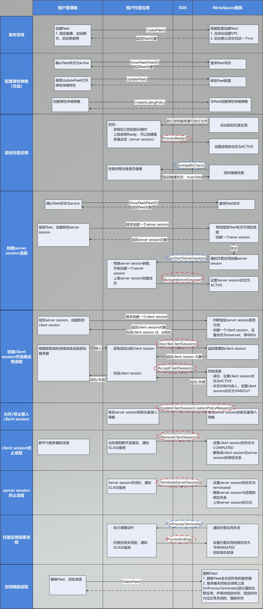

# MetaSpace开发者对接指南(C#版本)

## 术语：

1.	租户，表示使用华为云服务的企业用户
2.	用户，表示租户应用的使用者
3.	MetaSpace服务，表示华为云提供的应用托管服务平台
4.	租户管理面，表示租户与MetaSpace服务交互的应用，比如游戏大厅
5.	租户托管应用，表示租户托管在MetaSpace服务平台上的应用，比如游戏应用

## 接口对接
接口对接分为两部分，一部分是租户管理面与MetaSpace服务的交互（通过RESTful API交互），一部分是与租户托管应用与MetaSpace服务的交互（通过集成SDK交互）整体流程如下：


### 租户管理面与metaspace服务的交互接口说明：
详细接口信息看`API`接口文档，下面对接口做一些说明：
1. **CreateFleet**
创建`fleet`，这里可以通过"`process_configuration`"指定开机之后的启动路径和参数（这些参数是这个`fleet`每个虚拟机都可以拿到的参数）
 
2. **ShowFleet**
`fleet`创建之后状态是`Activating`，需要通过`ShowFleet`查询改`Fleet`的状态，只有状态变成"`active`"之后才表示这个`Fleet`可用，才可以进行`Server Session`的创建
 
3. **UpdateFleetInstanceCapacity**
`Fleet`创建之后默认会启动一个虚拟机来启动进程，需要等`Fleet`的状态为`active`，通过这个接口可以修改指定`Fleet`的虚拟机最大值、最少值和期望值
 
4. **UpdateFleet**
该接口主要是修改`Fleet`的属性，比如打开弹性伸缩
 
5. **CreateScalingPolicy**
`Fleet`创建之后默认不启动弹性伸缩，需要等`Fleet`的状态为`active`，调用`updateFleet` 开启弹性伸缩，然后通过`CreateScalingPolicy`可以配置自己的弹性阈值
 
6. **CreateServerSession**
可以通过`CreateServerSession`，给`Fleet`创建一个`server session`，如果该`Fleet`有可用的进程，该进程会接收到这个接口的参数
如果指定Fleet当前没有可用的虚拟机可用于分配，该接口会返回失败，如果开启了弹性策略的话，业务可以等待一段时间后再重试。
 
7. **ShowServerSession**
可以通过`ShowServerSession`，获取指定`ServerSession`的连接信息，也可以为`Server Session`创建`client session`来获取连接信息，`metaspace`平台通过`client session`对连接做了细致管理，推荐使用
如果`ServerSession`还没`active`的话，访问地址会被隐藏
 
8. **CreateClientSession**
可以通过`CreateSession`，给指定的`Server Session`创建一个`client session`，根据这个`client session`，不同的用户可以连接入服务器上，比如游戏里面，`10`个用户一局游戏，游戏局就是`server session`，而`client session`就表示了不同的用户，这些用户使用相同的服务器连接地址连接入托管服务器；创建`client session`之后，会有`60s`的有效期，超过这个时间之后`client session`会变为不可用
 
9. **DeleteFleet**
结束后，该接口是提供给用户做最后清理的，该接口可以清理所有指定`fleet`的所有资源

### 租户托管应用与MetaSpace服务的交互API
1. 托管应用的回调API（metaspace服务会调用的接口）列表如下，三个接口托管服务中需要根据自己的业务逻辑进行实现

|       API Name       | API Description                                                              |
| :------------------: | :--------------------------------------------------------------------------- |
|    OnHealthCheck     | 返回托管服务的健康状态，只有健康状态是true的应用，才会被分配到server session |
| OnStartServerSession | 接收到server session的创建信息，业务需要在这里执行server session的创建逻辑   |
|  OnProcessTermiante  | 接收到服务关闭的信息，业务需要在这里正确关闭进程，回收资源                   |

2. 托管应用的主调API（托管应用调用的metaspace接口）列表如下，

|             API Name              | API Description                                                                      |
| :-------------------------------: | :----------------------------------------------------------------------------------- |
|           ProcessReady            | 注册托管应用进程信息，通知metaspace服务进程已经启动完成                              |
|       ActivateServerSession       | 激活server session，表示相应的server session已经创建完毕，可以用于后续流程           |
|        AcceptClientSession        | client session已经连接成功                                                           |
|        RemoveClientSession        | 终止client session                                                                   |
|      DescribeClientSessions       | 获取指定server session的所有client session信息                                       |
| UpdateClientSessionCreationPolicy | 更新指定server session的client session创建策略，主要是是否允许新的client session接入 |
|    TermianteGameServerSession     | server session结束，终止响应的server session                                         |
|          PrcocessEnding           | 进程回收工作完成，可以正常关闭进程                                                   |

## 托管应用集成教程(c#)
1. grpc生成c# sdk代码
   当前提供了c#与go语言的demo(详见：`demo/go`与`demo/csharp`)
2. 在托管服务启动并确认自己可以提供服务，托管服务进程需要调用ProcessReady API 去通知metaspace平台自己已经启动完成，可以开始被分配server session。metaspace平台接受到通知后，会设置进程的状态为Activating，此时进程还不可用与分配server session。

    ```c#
    public static AuxProxyResponse ProcessReady(string[] logPath, int clientPort, int grpcPort)
    {
        logger.Println($"Getting process ready, LogPath: {logPath}, ClientPort: {clientPort}, GrpcPort: {grpcPort}");
        var req = new ProcessReadyRequest{
            ClientPort = clientPort,
            GrpcPort = grpcPort,
            // pid是当前进程的id
            Pid = Process.GetCurrentProcess().Id,
        };
        req.LogPathsToUpload.Add(logPath);         //repeated类型解析pb后，是只读类型，需要Add加入           
        return GrpcClient.ScaseClient.ProcessReady(req, meta);
    }
    ```
3. metaspace平台接收到ProcessReady通知后，会调用进程的onHealthCheck确认进程已进入ready状态，然后设置进程的状态为Active

    ```c#
    // 对象需要继承ProcessGrpcSdkService.ProcessGrpcSdkServiceBase
    public class ServerSdk : ProcessGrpcSdkService.ProcessGrpcSdkServiceBase

    public override Task<HealthCheckResponse> OnHealthCheck(HealthCheckRequest request, ServerCallContext context)
    {
        logger.Println($"OnHealthCheck, HealthStatus: {ScaseManager.HealthStatus}");
        return Task.FromResult(new HealthCheckResponse{
            HealthStatus = ScaseManager.HealthStatus
        });
    }
    ```
4. 租户管理面可以通过调用CreateServerSession API去创建server session，改server session会绑定到指定的fleet的某个托管应用进程上。metaspace平台接收到ServerSession创建请求后，会异步调用onStartServerSession API去通知托管应用进程，同时设置该server session为"Activating"状态

    ```c#
    public override Task<ProcessResponse> OnStartServerSession(StartServerSessionRequest request, ServerCallContext context)
    {
        logger.Println($"OnStartServerSession, request: {request}");
        ScaseManager.SetServerSession(request.ServerSession);
        return Task.FromResult(new ProcessResponse());
    }
    ```

5. 托管应用进程收到onStartServerSession后，需要处理自己的业务，在所有的都处理完成后，需要调用ActivateServerSession API 去通知metaspace平台当前server session已经激活，metaspace会设置改server session状态为active

```c#
public static AuxProxyResponse ActivateServerSession(string serverSessionId, int maxClients)
{
    logger.Println($"Activating game server session, ServerSessionId: {serverSessionId}, MaxClients: {maxClients}");
    var req = new ActivateServerSessionRequest{
        ServerSessionId = serverSessionId,
        MaxClients = maxClients,
    };  
    return GrpcClient.ScaseClient.ActivateServerSession(req, meta);
}
```
6. 租户管理面通过CreateClientSession接口给用户获取连接信息，用户接入使用client session接入后，托管盈余公进程会调用AcceptClientSession去通知metaspace平台当前client session已经接入，metaspace平台会设置改client session状态为active；如果client session创建60秒后都没有接入的话，状态会转变为timeout，该client session不可再用

```c#
public static AuxProxyResponse AcceptClientSession(string ClientSessionId)
{
    logger.Println($"Accepting Client session, ClientSessionId: {ClientSessionId}");
    var req = new AcceptClientSessionRequest{
        ServerSessionId = serverSession.ServerSessionId,
        ClientSessionId = ClientSessionId,
    };            
    return GrpcClient.ScaseClient.AcceptClientSession(req, meta);
}
```
7. 在用户断开连接后，托管应用进程需要调用RemoveClientSession API 去移除该用户，metaspace平台会将相应的client session设置为"complete"状态，并回收该配额

```c#
public static AuxProxyResponse RemoveClientSession(string ClientSessionId)
{
    logger.Println($"Removing Client session, ClientSessionId: {ClientSessionId}");
    var req = new RemoveClientSessionRequest{
        ServerSessionId = serverSession.ServerSessionId,
        ClientSessionId = ClientSessionId,
    };            
    return GrpcClient.ScaseClient.RemoveClientSession(req, meta);
}
```

8. 在一个server session结束之后，托管应用进程需要调用TermianteServerSession API 去通知metaspace平台将该server session状态设置为terminated

```c#
public static AuxProxyResponse TerminateServerSession()
{
    logger.Println($"Terminating game server session, ServerSessionId: {serverSession.ServerSessionId}");
    var req = new TerminateServerSessionRequest{
        ServerSessionId = serverSession.ServerSessionId
    };            
    return GrpcClient.ScaseClient.TerminateServerSession(req, meta);
}
```

9. metaspace平台如果要关闭托管应用进程（比如租户删除fleet），会调用onProcessTermainte来通知托管应用进程进行资源回收并关闭进程(该过程并不会改变会话状态)

```c#
public override Task<ProcessResponse> OnProcessTerminate(ProcessTerminateRequest request, ServerCallContext context)
{
    logger.Println($"OnProcessTerminate, request: {request}");
    // 设置进程终止时间
    ScaseManager.SetTerminationTime(request.TerminationTime);
    // 终止游戏服务器会话
    ScaseManager.TerminateServerSession();
    // 进程退出
    ScaseManager.ProcessEnding();
    return Task.FromResult(new ProcessResponse());
}
```

10. 托管应用进程关闭之前需要调用ProcessEnding来通知metaspace平台将自身的process对象状态设置为Termianted

```c#
public static AuxProxyResponse ProcessEnding()
{
    logger.Println($"Process ending, pid: {pid}");
    var req = new ProcessEndingRequest();            
    return GrpcClient.ScaseClient.ProcessEnding(req, meta);
}
```
11. 托管应用进程可以根据业务需要调用DescribeClientSessions来获取指定server session的全部client session信息

```c#
public static DescribeClientSessionsResponse DescribeClientSessions(
    string ServerSessionId, string ClientId, string ClientSessionId, string ClientSessionStatusFilter, string nextToken, int limit)
{
    logger.Println($"Describing Client session, ServerSessionId: {ServerSessionId}, \
                    ClientId: {ClientId}, ClientSessionId: {ClientSessionId}, \
                    ClientSessionStatusFilter: {ClientSessionStatusFilter}, \
                    NextToken: {nextToken}, Limit: {limit}");
    var req = new DescribeClientSessionsRequest{
        ServerSessionId = ServerSessionId,
        ClientId = ClientId,
        ClientSessionId = ClientSessionId,
        ClientSessionStatusFilter = ClientSessionStatusFilter,
        NextToken = nextToken,
        Limit = limit,
    };            
    return GrpcClient.ScaseClient.DescribeClientSessions(req, meta);
}

```
12. 托管应用进程可以根据业务需要来调用UpdateClientSessionCreationPolicy接口来更新client session的创建策略（是否允许新用户接入到当前server session）

```c#
public static AuxProxyResponse UpdateClientSessionCreationPolicy(string newPolicy)
{
    logger.Println($"Updating Client session creation policy, newPolicy: {newPolicy}");
    var req = new UpdateClientSessionCreationPolicyRequest{
        ServerSessionId = serverSession.ServerSessionId,
        NewClientSessionCreationPolicy = newPolicy,
    };            
    return GrpcClient.ScaseClient.UpdateClientSessionCreationPolicy(req, meta);
}
```
13. 启动grpc服务

```c#
public class Program
{
    public static int ClientPort = PortServer.GenerateRandomPort(2000, 6000);
    public static int GrpcPort = PortServer.GenerateRandomPort(6001, 10000);

    public static void Main(string[] args)
    {
        CreateHostBuilder(args).Build().Run();
    }

    public static IHostBuilder CreateHostBuilder(string[] args) =>{
        Host.CreateDefaultBuilder(args)
            .ConfigureWebHostDefaults(webBuilder =>
            {
                webBuilder.ConfigureKestrel(options =>
                {
                    // gRPC Port (Setup a HTTP/2 endpoint without TLS.)
                    options.ListenAnyIP(GrpcPort, o => o.Protocols = 
                        HttpProtocols.Http2);

                    // HTTP Port
                    options.ListenAnyIP(ClientPort);
                });

                webBuilder.UseStartup<Startup>();
            });
    }
}
```

14. 连接metaspace平台的grpc 服务

```c#
public class GrpcClient
{
    // 60002端口为metaspace grpc服务的启动端口
    private static string agentAdress = "127.0.0.1:60002";

    public static ProcessGrpcSdkService.ProcessGrpcSdkServiceClient ProcessServerClient
    {
        get
        {
            Channel channel = new Channel(agentAdress, ChannelCredentials.Insecure);
            return new ProcessGrpcSdkService.ProcessGrpcSdkServiceClient(channel);
        }
    }

    public static ScaseGrpcSdkService.ScaseGrpcSdkServiceClient ScaseClient
    {
        get
        {
            Channel channel = new Channel(agentAdress, ChannelCredentials.Insecure);
            return new ScaseGrpcSdkService.ScaseGrpcSdkServiceClient(channel);
        }
    }
}
```