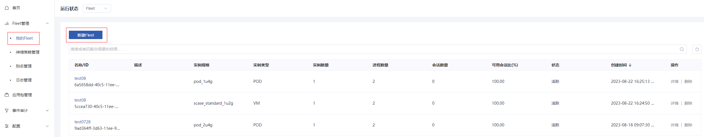
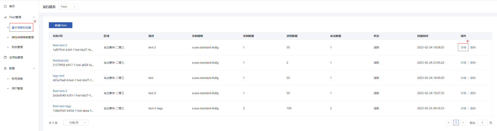
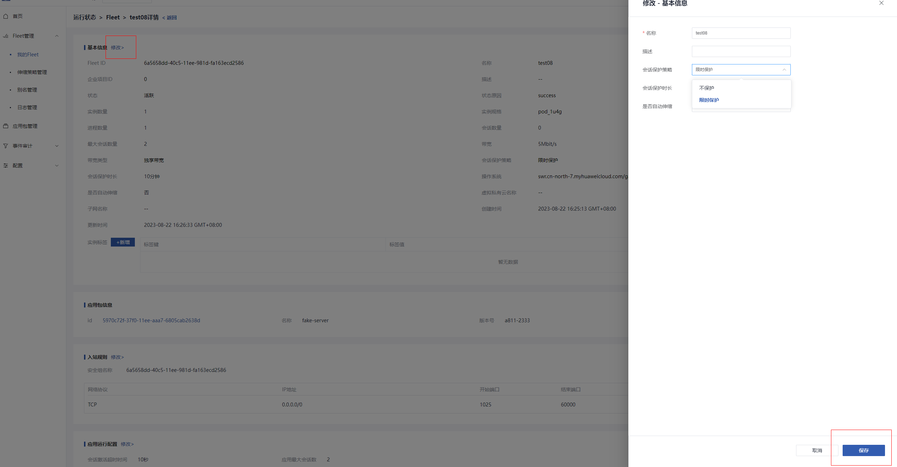

# 应用进程队列管理


## 创建应用进程队列

### 操作场景

`GameFlexMatch`平台提供应用进程的全局化动态部署及管理，您可以通过创建应用进程队列承载您的服务应用并对外提供服务。支持创建VM类型实例或POD类型实例。


### 操作步骤

1.登录`GameFlexMatch`管理控制台。

2.选择“Fleet管理 > 我的Fleet > 新建Fleet”。



3.配置基本信息、资源信息等参数，您也可以通过json文件直接导入参数，或通过已填参数导出json文件。重点配置参数说明如下表所示

| 参数                     | 解释                                                         | 取值样例               |
| ------------------------ | ------------------------------------------------------------ | ---------------------- |
| 名称                     | 应用进程队列的名称，可以不唯一                               | -                      |
| 应用包ID                 | 应用包id，创建后不支持修改，可在”应用包管理“的列表页中获取   | -                      |
| 区域                     | 应用进程队列所在的region                                     | 北京四                 |
| 实例类型                 | 应用进程队列的实例类型，取值为VM或POD                        | VM                     |
| VPC                      | VPC的名称。指定资源租户上的VPC创建fleet，若指定的VPC不存在则新建fleet失败在指定VPC创建Fleet时，会在指定的VPC上创建子网，并且会检查子网是否与已有子网冲突，若冲突则会再次随机子网，最多重复10次,需要保证指定的VPC网段包含部署时配置的VPC网段，否则可能导致创建fleet失败 | -                      |
| 会话保护策略             | 不保护：缩容时如果有会话在实例上运行，直接缩容；完全保护，缩容时如果有会话在实例上运行，等待会话结束再缩容；限时保护：缩容时如果有会话在实例上运行，等待一定时间后缩容，等待时间由会话保护时间指定 | 完全保护               |
| 服务端会话激活时延       | 下发创建服务会话请求到服务会话的状态变为可用状态的超时时间，默认600，单位秒 | 600                    |
| 单个进程最大服务端会话数 | 单进程最大并发服务会话数量                                   | 10                     |
| 启动路径                 | 应用进程启动程序路径，为linux风格文件路径                    | /local/app/start_up.sh |

4.参数配置完成后，单击”创建“。

5.Fleet状态为”活跃“时，即成功完成了Fleet的创建。


## 修改应用进程队列

### 操作场景

在管理应用进程队列的过程中，您可以根据需要修改应用进程队列的基本信息、入站规则、运行配置及容量信息。


### 操作步骤

1.登录`GameFlexMatch`管理控制台。

2.选择“Fleet管理 > 我的Fleet”。

3.在Fleet列表中，需修改的Fleet所在行中，单击“ 详情”。


4.单击参数栏后的”修改“，在侧弹窗中输入需修改的内容。

5.单击“保存”完成修改。



## 删除应用进程队列

### 操作场景

在您不再需要某个应用进程队列时，可以删除该应用进程队列。


### 删除须知

删除前请确认该Fleet是否关联有别名，若有关联则无法被删除。


### 操作步骤

1.登录`GameFlexMatch`管理控制台。

2.选择“Fleet管理 > 我的Fleet“。

3.在Fleet列表中，需删除的Fleet所在行中，单击“ 删除”。


4.在弹出的对话框中，单击”确定“。


## 指定在不同VPC创建fleet

服务组件之间默认使用内网通信，如果需要将fleet创建在其他VPC下，需要修改服务组件安全组，以及服务组件的启动参数

### 操作步骤

1. 确保fleetmanager配置路径/home/fleetmanager/configmap下的service_config.json脚本已配置所有服务组件的入站规则，确保appgateway和aass的**所有节点**的公网IP都已填入

   ```shell
       "internal_inbound_permissions": [
           {
               "protocol": "TCP",
               "ip_range": "{appgateway_host}/32",
               "from_port": 60001,
               "to_port": 60001
           },
           {
               "protocol": "TCP",
               "ip_range": "{aass_host}/32",
               "from_port": 9091,
               "to_port": 9091 
           }
       ],
   ```
   
2. 修改appgateway服务组件/home/appgateway_/bin/appgateway_run.sh参数，修改使用公网通信，保存后重启服务组件

   ```shell
   export AUXPROXY_IP_TYPE=publicIP #appgateway与auxproxy通信的ip类型:publicIP/privateIP
   ```

3. 和aass服务组件/home/aass/bin/aass_run.sh参数，修改使用公网通信，保存后重启服务组件

   ```shell
   # 与auxproxy连接的方式，默认为私网
   export CONNECT_TO_AUXPROXY_BY_IP=publicIP #aass与auxproxy通信的ip类型:publicIP/privateIP
   ```
   