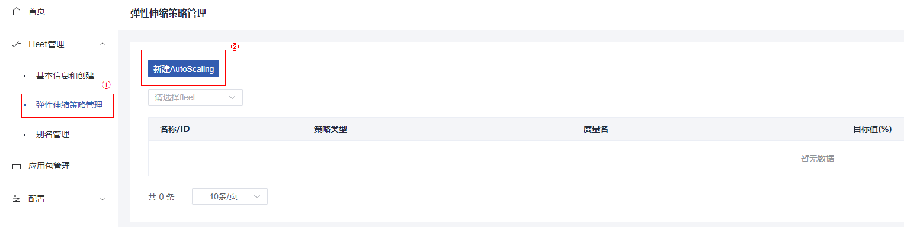
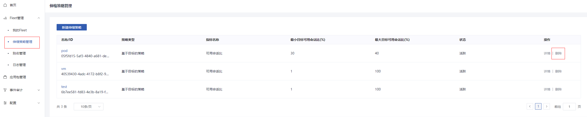

# 弹性伸缩策略管理

## 创建弹性伸缩策略

### 操作场景

在使用应用进程队列的过程中，您可以通过创建并绑定弹性伸缩策略，控制应用进程队列的扩缩容策略。

### 操作步骤

1.登录`gamebounce`管理控制台。

2.选择“Fleet管理 > 伸缩策略管理 > 新建伸缩策略”。

3.配置名称，策略类型和指标等参数，重点配置参数说明如下表所示

| 参数               | 解释                                       | 取值样例       |
| ------------------ | ------------------------------------------ | -------------- |
| 名称               | 创建的弹性伸缩策略名称                     | -              |
| 策略类型           | 伸缩策略类型，当前支持基于目标的策略       | 基于目标的策略 |
| 指标名称           | 策略需要控制的指标名称，当前支持可用会话比 | 可用会话比     |
| 最大目标可用会话比 | 用于控制应用进程队列的缩容阈值             | 60             |
| 最小目标可用会话比 | 用于控制应用进程队列的扩容阈值             | 30             |

4.参数配置完成后，单击”创建“。

## 修改弹性伸缩策略

### 操作场景

在管理应用进程队列的过程中，您可以修改该应用进程队列已经绑定的弹性伸缩策略。允许修改的参数包括名称、度量名以及目标值。

### 操作步骤

1.登录`gamebounce`管理控制台。

2.选择“Fleet管理 > 伸缩策略管理”。

3.在弹性伸缩策略列表中，需修改的弹性伸缩策略所在行中，单击“ 详情”。

4.在详情页中单击参数后的”修改“，输入修改后的内容，并单击“保存”完成修改。

## 删除弹性伸缩策略

### 操作场景

在您不再需要某个弹性伸缩策略时，可以删除该弹性伸缩策略。

### 操作步骤

1.登录`gamebounce`管理控制台。

2.选择“Fleet管理 > 伸缩策略管理”。

3.在弹性伸缩策略列表中，需删除的弹性伸缩策略所在行中，单击“ 删除”。

4.在弹出的对话框中单击“确认”完成删除。