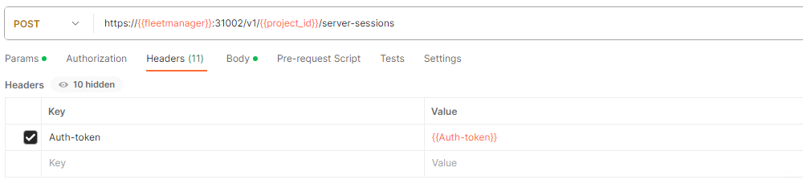
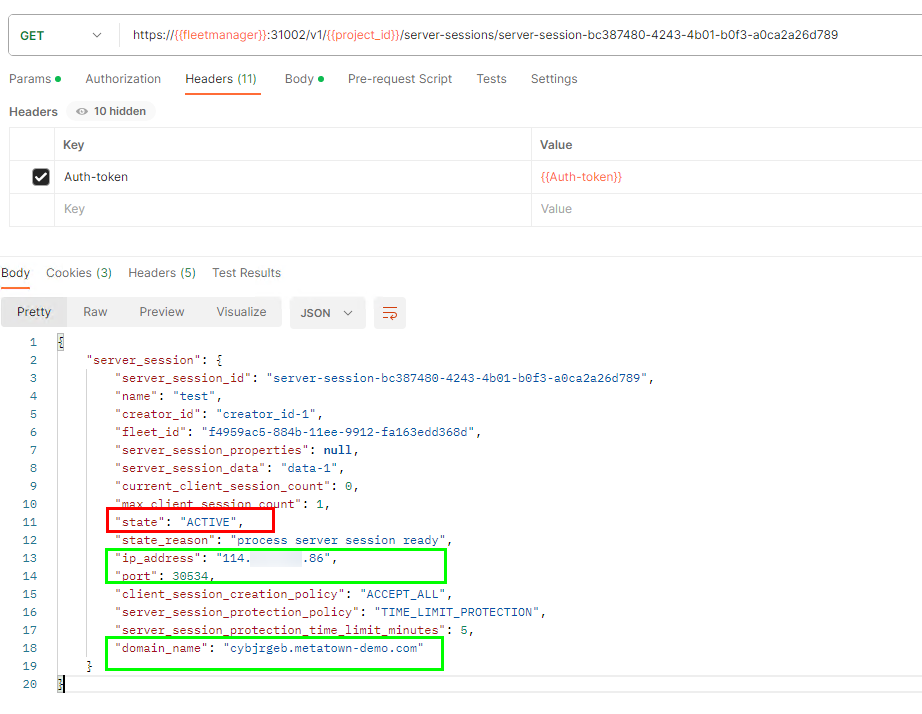
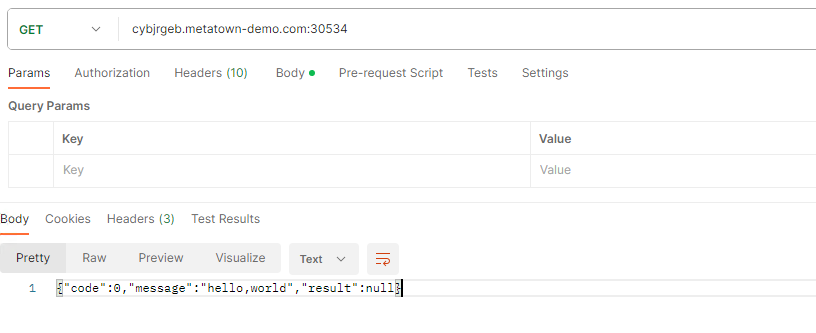

# 会话管理

## 创建服务端会话

### 操作场景

GameFlexMatch平台提供服务端会话分配的功能，在服务端应用就绪后，可向服务端程序创建服务端会话

### 创建会话

创建会话需使用API调用Fleetmanager接口，以下示范通过接口调用工具postman演示

1. 登录Fleetmanager，获取Auth-Token

2. 选择一个fleet，使用该fleet_id创建一个server_session，在Header里粘贴Auth-Token，请求体中填写数据（详见API文档）

   创建会话成功

3. 创建成功后，获得server_session_id，调用API查询会话的激活状态

4. 当会话状态为ACTIVE，则说明当前会话状态已可用，响应体中返回该服务端会话所在ECS的IP地址，监听的端口；若创建fleet添加了域名，响应体中还会返回访问ECS的域名，域名格式为 **{随机字符串}.{主域名}**。

- 通过IP地址访问服务，格式为 **"{ip_address}:{port}"**

- 通过域名访问服务，该域名指向fleet中的一台ECS，格式为 **"{domain_name}:{port}"**

