# gamebounce控制台快速入门
## 1. 用户管理，关联资源用户
+ gamebounce的用户分为两种类型，一种是用于登录控制台的gamebounce用户，一种是用于创建与管理计算、网络等资源的华为云租户
+ 管理员第一次登录或普通用户第一次登录时，需重置密码，并关联华为云租户，以正常使gamebounce控制台
### Step1. 管理员新建用户NewUser
+ 管理员登录


### Step2. 首次登录重置密码
+ 若管理员首次登录控制台，需修改密码
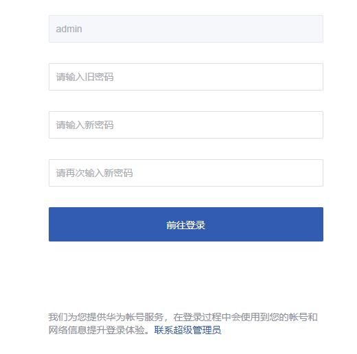

### Step3. 管理员首次进入若未关联资源租户，需先关联资源租户
 

+ **填写相关关联的资源租户相关信息**，简介如下:

  1. 使用租户信息

        ```
        租户名称: GFM平台租户信息名称
        项目id: 用于GFM创建资源资源的API项目id，可在华为云控制台-我的凭证-API凭证中获取
        AccessKey: 用于GFM访问API使用的密钥，可在华为云控制台-我的凭证-访问密钥中获取
        SecretAccessKey: 用于GFM访问API使用的密钥，可在华为云控制台-我的凭证-访问密钥中获取
        Region: 资源租户用于创建GFM资源的对应region
        密钥名: GFM弹性扩容虚机时的登录认证密钥
        云服务委托名: 目前用于打包镜像时安装ICAgent以及使用lts云日志服务的日志转储
      ```
    2. 应用包信息

         ```
         Auxproxy路径:  Auxproxy文件在OBS的存放路径
         ECS-应用包配置脚本路径: 用于创建ECS资源应用包的脚本文件在OBS的存放路径
         文件存放Region: OBS桶所在的Region
         容器-应用包配置脚本路径:  用于创建容器资源应用包的脚本在OBS的存放路径
         ```

  

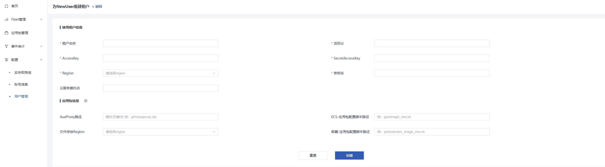


+ 资源租户关联成功，现在可以使用正常使用gamebounce了


## 2. 应用上传，制作镜像
+ 应用镜像内包含AuxProxy服务组件以及已完成对接的后端服务应用，并已完成相关的启动配置，用于弹性扩容虚机的模板
+ 执行该步骤之前，需确保资源租户向管理租户已经配置了正确的委托，以及资源租户配置了正确的云服务委托
+ 需保证上传的服务端应用可以正常的被启动

### Step1. 上传应用包，制作镜像
+ 用户登录控制台
+ 进入“应用包管理”模块，进入“创建应用包”，开始制作应用
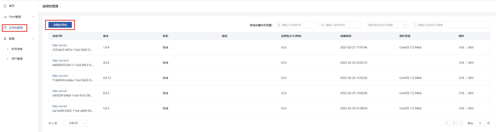

+ 填写制作镜像相关信息，点击创建server-application


### Step2. 查看应用包详情，确认应用状态
+ 进入应用包管理，搜索server-application
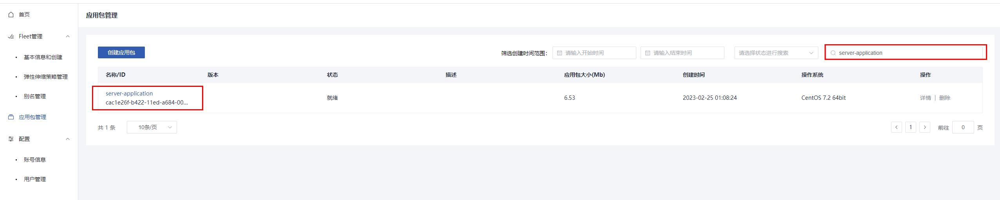
+ 点击应用名称查看应用详情，确认应用状态拿到应用包id
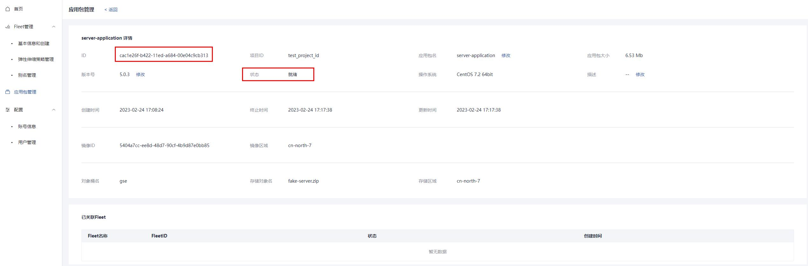
+ 当应用状态为就绪时，可以使用该应用创建fleet


## 3.创建实例规格

- 用户登录控制台
- 进入“配置”-“实例规格组”模块，创建实例规格组


- 创建实例规格，以vm类型的2u4g规格为例，填写实例规格组名称，选择使用的实例规格，点击确定

  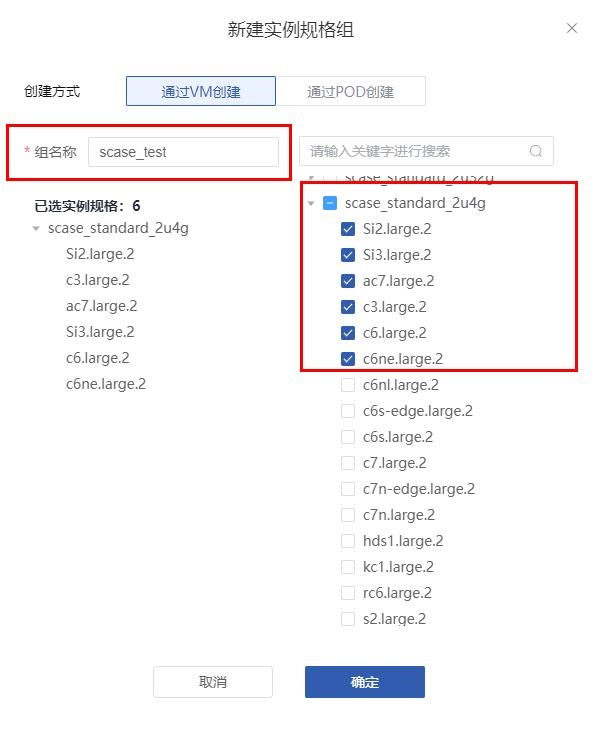


## 3. 创建Fleet流程
+ 应用进程队列(fleet)是一个管理后端服务应用集群的队列，可以支持手动或自动增加后端服务应用的数量，以满足不同的负载需求
+ 执行该步骤之前，需确保资源租户向管理租户已经配置了正确的委托，以及资源租户配置了正确的云服务委托
+ 需保证已经拿到了“就绪”状态的应用包ID

### Step1. 创建Fleet
+ 用户登录控制台
+ 进入创建fleet界面


+ 填写创建fleet的相关信息，支持json格式的文件导入
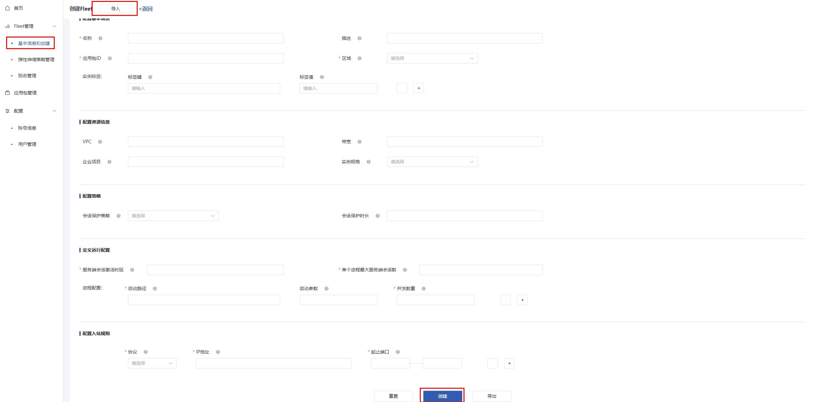

+ 点击创建，开始创建fleet

### Step2. 检查Fleet是否创建成功
+ 进入fleet列表，找到刚刚创建的fleet
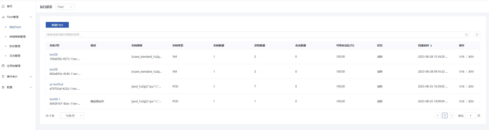

+ 点击详情，查看fleet信息


+ fleet状态由CREATING转为ACTIVE，则创建成功，转为ERROR，则创建失败，需管理员查看FleetManager服务日志查看失败原因

## 4. 创建弹性伸缩策略，开启弹性伸缩功能
+ 执行该步骤之前，需保证创建弹性伸缩策略的fleet处于激活状态
+ 当前只支持选择“可用会话比”一种弹性伸缩策略，可以根据当前可承载的最大会话数、当前会话以及可用会话比的动态关系弹性扩缩容计算资源


### Step1 创建弹性伸缩策略
+ 找到弹性伸缩策略创建入口
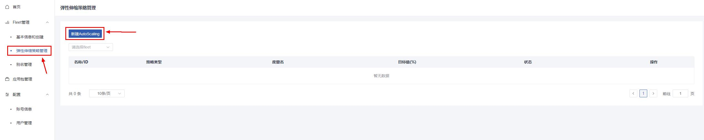

+ 选择弹性伸缩策略绑定的fleet_id，填写必要参数，点击创建
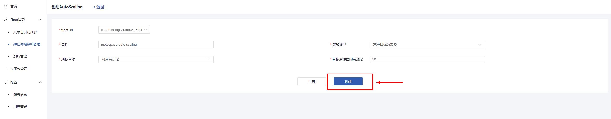

+ 确认弹性伸缩策略是否创建成功
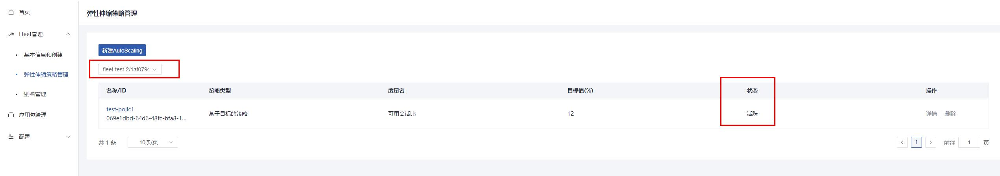

### Step2 修改fleet信息，开启弹性伸缩能力
+ 进入弹性伸缩策略所绑定的fleet的详情
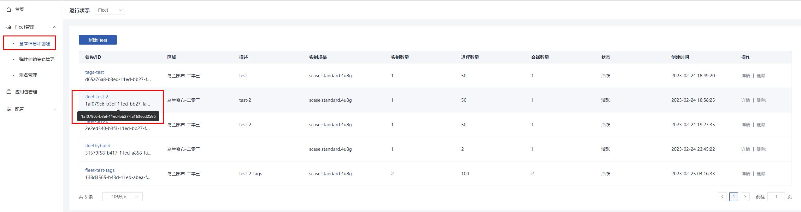

+ 修改 `基本信息->是否开启弹性伸缩` 字段，开启弹性伸缩能力
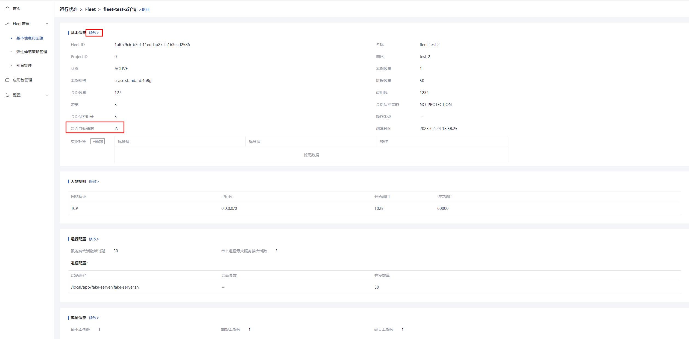

+ 现在gamebounce可以根据负载情况弹性扩缩容计算资源了


## 5. 快速创建别名(alias)关联(可选)
+ fleet别名可以提供灰度发布的功能，可以为多个fleet关联同一个alias，在创建会话时可以携带alias_id代替fleet_id来创建会话，并支持不同fleet有不同的权重，加权分配不同会话创建请求
+ 需保证关联的fleet的状态是ACTIVE激活状态
### Step1. 创建应用进程队列别名
+ 进入创建别名界面
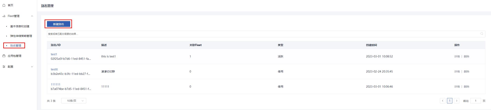

+ 填写别名创建相关信息
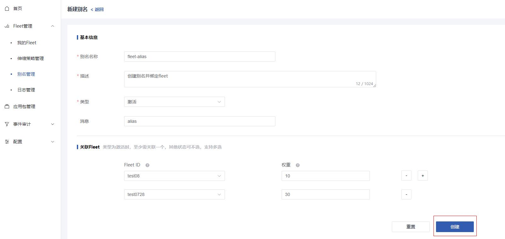

+ 点击创建，完成alias的创建，现在可以使用这个alias创建会话了

## 6. 创建日志接入和转储

- 为应用进程队列下的实例创建日志接入和日志转储，日志接入可暂存实例中的日志，并在华为云服务中的“云日志服务LTS”平台查看，可快捷筛选并分析相关的日志记录，日志转储提供将日志接入中记录的日志永久保存在OBS的服务。
- 执行该步骤之前，需保证创建弹性伸缩策略的fleet处于激活状态，并且确保资源租户向管理租户已经配置了正确的委托

### Step1. 创建日志接入

- 进入日志管理界面，点击新建日志

 

- 填写日志接入相关信息，日志接入需要选择一个日志组，若无日志组，则选择日志组的新建


- 创建成功后可配置日志自动转储到OBS中，也可选择”否“跳过此步骤，可在日志详情页随时创建


- 填写创建日志转储参数，点击创建


- 创建成功后日志管理页面则会新增一条记录，可直接点击日志流或者OBS转储路径跳转至对应华为云服务控制台

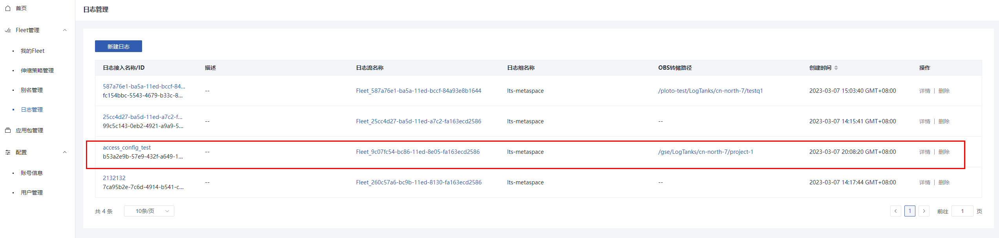


# 管理员创建子用户

### Step1. 管理员新建用户NewUser

+ 管理员登录
  

+ 找到新增用户入口

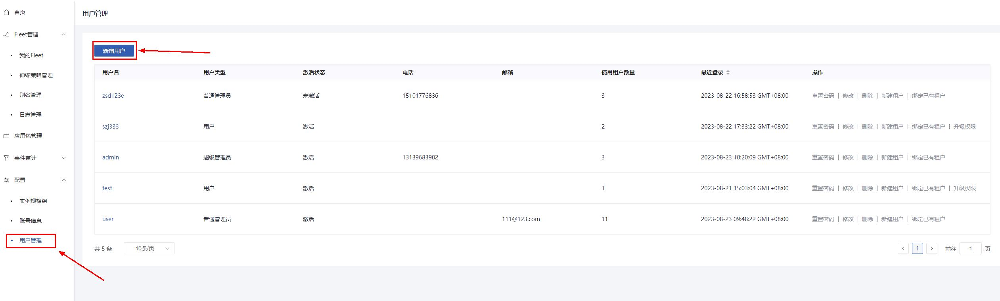

+ 新增普通用户，以NewUser为例
  

### Step2. 首次登录重置密码

+ NewUser首次登录控制台，需修改密码
  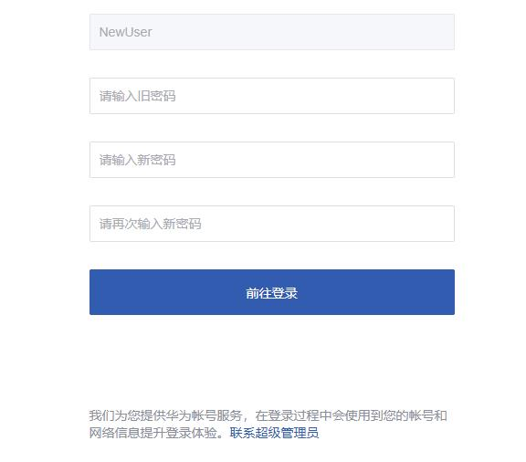

### Step3. 普通用户或管理员首次进入若未关联资源租户，需先关联资源租户

+ 需联系管理员为NewUser关联资源租户
  

### Step4. 管理员为NewUser关联资源租户

+ 管理员登录控制台
+ 管理员为NewUser新增关联租户

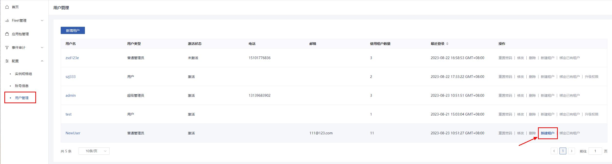

### Step5. 查看NewUser关联的资源租户详情

+ 查看用户NewUser详情
  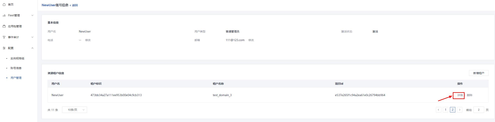

+ 查看NewUser关联的资源租户信息
  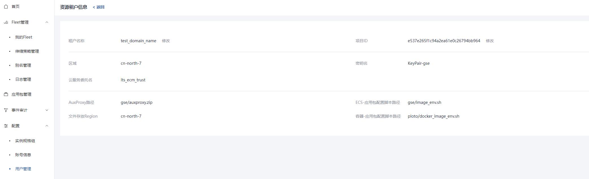