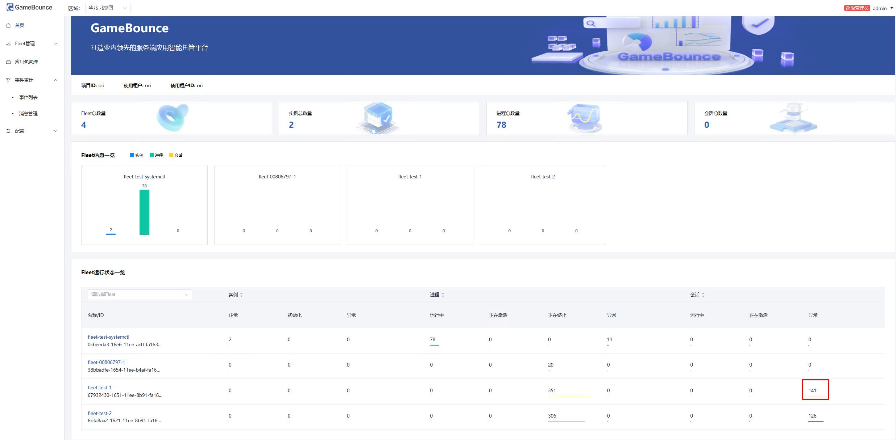
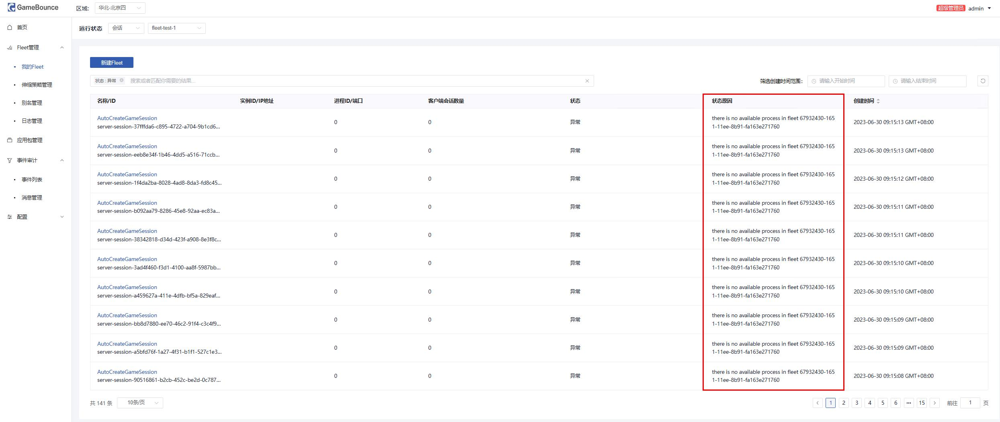

# 常见问题FAQ

## Fleet与应用包创建
1. 创建Fleet失败，如何排查原因？

   fleet创建的过程中涉及“同步账号信息”、“同步应用包资源”、“创建VPC”、“创建子网”、“创建安全组”、“创建弹性伸缩组”、“等待应用进程上报”等主要过程，创建失败时需要排查是哪一环节出现了问题：
  + **排查错误原因**: 登录`FleetManager`所在机器，打开日志文件`/home/fleetmanager/bin/log/run/run.log`，搜索“`creat_fleet`”关键词，排查错误信息
  + **同步账号信息**：查看`GameFlexMatch`所涉及到的账号信息是否配置完全，详见[用户指南-快速入门](../gameflexmatch-user-guide.md)
  + **同步应用包资源失败**：查看创建fleet所关联的应用包状态是否可用，若不可用，则切换成可用的应用包并重新创建
  + **创建VPC或子网失败**：创建Fleet支持绑定VPC与子网，若选择绑定VPC与子网，首先排查绑定的VPC与子网是否可用，若选择不绑定则默认新建，则需按照日志中返回的错误信息，排查原因
  + **创建安全组失败**：创建Fleet时默认创建一个安全组，同时支持绑定安全组，若创建安全组失败则需按照日志中返回的错误信息，排查原因
  + **创建弹性伸缩组失败**：后台aass组件执行创建弹性伸缩组的任务，若该步骤出现问题则需登录aass机器查看日志：/home/aass/bin/log/run/run.log，查看具体错误原因
  + **等待应用进程上报**：该问题主要是由于应用进程没有上报导致，原因主要分为对战服机器未成功创建(可登录华为云控制台查看)、对战服机器成功创建但应用未成功拉起(需登录对战服机器确认应用是否正确拉起)、应用正常拉起但未上报成功(可登陆对战服机器查看`auxproxy`日志:`/etc/auxproxy/log/run.log`，查看错误原因)
2. 创建应用包失败，如何排查原因?

   应用包创建过程涉及“创建ECS”、“拉取应用包”、“创建镜像”过程，需登录`FleetManager`日志查看具体报错原因后，进行排查
## 会话创建
**查看会话错误原因**

1. 会话创建失败分为多种情况：
   + **error for timeout**: 
     + 首先确定是否大量出现，若大量出现，则为对战服与appgateway的网络连接出现问题，首先排查对战服机器对应的安全组是否对appgateway地址开放60001端口，若未开放，可手动修改该安全组对appgateway开放端口与地址(对该`fleet`生效)，同时修改`fleetmanager`的`/home/fleetmanager/configmap/service_config.json`文件的`internal_inbound_permissions`，修改后对新fleet生效，该种情况一般在新部署时出现；若不为配置问题，则初步判断为网络问题，需联系华为云进行紧急规避
     + 若是偶尔出现，则需查看`appgateway`的日志`/home/appgateway/log/run/run.log`以及`auxproxy`的日志`/etc/auxproxy/log/run.log`,追溯会话生命流程，确认为`GameFlexMatch`问题还是游戏服务问题
   + 错误原因携带**redis**或**mysql**: mysql或redis规格较低，需要及时扩大规格
   + 错误原因携带**socket**或**file**: appgateway机器句柄数设置不合理，需修改配置
   + **there is no available process in fleet**: fleet中注册的进程不足，首先看是否大量出现：若大量出现则需要紧急规避：手动修改fleet的最小实例数，手动扩容机器，及时恢复业务后，回溯问题原因；若偶尔出现，则为弹性扩容速度未满足流量的上升速度，需调整弹性伸缩策略与fleet预留的最小实例数量
## 版本迭代
+ 如何快速安全的在业务高峰期进行版本迭代？
  
  `GameFlexMatch`可基于别名管理进行快速的游戏不停服更新迭代，若在业务低峰期时进行迭代则可直接新建Fleet，将新fleet关联进别名，旧fleet从别名中移出去，等待旧版本fleet上会话全部结束后，即可回收资源，但业务高峰期进行版本迭代时，需要保证业务不受影响，有两种更新方式：
  **逐步引流**：
      + 新建一个与旧版本fleet配置相同的fleet，新版本fleet最小实例数保持与旧版本最小实例数一致
      + 将新版本fleet关联至旧版本fleet所在的别名，并按照当前的机器数量的比例设置权重比
      + 按照分流情况逐渐增加新版本fleet的权重，逐渐减少旧版本fleet的权重
      + 等待流量稳定后，将旧版本fleet直接从别名中取消关联
      + 等待旧版本fleet会话全部结束后，回收fleet资源，变更结束
  **全量引流**：
      + 新建一个与旧版本fleet配置相同的fleet，并将新版本fleet的最小实例数设置为当前旧版本fleet的实例数，开启弹性伸缩
      + 将新版本fleet关联进旧版本fleet所在的别名，将旧版本fleet从别名中取消关联
      + 等待旧版本fleet上会话全部结束后，将新版本fleet的最小实例数修改至旧版本fleet设置的最小实例数
      + 回收旧版本fleet的资源，变更结束
    **推荐使用第二种变更方式**：可以在高峰期更加安全快速的完成版本的不停服更新
## 其他问题
+ 对战服机器CPU或内存异常？
  
  登录对战服机器，查看游戏进程数是否异常，若异常，则确认单个游戏进程是否占用较多CPU或内存资源，适当调整单台机器启动的进程数量
+ GameFlexMatch的资源监控出现异常？
  
  首先确认当前业务流量信息，确认时候流量相比之前同期突增，若为突增，针对不同节点的异常，则及时对相应节点做扩容或升高规格操作；若流量正常，但cpu或内存依旧出现告警，则需排查控制台首页是否出现大量异常会话，若出现，按照会话创建失败类型错误处理

