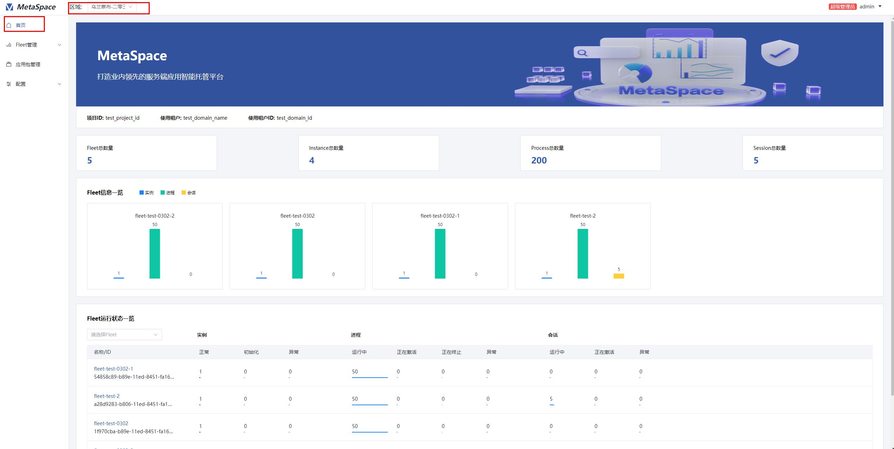

# 首页
## 简介
+ 首页提供了展示对MetaSpace资租户在某个region下的整体运行情况，包括Fleet、实例、进程与会话的总数量
+ 提供了图表化展示每一个Fleet中实例、进程与会话的数量
+ 提供了图表化显示每个Fleet中不同状态的实例、进程、会话的数量
## 操作
+ 点击`首页`查看总体运行情况

    
     
    
首页

+ (可选)若需查看某几条Fleet的运行状态，可在`首页->Fleet运行状态一览`中选择想要查看的Fleet，支持多选

    
     
    
fleet运行状态

