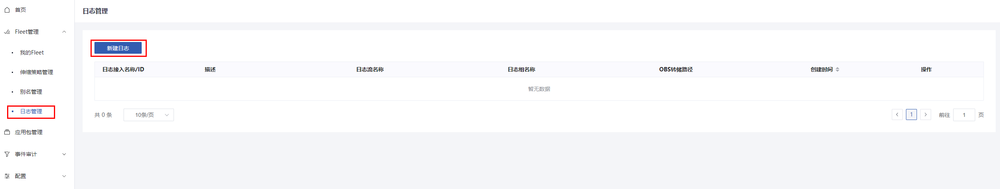
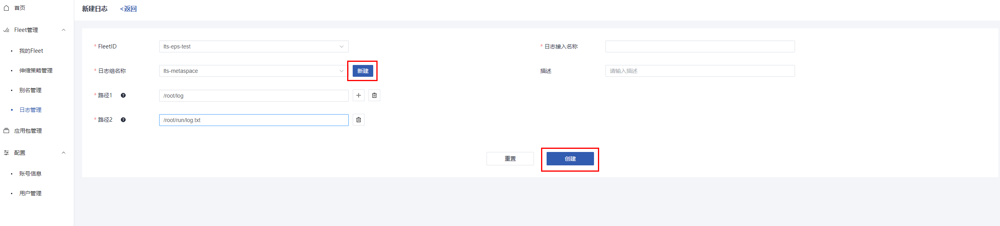
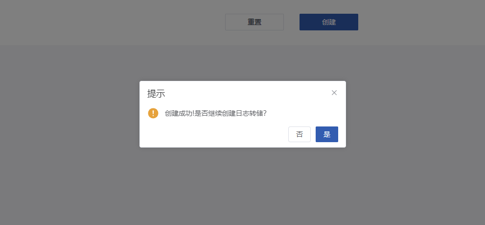
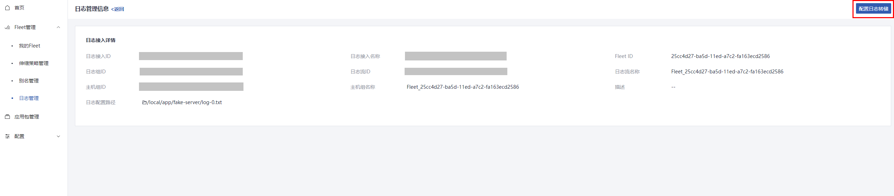
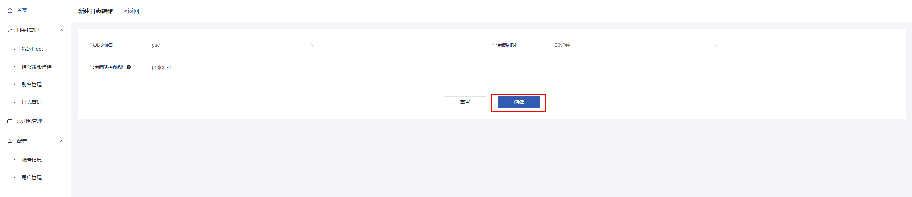
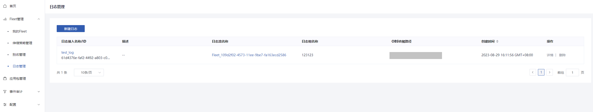
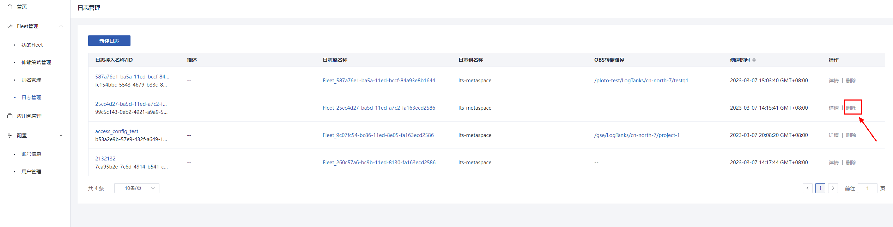
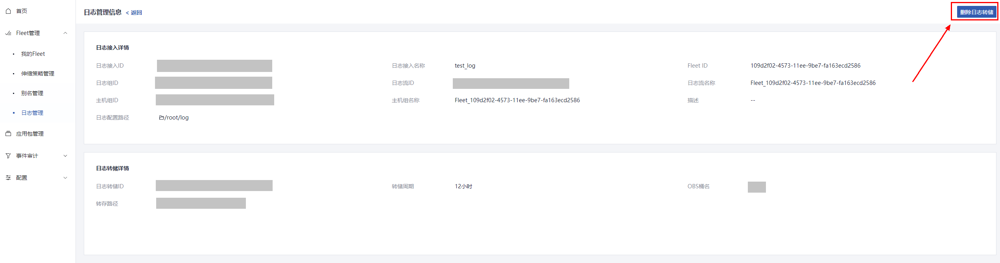

# 日志管理

## 创建日志接入

### 操作场景

Metaspace平台提供对应用进程队列中的实例接入日志自动化管理功能，您可以通过创建日志接入来记录和分析所有示例的日志内容。

### 操作步骤

1. 登录`Metaspace`管理控制台；

2. 选择“日志管理  > 新建日志”；

   

3. 填写日志接入参数，若无日志组，可点击”日志组名称“旁的”新建“，
   
   

4. 新建日志接入参数详情如下：

| 参数           | 解释                                                       | 取值样例 |
| -------------- | ---------------------------------------------------------- | -------- |
| FleetId        | 创建日志接入所属的应用进程队列                | -        |
| 日志接入名称 | 该日志接入的名称 | -        |
| 日志组名称     | 选择创建的日志接入的日志流所属的日志组           |    |
| 路径                   | 日志所在的路径或文件，支持多个接入路径， | /root/log或/root/log.txt |
| 描述                     | 该日志接入的描述信息 ||

创建日志组参数详情如下：

| 参数           | 解释                                                       | 取值样例 |
| -------------- | ---------------------------------------------------------- | -------- |
| 日志组名称 | 日志组的名称 | -        |
| 日志保留时间（天） | 日志在LTS平台中保留的时间，范围1~30天 | 7 |

5. 新建成功后会提示创建日志转储，选择”是“则跳转创建，选择”否"则跳过创建，进入日志接入详情页可以随时创建；
   

6. 注意，一个日志接入只能对应一个日志转储。

## 创建日志转储

### 操作场景

日志转储为在日志接入中暂存的日志进行永久转储到OBS桶内，配置完成后会按照参数进行自动转存。

### 操作步骤

1. 登录`Metaspace`管理控制台；
2. 选择“日志管理  > 日志详情  > 配置日志转储”；

3. 填写创建日志转储的配置信息

4. 配置参数信息如下：

| 参数           | 解释                                                       | 取值样例 |
| -------------- | ---------------------------------------------------------- | -------- |
| OBS桶名 | 日志转储OBS桶的名称 | -        |
| 转储路径前缀 | 输入LTS-test，则日志转储路径为：OBS桶名/LogTanks/LTS-test/Y/m/done/H/m/ | - |
| 转储周期 | 转储周期可选2分钟，5分钟，30分钟，1小时，3小时，6小时，12小时 | - |

5. 创建成功后，列表页显示该日志接入的obs转储路径，未配置转储显示空，路径可链接到华为OBS云服务的桶对象列表页

## 删除日志接入与转储

### 操作背景

删除已配置的日志接入和日志转储，

### 操作步骤

1. 删除日志接入（若已配置日志转储，则需要先删除日志转储），在日志接入的列表页，找到需要删除的日志接入项的删除按钮，点击即可删除

   

2. 删除日志转储，在日志接入的详情页面中，点击右上角“删除日志转储”即可删除

