# GameFlexMatch快速上手: 目录
- [GameFlexMatch快速上手: 目录](#gameflexmatch快速上手-目录)
- [1. 用户管理，关联资源用户](#1-用户管理关联资源用户)
  - [1.1. 完善信息](#11-完善信息)
- [2. 应用上传，制作镜像](#2-应用上传制作镜像)
  - [2.1. 创建应用包](#21-创建应用包)
  - [2.2. 查看应用包详情，确认应用状态](#22-查看应用包详情确认应用状态)
- [3. 创建实例规格](#3-创建实例规格)
  - [3.1. 操作步骤](#31-操作步骤)
- [4. 创建Fleet流程](#4-创建fleet流程)
  - [4.1. 创建Fleet](#41-创建fleet)
  - [4.2. 检查Fleet是否创建成功](#42-检查fleet是否创建成功)
  - [4.3. 创建弹性伸缩策略，开启弹性伸缩功能（可选）](#43-创建弹性伸缩策略开启弹性伸缩功能可选)
- [5. 创建别名(alias)关联(可选)](#5-创建别名alias关联可选)
  - [5.1. 创建应用进程队列别名](#51-创建应用进程队列别名)
- [6. 创建日志接入和转储（可选）](#6-创建日志接入和转储可选)
  - [6.1. 创建日志接入](#61-创建日志接入)

# 1. 用户管理，关联资源用户

- GameFlexMatch的用户分为两种类型，
    + **登录控制台用户**：用于登录GFM控制台，进行日常的管理运维等
    + **华为云租户**：用于创建与管理计算、网络等资源
  两者都要进行关联配置
- 管理员第一次登录或普通用户第一次登录时，需重置密码，并关联华为云租户，以正常使GameFlexMatch控制台。

## 1.1. 完善信息

1.  使用管理员账号密码登录控制台，若管理员首次登录控制台，需修改密码后重新登录；

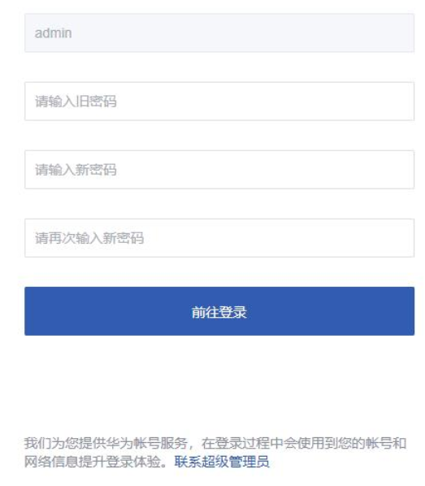

2.  管理员首次进入若未关联资源租户，需先关联资源租户

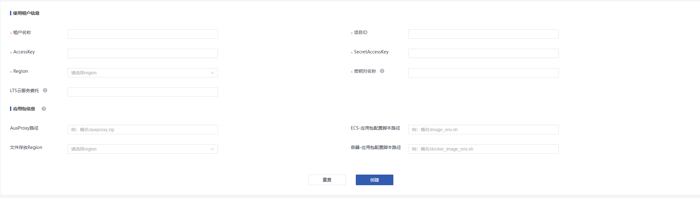  

3.  **填写相关关联的资源租户相关信息**
 
简介如下:

使用租户信息：

-   **租户名称**: GameFlexMatch平台绑定的租户信息名称，也是你的华为云租户名称，可登陆[统一身份认证服务-用户](https://account.huaweicloud.com/usercenter/#/iam/users)，选择您将要绑定的华为云租户

-   **项目id**:
    用于GameFlexMatch创建资源资源的API项目id，可在华为云控制台-我的凭证-[API凭证](https://console.huaweicloud.com/iam/#/mine/apiCredential)中获取，选择您将要绑定的区域项目的ID

-   **Access Key**:
    用于GameFlexMatch访问API使用的密钥，可在华为云控制台-我的凭证-[访问密钥](https://console.huaweicloud.com/iam/#/mine/accessKey)中获取，若无则需要新增

-   **Secret Access Key**:
    用于GameFlexMatch访问API使用的密钥，可在华为云控制台-我的凭证-[访问密钥](https://console.huaweicloud.com/iam/#/mine/accessKey)中获取，若无则需要新增

-   **Region**: 资源租户用于创建GameFlexMatch资源的对应region，该信息需要与项目ID对应

-   **密钥名**: GameFlexMatch弹性扩容虚机时的登录认证密钥对，你可以根据该秘钥对进行登陆战斗服的虚机；你可以登陆数据加密控制台-[秘钥对管理](https://console.huaweicloud.com/console/#/dew/kps/kpsList/accountKey)-账号秘钥对 进行查看，若没有则需要新建。

-   **云服务委托名**:
    目前用于打包镜像时安装ICAgent以及使用lts云日志服务的日志转储，你可以在华为云控制台-统一身份认证服务-[委托](https://console.huaweicloud.com/iam/#/iam/agencies)中查看，若没有你可以新建一个委托：
    1. 委托名称你可以选择自定义，如`gfm-lts-agency`
    2. 委托类型选择**云服务**
    3. 云服务可以搜索选择：ECS
    4. 点击下一步后，授予该委托权限：`APM FullAccess`与`LTS FullAccess`
    5. 创建完成后你可以将委托名称`gfm-lts-agency`配置到对应位置

应用包信息（可选，为空时使用默认参数）

-   **Auxproxy路径**: Auxproxy文件在OBS的存放路径，请保证已将**auxproxy.zip**上传至你将要配置的OBS路径中

-   **ECS-应用包配置脚本路径**:
    用于创建ECS资源应用包的脚本文件在OBS的存放路径，请保证已将**image_env.sh**上传至你将要配置的OBS路径中

-   **文件存放Region**: OBS桶所在的Region

-   **容器-应用包配置脚本路径**:
    用于创建容器资源应用包的脚本在OBS的存放路径；若使用容器，此项必填。请保证已将**docker_image_env.sh**上传至你将要配置的OBS路径中

资源租户关联成功，现在可以正常使用GameFlexMatch了

#  2. 应用上传，制作镜像

-   应用镜像内包含AuxProxy服务组件以及已完成对接的后端服务应用，并已完成相关的启动配置，用于弹性扩容虚机的模板；

-   使用前提：

> 需确保资源租户向管理租户已经配置了正确的租户信息；
>
> 需保证上传的服务端应用可以正常的被启动；

详情参考指导文件中应用包部分。

## 2.1. 创建应用包

1.  用户登录控制台

2.  进入"应用包管理"模块，进入"创建应用包"，开始制作应用

3.  填写制作镜像相关信息，点击创建

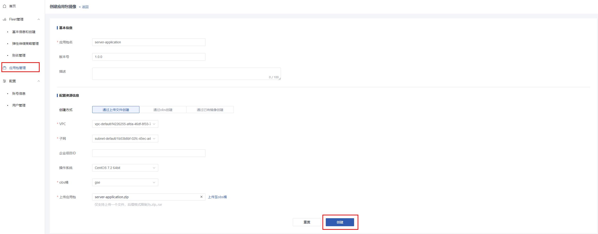

## 2.2. 查看应用包详情，确认应用状态

1.  应用包管理，找到创建的应用包

2.  用名称查看应用详情，确认应用状态是否为"活跃"

3.  状态为就绪时，可以使用该应用创建fleet

# 3. 创建实例规格

-   实例规格组提供一组ECS的规格，按照所选规格的优先顺序尝试创建，用户可根据业务需求选择实例的CPU核心数和内存大小；

-   使用前提：

> 需要正确配置用户租户信息；

## 3.1. 操作步骤

1.  用户登录控制台；

2.  进入"配置"-"实例规格组"模块，创建实例规格组；

3.  创建实例规格，以vm类型的2u4g规格为例，填写实例规格组名称，选择使用的实例规格，点击确定。

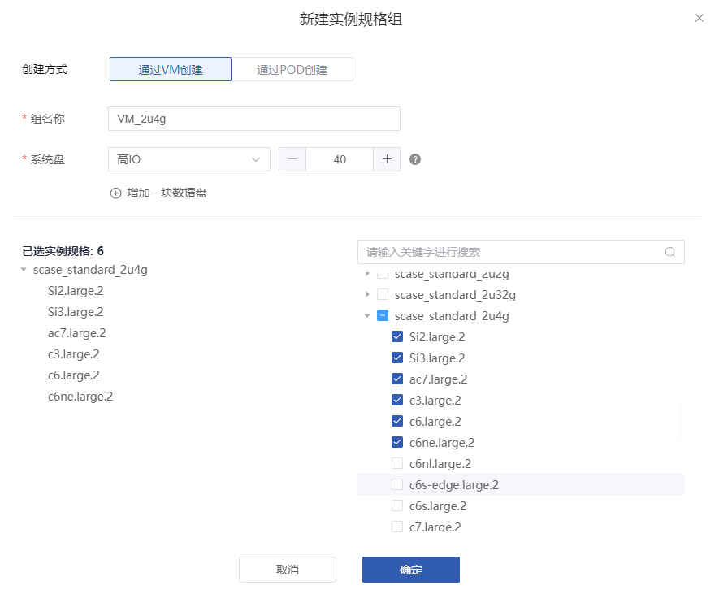{

# 4. 创建Fleet流程

-   应用进程队列(fleet)是一个管理后端服务应用集群的队列，可以支持手动或自动增加后端服务应用的数量，以满足不同的负载需求，

-   使用前提

> 需保证已经创建好"就绪"状态的应用包；
>
> 需要创建好实例规格组；

## 4.1. 创建Fleet

1.  用户登录控制台

2.  进入创建fleet界面；

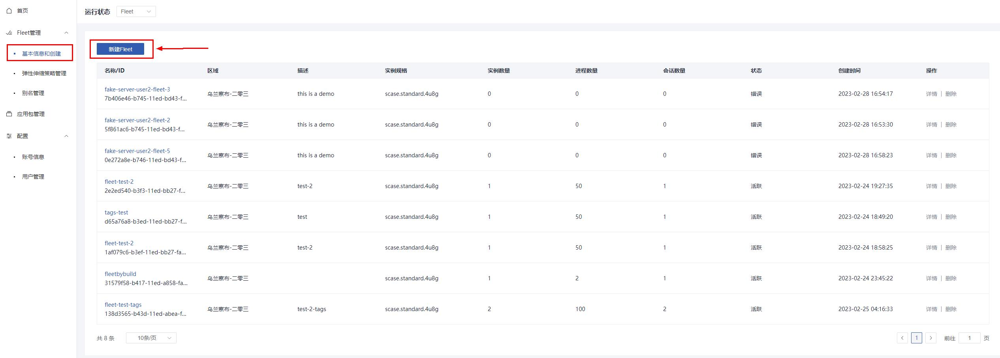

3.  填写创建fleet的相关信息，支持json格式的文件导入，参数详情参考**应用进程队列管理章节**；

4.  点击创建，开始创建fleet。

## 4.2. 检查Fleet是否创建成功

1.  进入fleet列表，找到刚刚创建的fleet；

2.  点击详情，查看fleet信息；

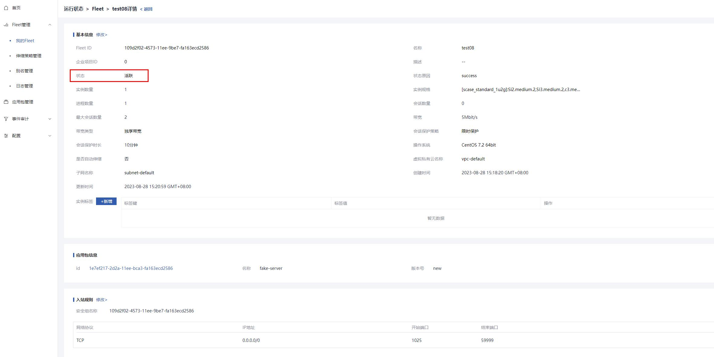

3.  fleet状态由"创建中"转为"活跃"，则创建成功，转为"异常"，则创建失败，在详情页状态原因可初步定位出现异常的步骤，更详细排查原因需管理员查看FleetManager服务日志定位，常见错误见错误信息。

## 4.3. 创建弹性伸缩策略，开启弹性伸缩功能（可选）

-   执行该步骤之前，需保证创建弹性伸缩策略的fleet处于激活状态；

-   当前只支持选择"可用会话比"作为弹性伸缩的基准，可以根据当前可承载的最大会话数、当前会话以及可用会话比的动态关系弹性扩缩容计算资源；

-   使用前提：

> 需要绑定的Fleet为"活跃"状态；

1.  找到弹性伸缩策略创建入口；

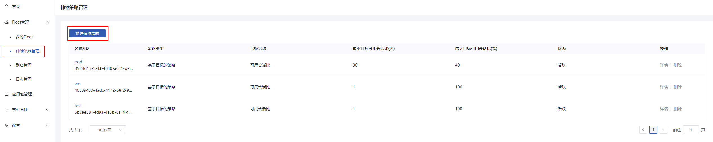

2.  选择弹性伸缩策略，填写参数，点击创建；

> 注：可用会话比=（最大会话数-已用会话数）/最大会话数
>
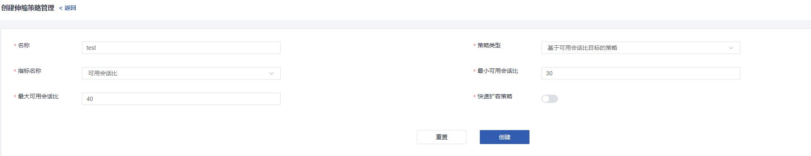

3.  在伸缩策略详情页，选择新建关联；

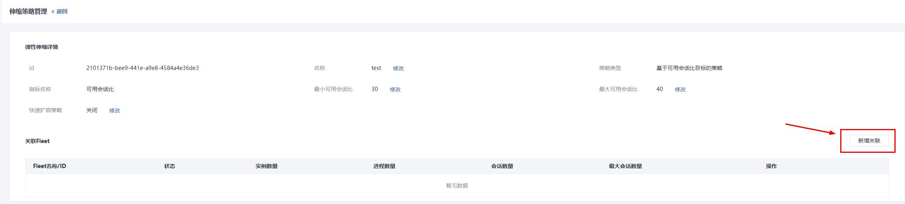

4.  选择策略需要关联的fleet；

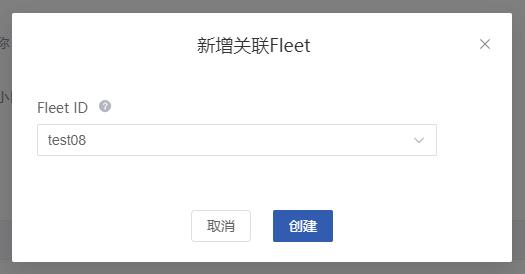

5.  确认弹性伸缩策略是否创建成功；

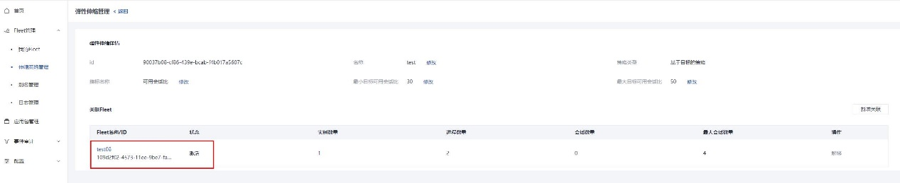

6.  进入弹性伸缩策略所绑定的fleet的详情；

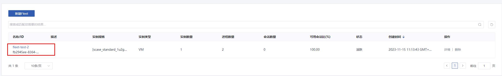

7.  修改 基本信息-\>是否开启弹性伸缩 字段，开启弹性伸缩能力；

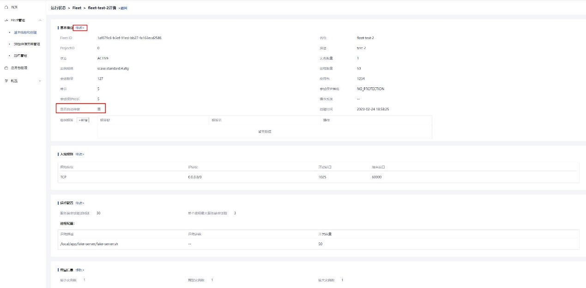

8.  现在GameFlexMatch可以根据负载情况弹性扩缩容计算资源了；

# 5. 创建别名(alias)关联(可选)

-   fleet别名可以提供灰度发布的功能，可以为多个fleet关联同一个alias，在创建会话时可以携带alias_id代替fleet_id来创建会话，并支持不同fleet有不同的权重，加权分配不同会话创建请求；

-   使用前提：

> 需保证关联的fleet的状态是"活跃"激活状态；

## 5.1. 创建应用进程队列别名

1.  进入创建别名界面；

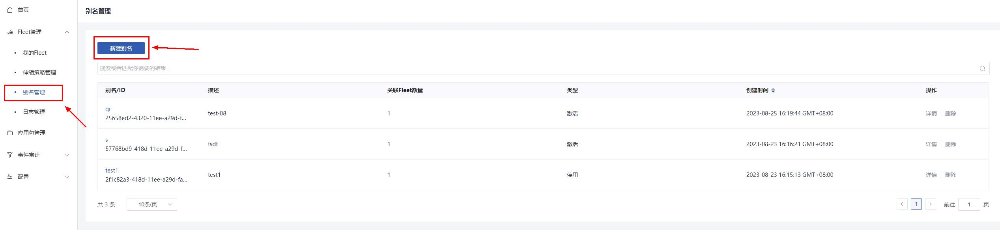

2.  填写别名创建相关信息；

3.  点击创建，完成alias的创建，现在可以使用这个alias创建会话了

# 6. 创建日志接入和转储（可选）

-   日志接入可以将弹性伸缩中的实例产生的应用日志暂存到LTS服务中，可以对日志进行分析记录，也可以配置永久转储至OBS；

-   使用前提：

> 需要配置租户信息中的云服务委托，并正确授权，再进行应用包打包（保证ICAgent正确安装在镜像中）；
>
> 需要配置的Fleet需要为"活跃"状态；

## 6.1. 创建日志接入

1.  进入日志管理界面，点击新建日志；

2.  填写日志接入相关信息，日志接入需要选择一个日志组，若无日志组，则选择日志组的新建；

3.  创建成功后可配置日志自动转储到OBS中，也可选择"否"跳过此步骤，可在日志详情页随时创建；

4.  若选择创建转储，填写创建日志转储参数，点击创建；

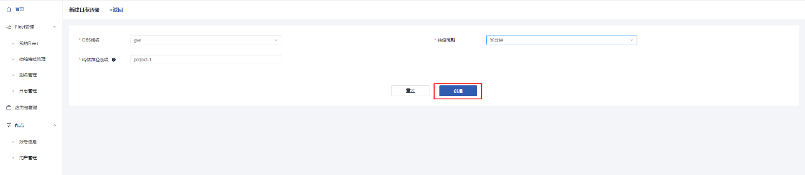

5.  创建成功后日志管理页面则会新增一条记录，可直接点击日志流或者OBS转储路径跳转至对应华为云服务控制台；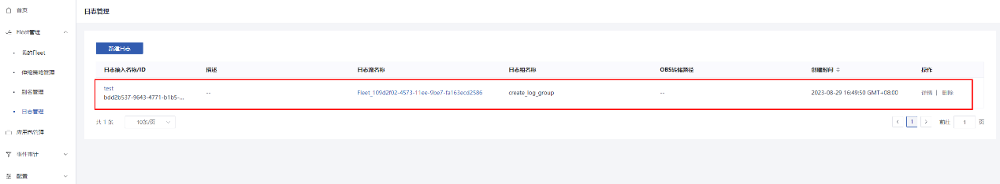