# The Table of Contents {#the-table-of-contents .TOC-Heading}


# Introduction to GameFlexMatch

This service consists of four components: FleetManager, AppGateway,
AASS, and AuxProxy. FleetManager is a global component, AppGateway and
AASS are region-level components, and AuxProxy is a VM-level component.
The following figure shows the overall architecture.

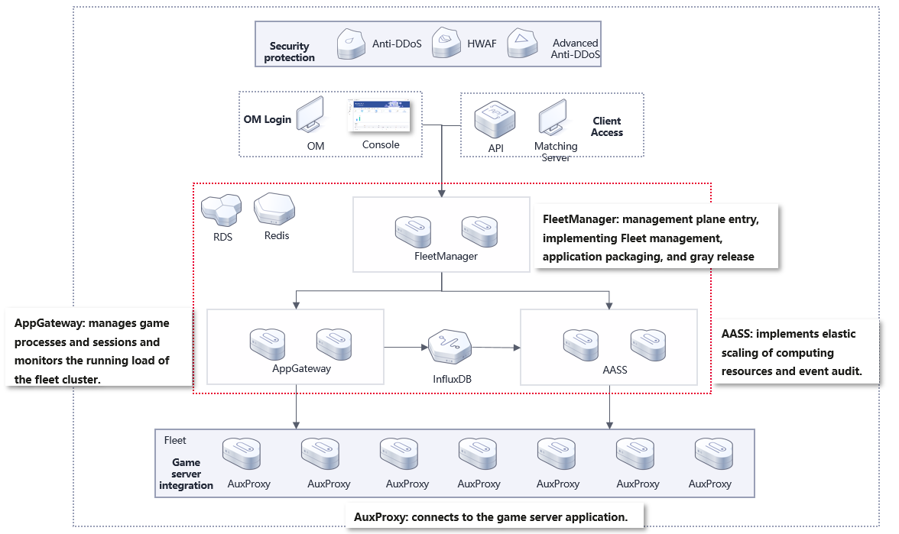

## Component Function

### The FleetManager component provides the following functions:

Deploys and manages applications globally and dynamically, and supports
the configuration of dynamic deployment policies.

### Functions of the AASS component:

Creates applications and manages and executes scaling policies.

-   Determine whether to perform application process resiliency based on
    the system load.

-   Determine the capacity expansion/reduction process and resource
    quantity based on the number of service requests.

-   Interworks with a third-party resource management system to control
    resource application and release.

### AppGateway component functions:

-   Stores and manages sessions (server sessions and client sessions)
    objects (creation, deletion, change, and status statistics), and
    collects statistics on client request status.

-   Manages regional processes (mainly statistics and display).

-   Reporting statistics (including statistics on processes, client
    sessions, server sessions, and client requests)

-   Affinity rule management (Affinity rules are the mapping between the
    client request and the server session, and are used to select the
    application process object of the client request for the
    gateway-proxy.)

### Functions of the AuxProxy component

Management plane component of the host. One component is started on each
VM and manages application processes on the VM.

-   Manages the life cycle of application processes.

-   Monitors application processes and reports the status information
    about application processes, client sessions, and server sessions.

## Console page

This project provides frontend pages developed based on the Vue to
facilitate users to operate and maintain service components and cloud
resources.

# GameFlexMatch Quickly Start 

## Managing users and associating resource users

-   GameFlexMatch users are classified into two types: GameFlexMatch
    users for logging in to the console and HUAWEI CLOUD tenants for
    creating and managing computing and network resources.

-   When logging in to the GameFlexMatch console for the first time, the
    administrator or common user needs to reset the password and
    associate the password with the HUAWEI CLOUD tenant so that the
    GameFlexMatch console can work properly.

### Complete information

1.  Log in to the console using the administrator account and password.
    If the administrator logs in to the console for the first time,
    change the password and log in again.

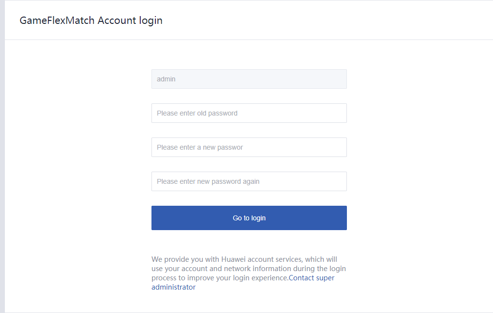

2.  If no resource tenant is associated at the first login, the
    administrator needs to associate the resource tenant first.

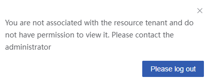
  

3.  **Enter information about associated resource tenants.**

Use tenant information:

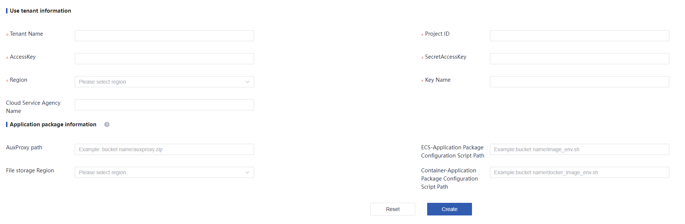

-   **Tenant name**: The name of the tenant bound to the GameFlexMatch platform is also your HUAWEI CLOUD tenant name. You can log in to [IAM-users](https://account-intl.huaweicloud.com/usercenter/#/iam/users) and select a HUAWEI CLOUD tenant.

-   **Project ID**: Project ID of the API used by GameFlexMatch to create resources. To obtain the project ID,  You can log in to [mine-apiCredential](https://console-intl.huaweicloud.com/iam/#/mine/apiCredential) to select the ID of the regional project that you want to bind.

-   **Access Key**: Key used by GameFlexMatch to access APIs. You can obtain it from HUAWEI CLOUD console -> My Credentials -> [Access key](https://console-intl.huaweicloud.com/iam/#/mine/accessKey).

-   **Secret Access Key**: Key used by GameFlexMatch to access APIs. You can obtain it from HUAWEI CLOUD console -> My Credentials -> [Access key](https://console-intl.huaweicloud.com/iam/#/mine/accessKey).

-   **Region**: Resource tenants are used to create regions for GameFlexMatch resources. The information must correspond to the project ID.

-   **Key name**: Login authentication key pair for GameFlexMatch elastic VM capacity expansion. You can use this key pair to log in to the VM of the battle server. You can log in to the DEW console and choose [Key Pair Management](https://console-intl.huaweicloud.com/console/#/dew/kps/kpsList/accountKey) to view the account key pair. If no key pair is available, create one.

-   **Cloud Service Agency Name**: You can choose Identity and Access Management > [Agency] (https://console-intl.huaweicloud.com/iam/#/iam/agencies) on the HUAWEI CLOUD console to view the ICAgent and LTS log dump.
    1.  You can customize the agency name, for example, gfm-lts-agency.
    2.  Select **Cloud Service** for Agency Type.
    3.  Cloud Service: Select ECS.
    4.  Click Next and grant the agency permissions:'APM FullAccess' and'LTS FullAccess'.
    5.  After the agency is created, you can configure the agency name'gfm-lts-agency' to the corresponding location.

Application package information (optional. If this parameter is left blank, the default value is used.)

-   **Auxproxy Path**: OBS path for storing the Auxproxy file. Ensure that **auxproxy.zip** has been uploaded to the OBS path to be configured.
-   **ECS-Application Package Configuration Script Path**: OBS path for storing the script file used to create the ECS resource application package. Ensure that **image_env.sh** has been uploaded to the OBS path to be configured.

-   **Region**: Region where the OBS bucket resides

-   **Container-Application Package Configuration Script Path**: OBS path for storing the script for creating a containerized application package; If a container is used, this parameter is mandatory. Ensure that **docker_image_env.sh** has been uploaded to the OBS path to be configured.

The resource tenant is successfully associated and can use
GameFlexMatch.

## Application upload and image creation

-   The application image contains the AuxProxy service component and
    interconnected backend service applications, and related startup
    configuration has been completed. The template used for elastic VM
    expansion has been configured.

-   Prerequisites:

> Ensure that the resource tenant has configured correct tenant
> information for the management tenant.
>
> Ensure that the uploaded server applications can be started normally.

For details, see the application package part in the guide.

### Creating an Application Package

1.  User login console

2.  Go to the Application Package Management page and click "Create App
    Package" to create an application.

> 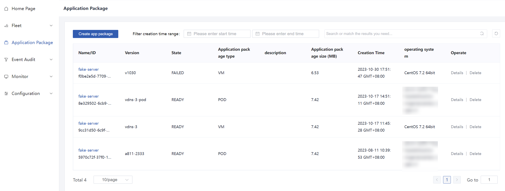

3.  Enter the image creation information and click Create
    Server-Application.

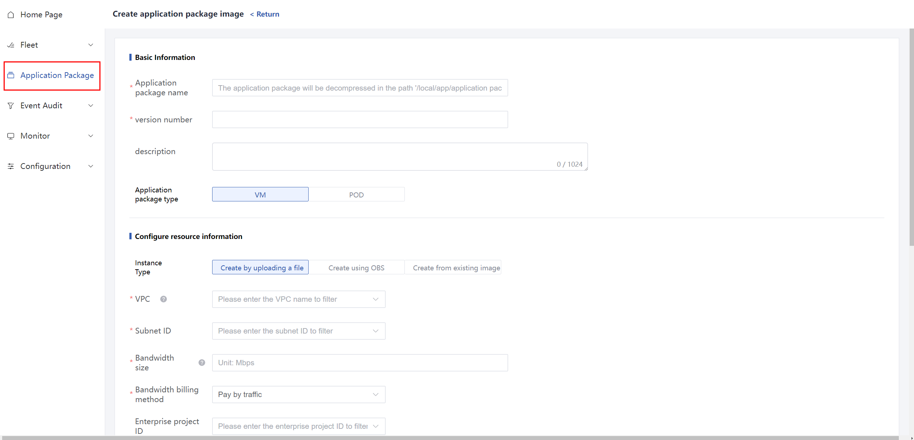

### View the application package details and check the application status.

1.  On the application package management page, find fake-server.

> 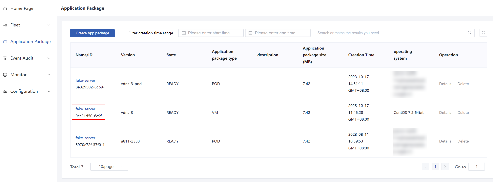

2.  Click to view details and check whether the application status is
    READY.

> 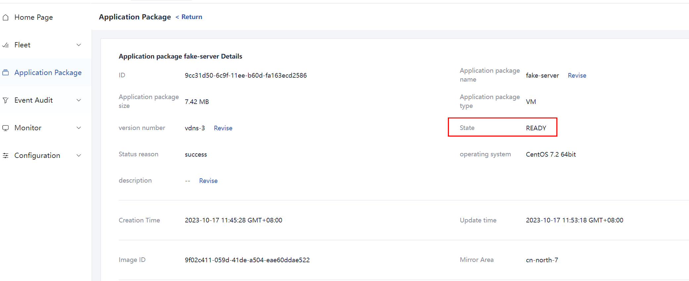

3.  When the status is Ready, you can use the application to create a
    fleet.

## Creating an Instance Flavor

-   An ECS flavor group provides a group of ECS flavors. You can select
    the number of CPU cores and memory size based on service
    requirements.

-   Prerequisites:

> The user tenant information must be correctly configured.

### Operation Procedure

1.  A user logs in to the console.

2.  Choose Configuration \> Instance Flavor Group and create a new
    flavor group.

> 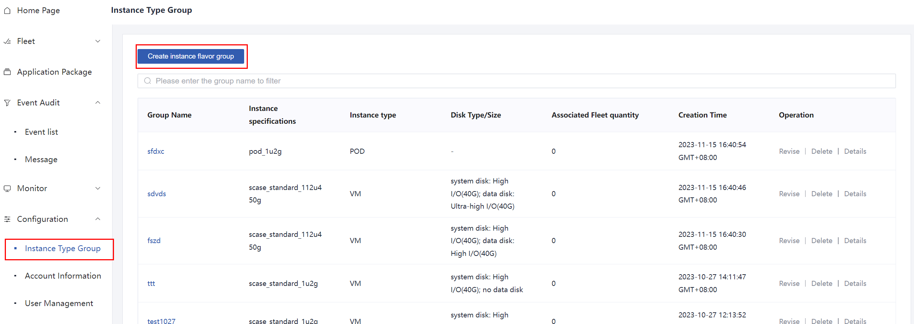

3.  Create an instance specification. For example, the 2U4G instance
    specification of the VM type is used. Enter the instance
    specification group name, select the instance specification, and
    click OK.

> 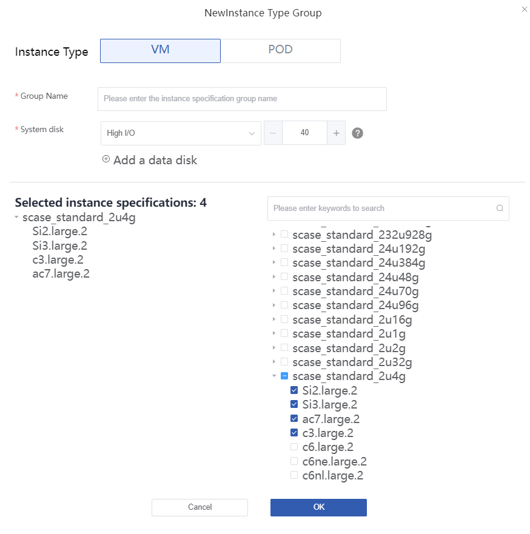

## Process for creating a fleet

-   An application process queue (fleet) is a queue that manages backend
    service application clusters. The number of backend service
    applications can be manually or automatically increased to meet
    different load requirements,

-   Prerequisites

> An application package in the Ready state has been created.
>
> You need to create an instance specification group.

### Creating a Fleet

1.  User login console

2.  The page for creating a fleet is displayed.

> 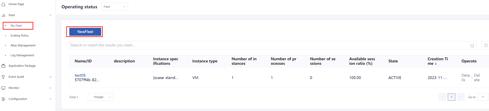

3.  Enter the fleet creation information. JSON files can be imported.
    For details about the parameters, see the application process queue
    management section.

4.  Click Create to create a fleet.

> 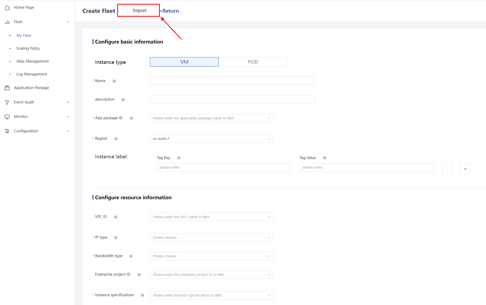

### Check whether the Fleet is successfully created.

1.  Go to the fleet list and find the newly created fleet.

> 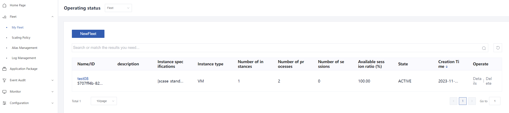

2.  Click Details to view the fleet information.

> 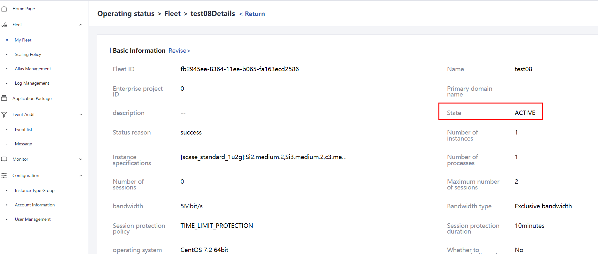

3.  If the fleet status changes from Creating to Active, the creation is
    successful. If the fleet status changes from Creating to Abnormal,
    the creation fails. You can locate the fault in the details page.
    For details, view the FleetManager service logs. For common errors,
    see Error Information.

### (Optional) Create an Scaling policy and enable the Scaling function.

-   Before performing this step, ensure that the fleet for which the
    Scaling policy is created is activated.

-   Currently, only the available session ratio can be selected as the
    benchmark. Computing resources can be scaled in or out based on the
    maximum number of sessions that can be carried, the current session,
    and the dynamic relationship between the available session ratio.

-   Prerequisites:

> The Fleet to be bound is in the Active state.

1.  Find the entry for creating an Scaling policy.

> 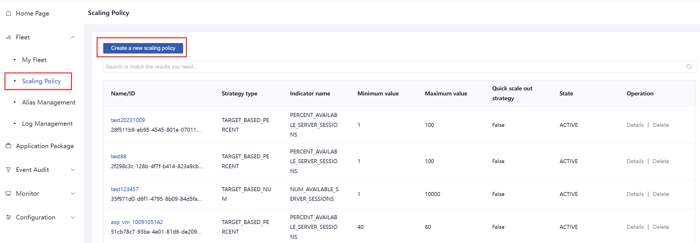

2.  Select an Scaling policy, set parameters, and click Create.

> Note: Rate of available sessions = (Maximum number of sessions -
> Number of used sessions)/Maximum number of sessions
>
> 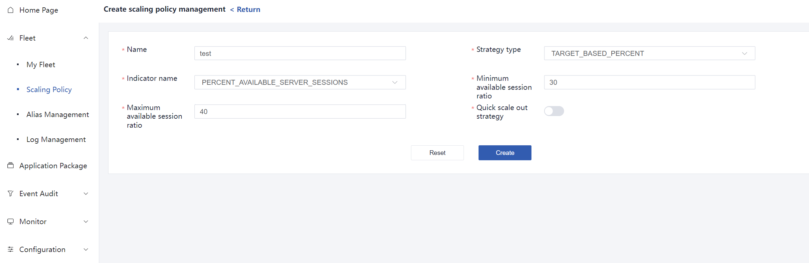

3.  On the Scaling policy details page, click Create Association.

> 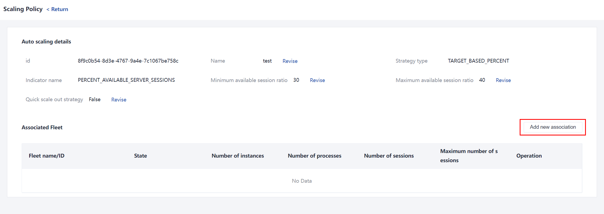

4.  Select the fleet to be associated with the policy.

> 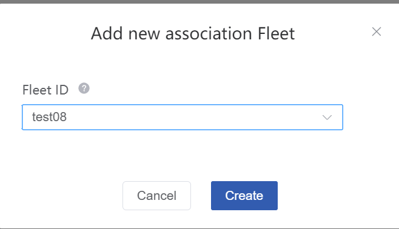

5.  Check whether the Scaling policy is successfully created.

> 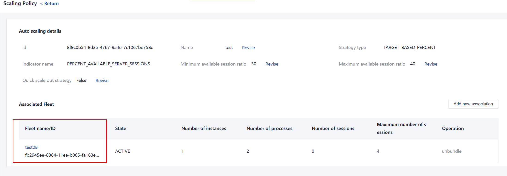

6.  The details about the fleet bound to the Scaling policy are
    displayed.

> 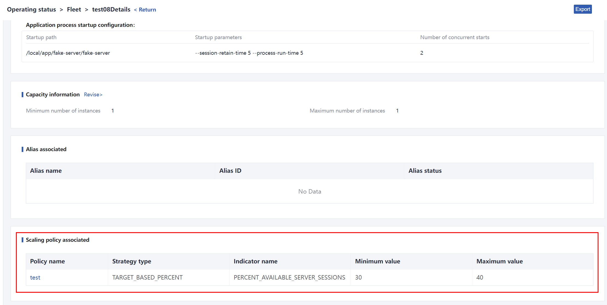

7.  Modify Basic Information \> Enable Auto Scaling to enable the auto
    scaling capability.

> 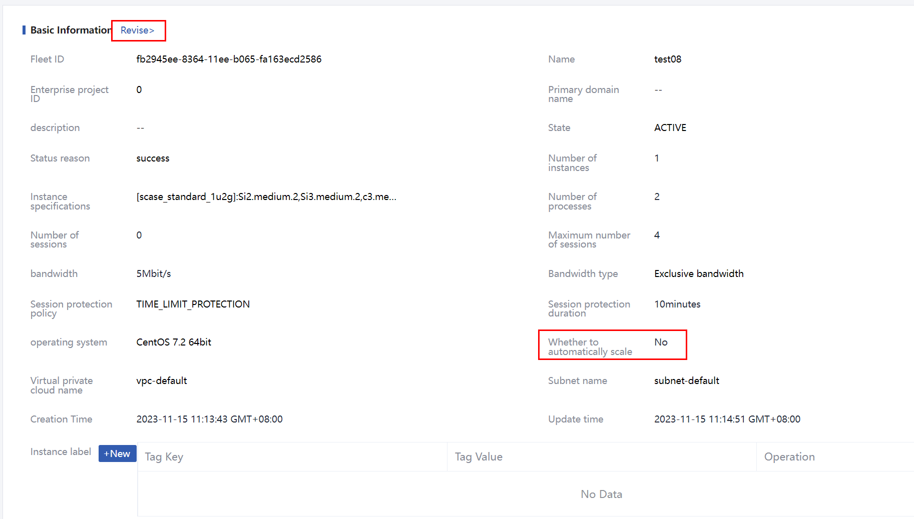

8.  Now, GameFlexMatch can flexibly scale computing resources based on
    the load.

## (Optional)Creating an alias association

-   The fleet alias supports dark launch. Multiple fleets can be
    associated with the same alias. When creating a session, alias_id
    can be carried instead of fleet_id to create a session. Different
    fleets have different weights and different session creation
    requests can be weighted.

-   Prerequisites:

> Ensure that the associated fleet is in the Active state.

### Create Apply Process Queue Alias

1.  The page for creating an alias is displayed.

> 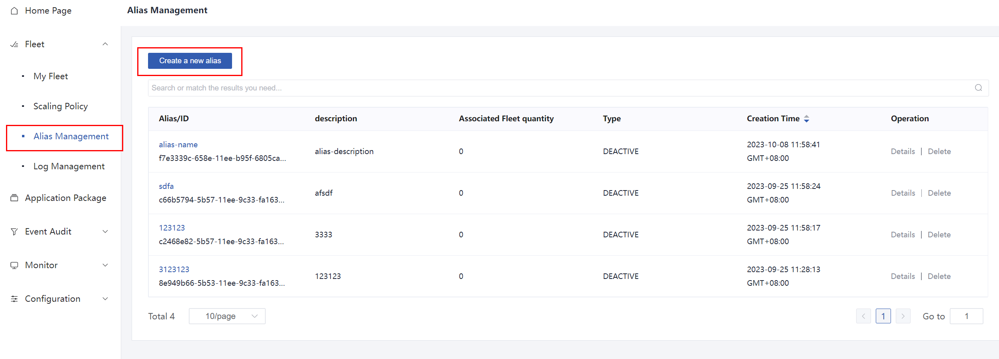

2.  Enter the alias creation information.

> 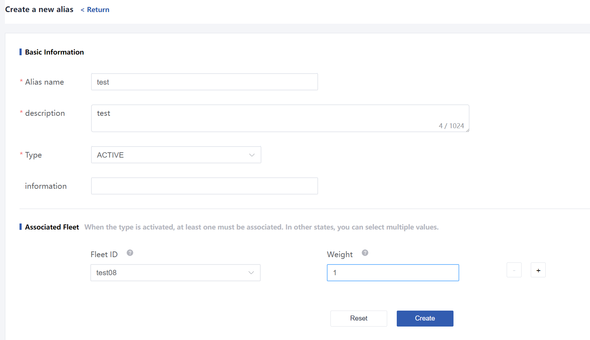

3.  Click Create to create an alias. Now you can use the alias to create
    a session.

## (Optional) Creating Log Ingestion and Dump

-   Log Access allows you to temporarily store application logs
    generated by instances in Scaling group to LTS, analyze and record
    the logs, or permanently dump the logs to OBS.

-   Prerequisites:

> You need to configure the cloud service agency in the tenant
> information, correctly authorize the cloud service agency, and pack
> the application package (ensure that the ICAgent is correctly
> installed in the image).
>
> The Fleet to be configured must be in the Active state.

### Creating Log Access

1.  On the Log Management page, click New Log.

> 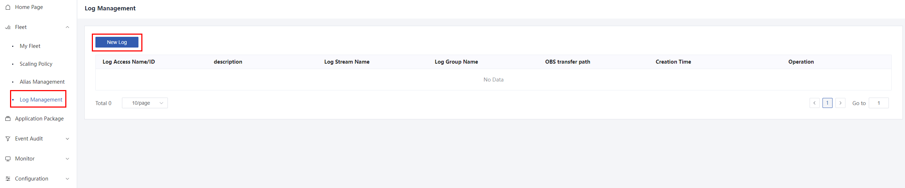

2.  Enter information about log access. You need to select a log group
    for log access. If there is no log group, create a log group.

> 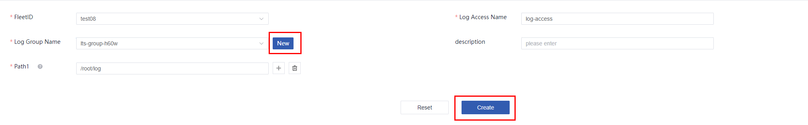

3.  After the creation is successful, you can configure the automatic
    transfer of logs to OBS. You can also select No to skip this step
    and create a log at any time on the log details page.

> 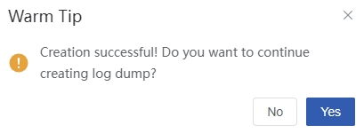

4.  If you select Create log transfer, set the parameters for creating
    log transfer and click Create.

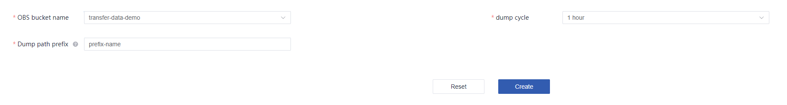

5.  After the creation is successful, a new record is displayed on the
    Log Management page. You can click the log stream or OBS path to go
    to the corresponding HUAWEI CLOUD service console.
    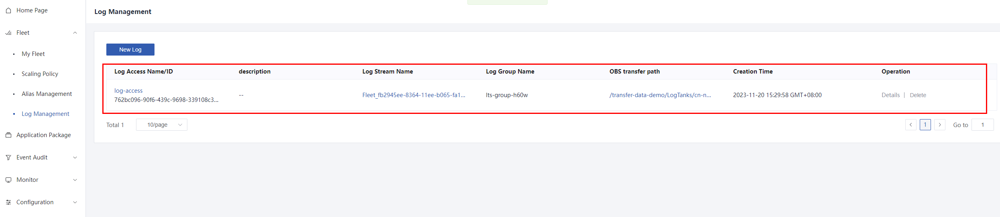

# Home Page

## Brief Introduction

-   The home page displays the overall running status of the
    GameFlexMatch tenant in a region, including the number of Fleets,
    instances, processes, and sessions.

-   Displays the number of instances, processes, and sessions in each
    Fleet in a chart.

-   Displays the number of instances, processes, and sessions in
    different states in each Fleet in a chart.

## Operation

· Click the homepage to view the overall running status.

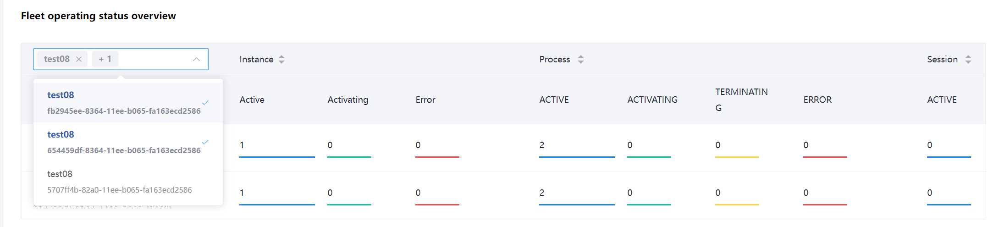

· To view the running status of several Fleets, choose Home \> Fleet
Running Status. You can select multiple Fleets.

# User management

GameFlexMatch uses GameFlexMatch users to manage HUAWEI CLOUD tenants.
Users can be associated with tenants to manage HUAWEI CLOUD resources.
Multiple users can be associated with one tenant, and a user can be
associated with multiple tenants. Instant switchover is supported.

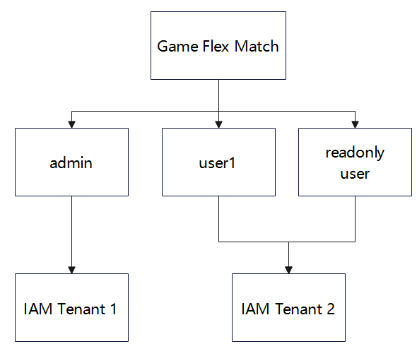

## Initial Login Operation

1.  When the project is started, the system checks whether the database
    has an account. If no account exists, the system initializes a super
    administrator account. The default password is the value of
    "DEFAULT_LOGIN_PASSWORD" in the fleetmanager_run.sh script.

2.  On the login page, enter the user name "admin" and password.

3.  You need to change the default password upon the first login. If the
    password is changed successfully, the system automatically logs out
    and logs in again.

4.  After the login is successful, the response data contains
    Auth-Token. All APIs except the login API must carry Auth-Token in
    the request header for authentication (see chapter 12 API invoking).

5.  Description:

    a.  For the token generated based on the JWT architecture, you can
        set the key for generating the token and the expiration time in
        the environment variable. The corresponding fields are JWTKEY
        and JWT_TOKEN_LIFETIME.

    b.  A login operation is a session request. The session expiration
        time can be set by the LOGIN_SESSION_LIFETIME field in the
        script file. If the session expires, the session will not be
        renewed and you need to log in again.

6.  Frozen accounts cannot be used to log in to the system.

7.  After you log out, the current cookies will be deleted and the
    original token cannot be used.

Description of user types

| **User  type**      | **Value** |
| ------------------- | --------- |
| Read-only user      | 0         |
| Common user         | 5         |
| Super administrator | 9         |

Description of the activation state

| **Activated  state**                                         | **Value** |
| ------------------------------------------------------------ | --------- |
| Inactive. The password is not changed  upon the first login. | 0         |
| Activated, password changed                                  | 1         |
| If the account is frozen and the password  is incorrect for five consecutive times, the administrator needs to reset the  password. | - 1       |

## User management

### Creating a User

Administrators can create sub-users to manage the platform. Common users
and read-only users are supported. Common users have the permission to
modify resources on the platform. Read-only users can only view
resources on the platform.

-   Administrator Creating a User.

1.  Administrator Login

2.  Find the entry for adding a user.

> 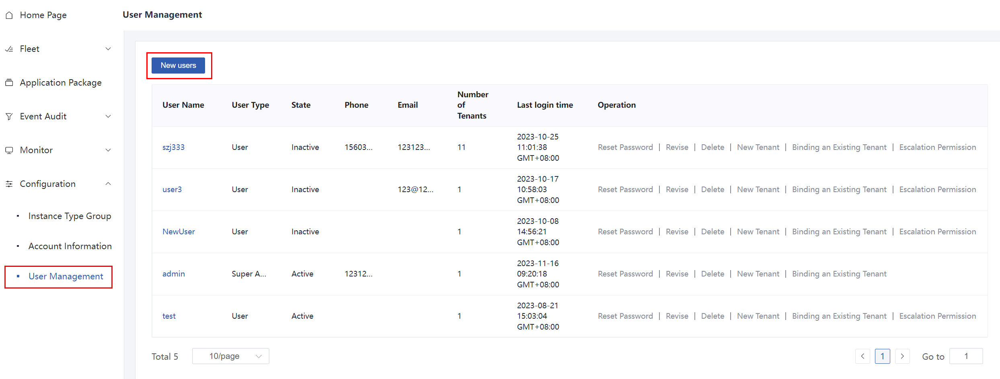

3.  Add a common user. NewUser is used as an example.

> 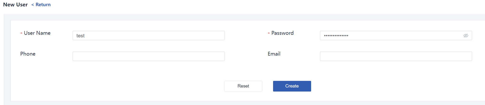

4.  The administrator associates the resource tenant with the new user.

> 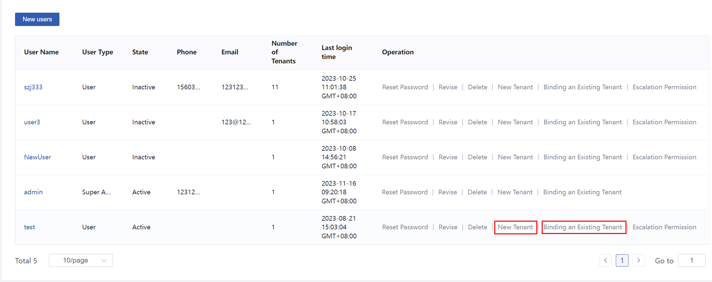

5.  Viewing user Details

> 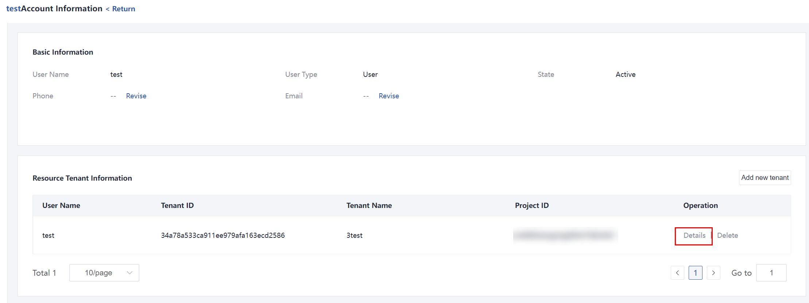

6.  Viewing Resource Tenant Information Associated with current user.

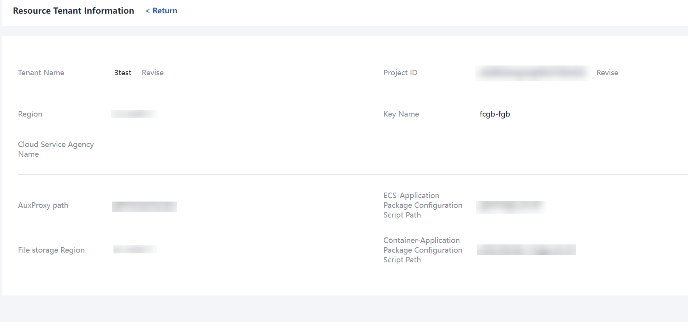

### Modify a User

A user can modify only personal information (email address and phone
number). The super administrator can modify the personal information,
activation status, and user type of a user, and reset the password.

1\. Log in to the console as the administrator.

2\. Choose Configuration \> User Management, select the user to be
modified, and click Modify or Reset Password.

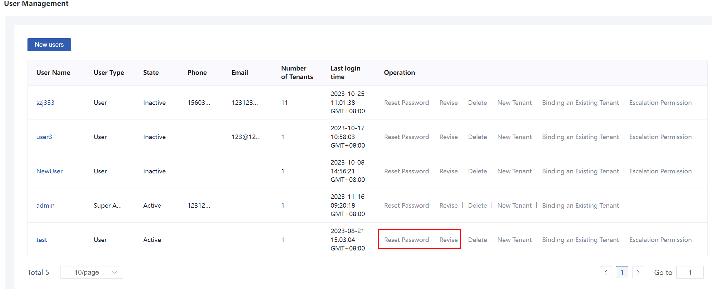

### Delete user

1.  Log in to the console as the administrator.

2.  Choose Configuration \> User Management, select the user to be
    deleted, and click Delete.

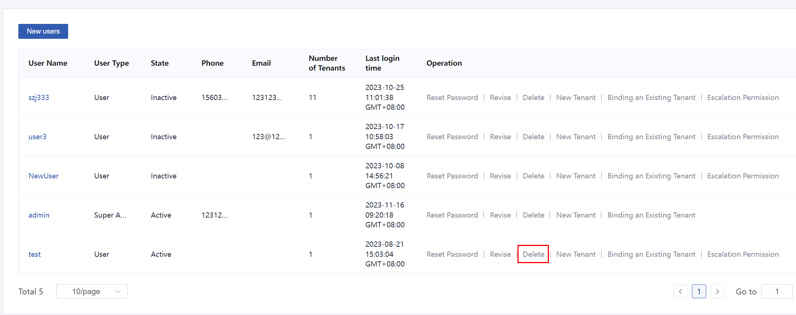

## Tenant management

Tenant management is an important part of GameFlexMatch. Platform users
create and manage HUAWEI CLOUD resources through associated HUAWEI CLOUD
tenants.

### Creating a Tenant

You can create a tenant in any of the following modes:

-   The administrator logs in to the system for the first time.

-   The administrator adds a user.

-   The administrator adds a tenant for the user on the console.

To add a tenant, perform the following steps:

1.  Choose Configuration \> User Management and add a tenant for the
    target user.

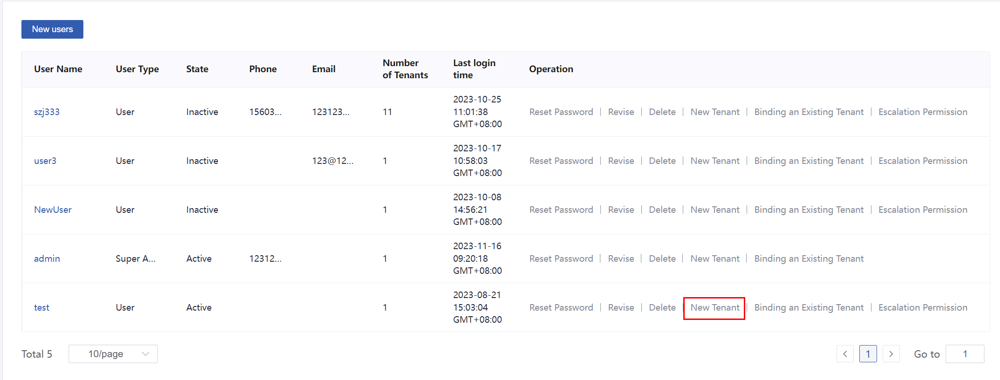

2.  Parameters for creating a tenant are as follows:

Use the tenant information:

-   Tenant name: name of the GameFlexMatch platform tenant information

-   Project ID: specifies the ID of the API project used by
    GameFlexMatch to create resources. You can obtain the project ID by
    choosing My Credential \> API Credential on the HUAWEI CLOUD
    console.

-   Access Key: specifies the key used by GameFlexMatch to access APIs.
    You can obtain the key by choosing My Credential \> Access Key on
    the HUAWEI CLOUD console.

-   Secret Access Key: specifies the key used by GameFlexMatch to access
    APIs. You can obtain the key by choosing My Credential \> Access Key
    on the HUAWEI CLOUD console.

-   Region: indicates the region where the resource tenant creates
    GameFlexMatch resources.

-   Key name: Login authentication key used during VM scaling by
    GameFlexMatch

-   Cloud Service Agency Name: This parameter is used to install ICAgent
    during image packing and use LTS to dump logs.

Application package information (Optional. If this parameter is left
blank, the default parameter is used.)

-   Auxproxy Path: OBS path for storing Auxproxy files.

-   ECS-Application Package Configuration Script Path: OBS path for
    storing the script file used to create ECS resource application
    packages.

-   Region: indicates the region where the OBS bucket is located.

-   Container-Application Package Configuration Script Path: OBS path
    for storing the script for creating container resource application
    packages. If a container is used, this parameter is mandatory.

3.  Click Create to complete the creation process.

### Querying a Tenant

1.  Log in to the platform as the administrator.

2.  Choose Configuration \> User Management and select a user.

3.  Click the resource tenant details to view the details.

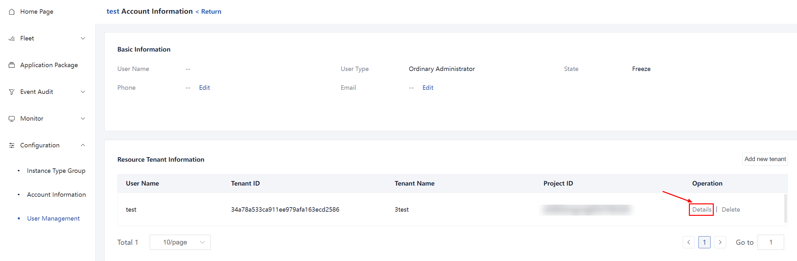

### Binding a Tenant

The administrator binds an existing tenant to the user so that the
tenant information can be reused.

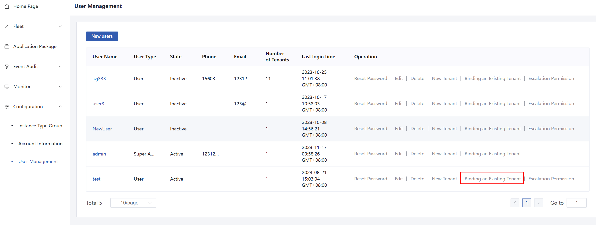

### Switch a Tenant

1.  Logging In to the GameFlexMatch Console

2.  Click in the upper right corner to switch to the associated resource
    tenant.

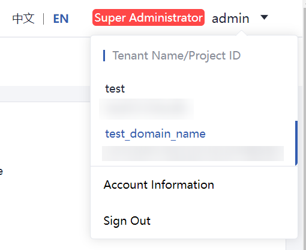

### Delete a Tenant

1.  Log in to the console as the administrator.

2.  On the User Management page, select a user and select the tenant to
    be deleted in the Account Information area.

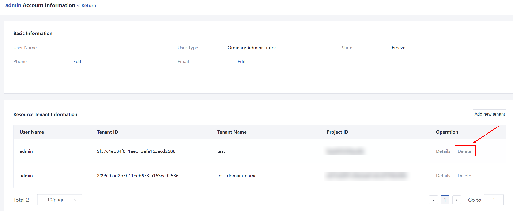

# Application package management

## Creating an Application Package

### Operation Scenario

You can upload an application package to be hosted to the GameFlexMatch
platform to automatically generate an application package image with the
monitoring and reporting plug-ins installed and use the image to create
a fleet. The VM and POD image packaging modes are supported. You can
also bind an existing private image in HUAWEI CLOUD IMS or SWR to
quickly build a fleet.

### Creation Instructions

Before creating an application package by uploading a file or using OBS,
create the required VPC and subnet under the current resource tenant.

### Operation Procedure

1.  Upload the following files to the OBS bucket of the management
    account:

    a.  The Auxproxy service component package, which can be in ZIP or
        RAR format. (Ensure that each file is stored in the same
        directory and does not need to be contained in the auxproxy
        folder.)

    b.  Image packaging environment building scripts "image_env.sh" (VM
        instance image) and "docker_image_env.sh" (Pod instance image)

    c.  the application package (zip or rar) to the OBS bucket of the
        resource account.

2.  In the application image, the application is decompressed in the
    /local/app/{Name of the created application package} directory by
    default. Adjust the application startup script based on the
    directory or modify the application download path in the environment
    building script.

3.  Add the following parameters to the FleetManage_run.sh script for
    starting the FleetManger server components:

> OBS path of the environment build script:
>
> export DEFAULT_AUXPROXY_PATH=Bucket name/auxproxy.zip
>
> OBS Path of the Auxproxy Service Component Package
>
> export DEFAULT_SCRIPT_PATH=Bucket name/image_env.sh

4.  Log in to the GameFlexMatch management console.

5.  Choose Application Package Management \> Create Application Package.

6.  Select the required creation mode and set parameters such as the
    application package name and version number. The following table
    describes the key parameters.

| **Parameters**           | **Explained**                                                | **Example Value** |
| ------------------------ | ------------------------------------------------------------ | ----------------- |
| Application Package Name | Indicates the name of the  created application package. The name contains 2 to 50 characters, which  starts with a letter and consists of letters, digits, underscores (_), and  hyphens (-). | server            |
| Version Number           | Version number of the  created application package. The value contains 1 to 50 characters. | 1.0.0             |
| Application Package Type | Specifies the type of the  created application package. If the value is POD, the SWR image is created.  If the value is VM, the IMS image is created. | VM                |
| VPC                      | Specifies the VPC ID, which  is used to bind the ECS where the image is created. | -                 |
| Subnet                   | Specifies the subnet ID,  which is used to bind the ECS for creating an image. | -                 |
| Operating system         | If Application Package Type  is set to VM, the ECS OS used for creating an image is the underlying OS.  CentOS is recommended. To view the OS, choose HUAWEI CLOUD Console > IMS  > Public Images. When POD is selected for Application Package Type, the  value is the underlying operating system in the container. | CentOS 7.2 64bit  |
| OBS bucket               | OBS bucket name, which is  used to store application package files. | GameFlexMatch     |
| Storage Path             | OBS application package  file path                           | build/server.zip  |

7.  After the parameters are set, click Create.

8.  When the application package status is Ready, it can be used to
    create a fleet.

## Modifying an Application Package

### Operation Scenario

You can modify an application package as required. You can modify the
name, version number, and description of an application package.

### Operation Procedure

1.  Log in to the GameFlexMatch management console.

2.  Choose Application Package Management.

3.  In the application package list, locate the row that contains the
    target application package, and click Details.

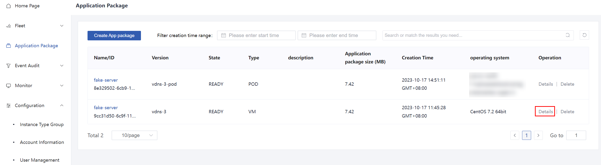

4.  Click Modify next to the parameter and enter the content to be
    modified in the text box.

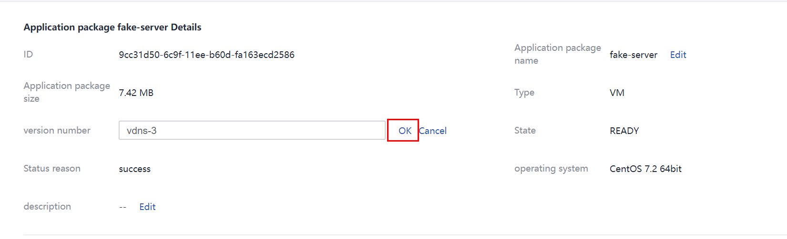

5.  Click OK.

## Delete an application package

### Operation Scenario

You can delete an application package that you no longer need.

### Delete Instructions

Before deleting the application package, check whether the application
package is associated with a fleet that is not in the terminated state.
If yes, the application package cannot be deleted.

### Operation Procedure

1.  Log in to the GameFlexMatch management console.

2.  Choose Application Package Management.

3.  In the application package list, locate the row that contains the
    target application package, and click Delete.

> 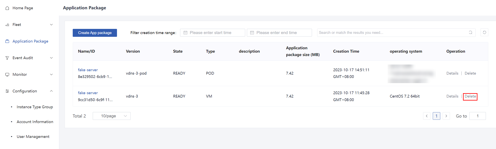

4.  In the displayed dialog box, click OK.

# Creating a DB Instance Flavor Group

The GameFlexMatch platform supports the creation of instance
specification group templates in advance. You can select the template
when creating a fleet.

## Creating a VM Instance Specification Group

### Operation Scenario

For ECS instance specifications with the fleet type as ECS, a maximum of
10 ECS models can be selected under the same flavor. The fleet is
created based on the selected flavor priorities.

### Operation Procedure

1.  Choose Configuration \> Instance Specification Group and click
    Create Instance Flavor Group.

> 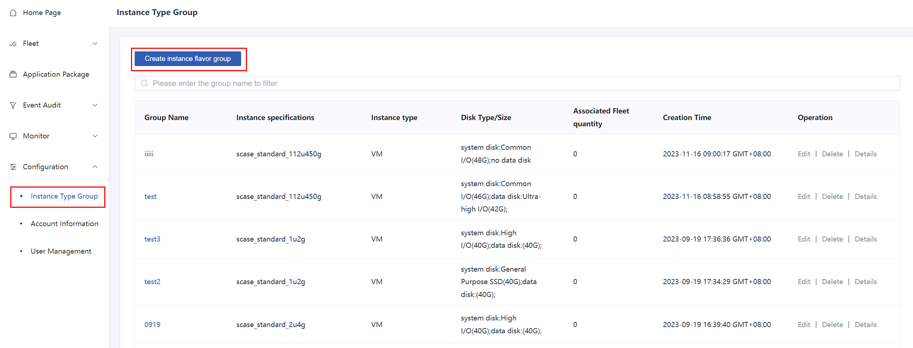

2.  Select the VM type instance, enter the group name, select the
    required instance specifications in sequence, and click OK.

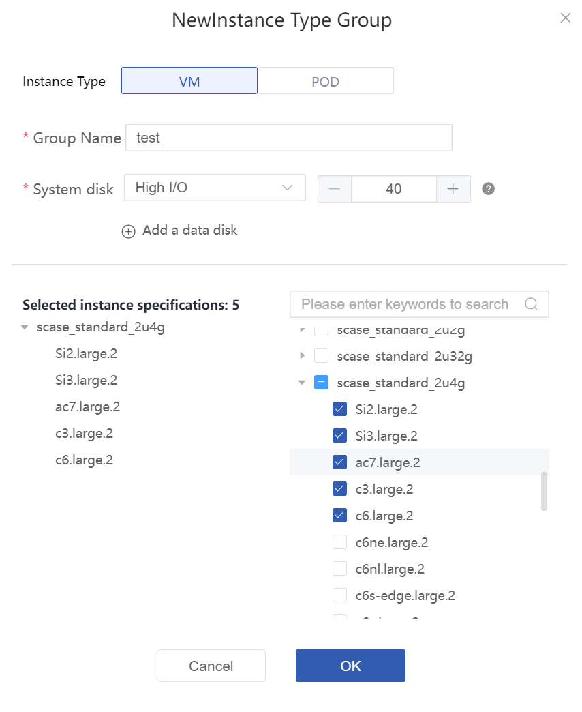

## Creating a Pod Instance Flavor Group

### Operation Scenario

Allows users to create a specification group of the pod type, select the
VM type, and select the CPU and memory size of the pod instance.

### Operation Procedure

1.  Choose Configuration \> Instance Specification Group and click
    Create Instance Specification Group.

2.  Select the VM type instance, enter the group name, select the
    required instance specifications in sequence, and click OK.

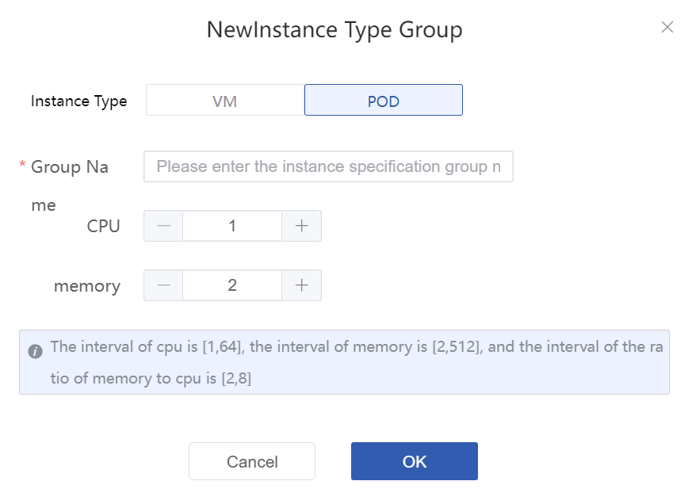

# Process Queue Management

## Create Apply Process Queue

### Operation Scenario

The GameFlexMatch platform provides global dynamic deployment and
management of application processes. You can create application process
queues to carry your service applications and provide services for
external systems. VM or POD instances can be created.

### Operation Procedure

1.  Log in to the GameFlexMatch management console.

2.  Choose Fleet Management \> My Fleet \> Create Fleet.

> 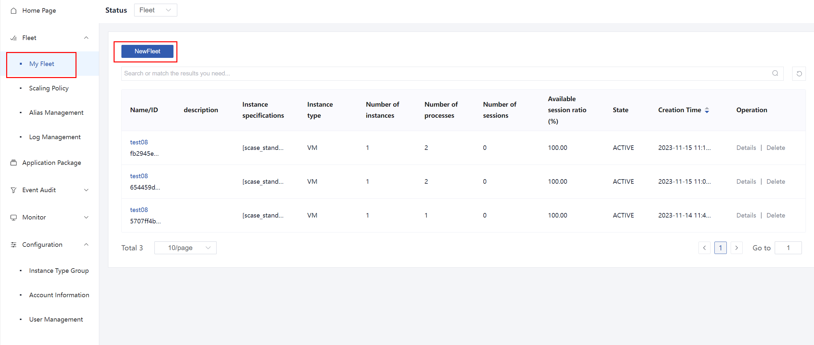

3.  Configure parameters such as basic information and resource
    information. You can import parameters in a JSON file or export a
    JSON file based on the entered parameters. The following table
    describes the key parameters.

| **Parameters**           | **Explained**                                                | **Example Value** |
| ------------------------ | ------------------------------------------------------------ | ----------------- |
| Application Package Name | Indicates the name of the  created application package. The name contains 2 to 50 characters, which  starts with a letter and consists of letters, digits, underscores (_), and  hyphens (-). | server            |
| Version Number           | Version number of the  created application package. The value contains 1 to 50 characters. | 1.0.0             |
| Application Package Type | Specifies the type of the  created application package. If the value is POD, the SWR image is created.  If the value is VM, the IMS image is created. | VM                |
| VPC                      | Specifies the VPC ID, which  is used to bind the ECS where the image is created. | -                 |
| Subnet                   | Specifies the subnet ID,  which is used to bind the ECS for creating an image. | -                 |
| Operating system         | If Application Package Type  is set to VM, the ECS OS used for creating an image is the underlying OS.  CentOS is recommended. To view the OS, choose HUAWEI CLOUD Console > IMS  > Public Images. When POD is selected for Application Package Type, the  value is the underlying operating system in the container. | CentOS 7.2 64bit  |
| OBS bucket               | OBS bucket name, which is  used to store application package files. | GameFlexMatch     |
| Storage Path             | OBS application package  file path                           | build/server.zip  |

4.  After the parameters are set, click Create.

5.  Wait for the creation. If the Fleet status is Active, the Fleet is
    successfully created. If the Fleet status is Abnormal, locate the
    fault by referring to the fault guide.

## Modifying the application process queue

### Operation Scenario

When managing application process queues, you can modify the basic
information, inbound rules, running configuration, and capacity
information about the application process queues as required.

### Operation Procedure

1.  Log in to the GameFlexMatch management console.

2.  Choose Fleet Management \> My Fleet.

3.  In the Fleet list, locate the row that contains the target Fleet,
    and click Details.

> 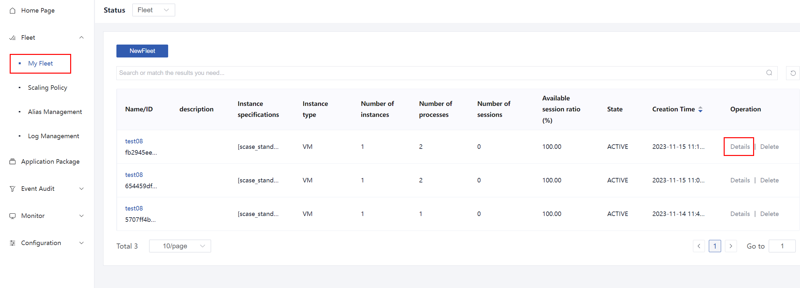

4.  Click "Edit" and enter the content to be modified in the dialog box
    that is displayed.

> 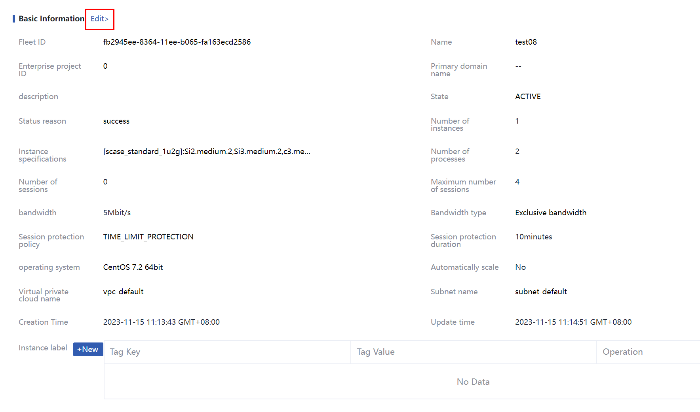

5.  Click Save.

## Deleting the Apply Process Queue

### Operation Scenario

You can delete an apply process queue when you no longer need it.

### Delete Instructions

Before deleting a Fleet, check whether the Fleet is associated with an
alias. If yes, the Fleet cannot be deleted.

### Operation Procedure

1.  Log in to the GameFlexMatch management console.

2.  Choose Fleet Management \> My Fleet.

3.  In the Fleet list, locate the row that contains the target Fleet,
    and click Delete.

> 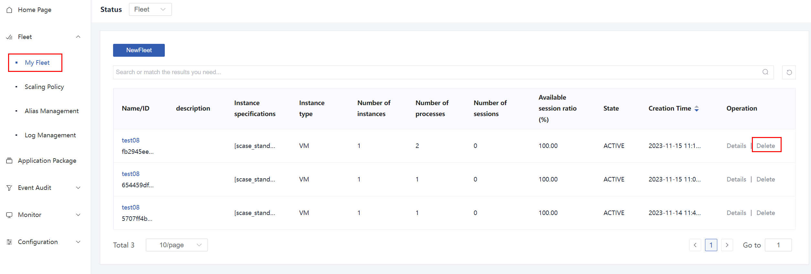

4.  In the displayed dialog box, click OK.

# Auto-Scale policy management

## Creating an Scaling Policy

### Operation Scenario

When using the application process queue, you can create and bind an
Scaling policy to control the scaling policy of the application process
queue.

### Operation Procedure

1.  Log in to the GameFlexMatch management console.

2.  Choose Fleet Management \> Scaling Policy \> Create new scaling
    policy.

> 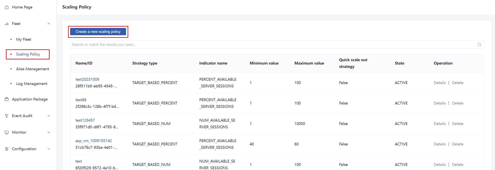

3.  Set parameters such as Name, Policy Type, and Indicator. The
    following table describes the key parameters.

| **Parameters**                          | **Explained**                                                | **Example Value**        |
| --------------------------------------- | ------------------------------------------------------------ | ------------------------ |
| Name                                    | Name of the created **SCALING** policy.                      | -                        |
| Policy Type                             | Specifies the type  of the scaling policy. Currently, target-based policies are supported. | Goal-based Policy        |
| Indicator Name                          | Indicates the name  of the indicator to be controlled by the policy. Currently, the available  session percent and number are supported. | Available Session  Ratio |
| Maximum Target  Available Session Ratio | This parameter  specifies the threshold for reducing the number of application process  queues. | 60                       |
| Minimum target  available session ratio | This parameter  determines the capacity expansion threshold of the application process queue. | 30                       |

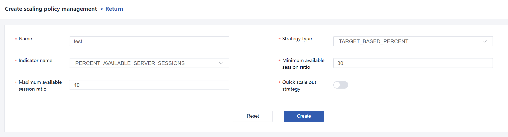

4\. After the parameters are set, click Create.

## Modifying an Scaling Policy

### Operation Scenario

When managing an application process queue, you can modify the Scaling
policy bound to the application process queue. Parameters that can be
modified include the name, measure name, and target value.

### Operation Procedure

1.  Log in to the GameFlexMatch management console.

2.  Choose Fleet Management \> Scaling Policy Management.

3.  In the Scaling policy list, locate the row that contains the target
    Scaling policy, and click Details.

4.  On the details page, click Modify next to the parameter, enter the
    modified content, and click Save.

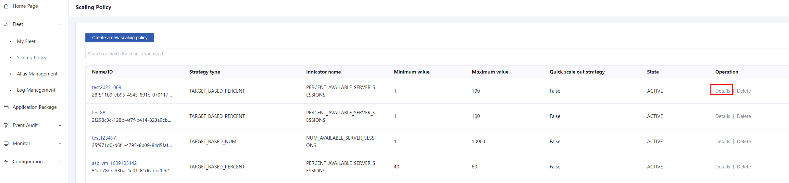

## Deleting an Scaling Policy

### Operation Scenario

You can delete an Scaling policy that is no longer required.

### Operation Procedure

1.  Log in to the GameFlexMatch management console.

2.  Choose Fleet Management \> Scaling Policy Management.

3.  In the Scaling policy list, locate the row that contains the target
    Scaling policy, and click Delete.

> 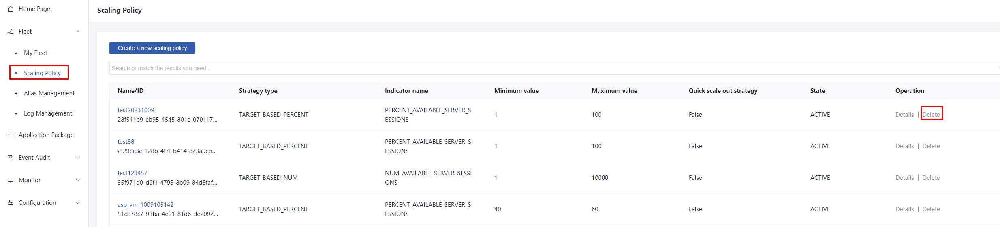

4.  In the displayed dialog box, click OK.

# Alias Management

## Creating aliases

### Operation Scenario

You can create aliases for the application process queue (fleet). You
can use aliasId to replace fleetId to create sessions to complete the
gray release update process. In addition, you can configure different
weights for different fleets and allocate different session creation
requests in weighted mode.

### Creation Instructions

Ensure that all fleets associated with the alias are activated. The
weight of each fleet is a relative weight. The value is an integer
ranging from 0 to 100.

### Operation Procedure

1.  Logging In to the GameFlexMatch Console

2.  Choose Fleet Management \> Alias Management \> Create Alias.

> 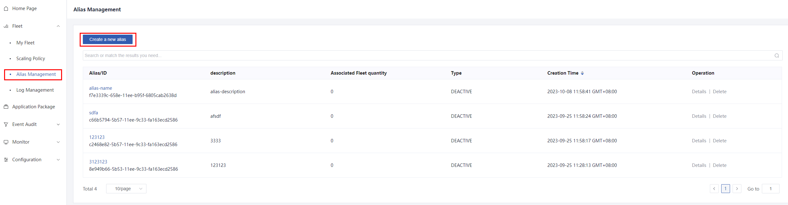

3. Set the required parameters.

| Parameters           | Description                                                  | Type   |
| -------------------- | ------------------------------------------------------------ | ------ |
| **aliases**          | The alias name contains 1 to 1024 characters.  It starts with a letter and consists of letters, digits, underscores (_), and  hyphens (-). | string |
| **Description**      | Description of the alias (1 to 1024  characters)             | string |
| **Type**             | Alias type (activated/deactivated). Alias of  the activated type can be used to create sessions. | enum   |
| **Message**          | Alias message, which is returned when a  session is created with an alias of the disabled type (1 - 1024 characters) | string |
| **Associated Fleet** | Select the fleet to be associated with the  alias and set the weight of the fleet. A maximum of 10 fleets can be  associated. | array  |
| **Fleet ID**         | Specifies the ID of the associated fleet. The  value is a 32-bit UUID. | string |
| **Weight**           | The value ranges from 0 to 100.                              | int    |

4.  After the parameters are set, click Create.

## Modifying aliases

### Operation Scenario

You can modify the alias name, description, type, message, and
associated fleet when the alias name, description, type, message, and
associated fleet need to be added, deleted, or modified. If the fleet
associated with the alias changes to the active state but the alias type
needs to be changed to the active state, you need to modify the alias
type.

### Operation Procedure

1.  Log in to the GameFlexMatch Console

2.  Choose Fleet Management \> Alias Management and select the alias to
    be modified.

3.  Modify the value based on the site requirements. When modifying the
    associated fleet, only the weight can be modified.

## Querying aliases

### Operation Scenario

Filter aliases by alias name, type, and associated fleet.

### Operation Procedure

1.  Log In to the GameFlexMatch Console

2.  Choose Fleet Management \> Alias Management.

3.  Click the search box. Search by fleet id, alias name, or alias type
    is displayed. Select a value based on the site requirements.

> 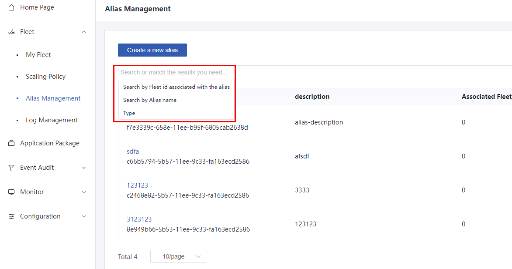

## Delete Alias

### Operation Scenario

If an alias is no longer used, you need to delete it.

### Operation Procedure

1.  Logging In to the GameFlexMatch Console

2.  Choose Fleet Management \> Alias Management, select the alias to be
    deleted, and click Delete.

3.  In the displayed Confirm dialog box, click OK.

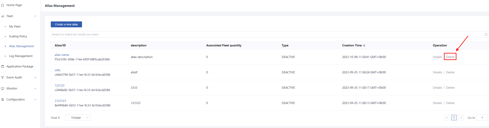

# Log management

## Creating Log Access

### Operation Scenario

The GameFlexMatch platform provides the automatic management function
for instance access logs in the application process queue. You can
create a log access to record and analyze the logs of all instances.

### Operation Procedure

1.  Log in to the GameFlexMatch management console.

2.  Choose Log Management \> Create Log.


3.  Set log access parameters. If no log group exists, click Create next
    to Log Group Name.


4.  The following table lists the parameters for creating a log access.

| **Parameters**  | **To explain**                                               | **Example Value**           |
| --------------- | ------------------------------------------------------------ | --------------------------- |
| FleetId         | Creating an  application process queue to which log access belongs | -                           |
| Log Access Name | Log access name.                                             | -                           |
| Log group name. | Select the log group  to which the created log stream belongs. |                             |
| Pathway         | Log path or file.  Multiple access paths are supported,      | /root/log or  /root/log.txt |
| Description     | Description of the  log.                                     |                             |

The parameters for creating a log group are as follows:

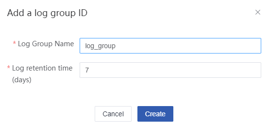

| **Parameters**               | **Explained**                                                | **Example Value** |
| ---------------------------- | ------------------------------------------------------------ | ----------------- |
| Log group name.              | Log group name.                                              | -                 |
| Log retention period  (days) | Log retention period  on the LTS platform, ranging from 1 to 365 days. | 7                 |

5.  After the creation is successful, the system prompts you to create a
    log dump. If you click Yes, you will be redirected to the creation
    page. If you click No, you will skip the creation. You can create a
    log dump at any time on the log access details page.


6.  Note that one log access corresponds to only one log dump.

7.  After a log access task is created, it takes about 10 minutes to
    view detailed log information on LTS.

## Creating a Log Dump

### Operation Scenario

Log dumping is used to permanently dump logs temporarily stored in Log
Access to OBS buckets. After the configuration is complete, logs are
automatically dumped based on parameters.

### Operation Procedure

1.  Log in to the GameFlexMatch management console.

2.  Choose Log Management \> Log Details \> Configure Log Dump.

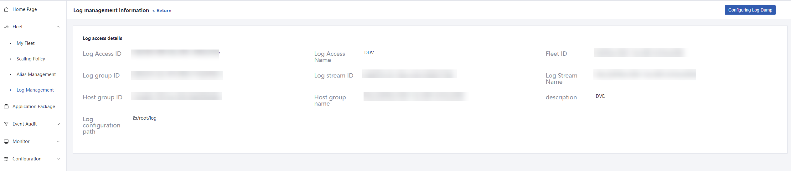

3.  Enter the configuration information for creating log dump.

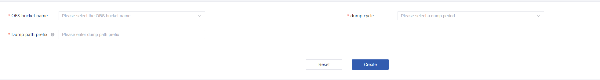
4.  Set the parameters as follows:

| **Parameters**   | **Explained**                                                | **Example Value** |
| ---------------- | ------------------------------------------------------------ | ----------------- |
| OBS bucket name  | Specifies the name  of the OBS bucket for dumping logs.      | -                 |
| Dump Path Prefix | If you enter  LTS-test, the log dump path is OBS bucket name /LogTanks/LTS-test/Y/M/D/. | -                 |
| Dump Period      | The dump period can  be 2 minutes, 5 minutes, 30 minutes, 1 hour, 3 hours, 6 hours, or 12 hours. | -                 |

5.  After the creation is successful, the OBS dump path is displayed on
    the list page. If the dump path is not configured, the OBS dump path
    is empty. The path can be linked to the OBS bucket object list page.

## Deleting Log Access and Dump

### Background

Delete the configured log access and log dump.

### Operation Procedure

1.  Delete Log Access. (If log dump has been configured, delete the log
    dump first.). On the log access list page, locate the log access
    item to be deleted and click Delete.

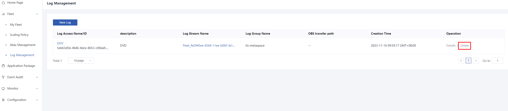

2.  To delete a log dump, click Delete Log Dump in the upper right
    corner of the Log Access page.

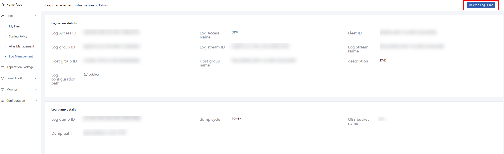

# Event Audit

## Viewing the Event List

### Operation Scenarios

View Game Flex Match events, including network, instance, session, and
application package events. The event levels are normal, warning, and
accident. You can configure notifications for event levels.

### Operation Procedure

Choose Event Audit \> Event List to view events. You can filter events
by resource type and severity.

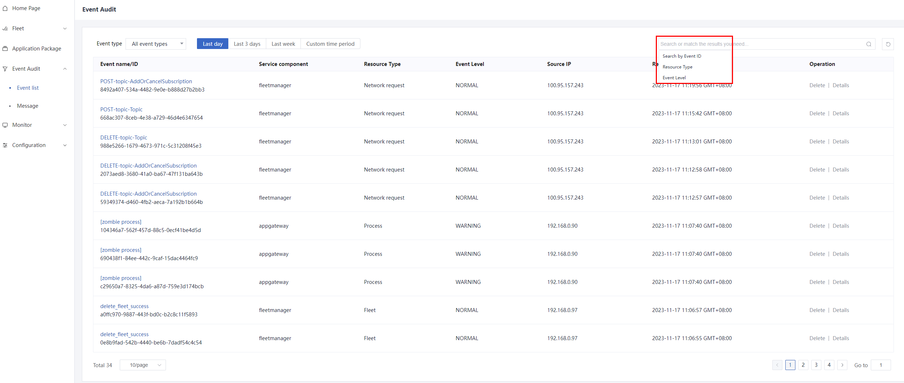

## 11.2 Message Management

### 11.2.1 Operation Scenarios

Message management manages notification subscriptions and sends
notifications to subscribers through SMN.

### 11.2.2 Operation Procedure

1\. Choose Event Audit \> Message, add a topic for the event, and select
the event level for which notifications need to be sent.

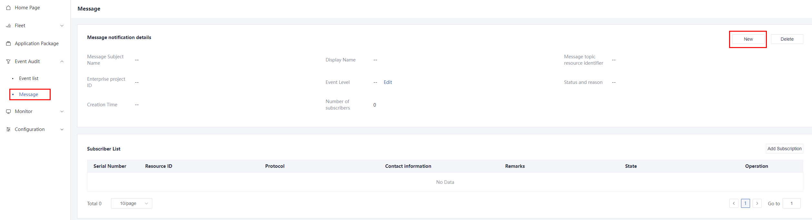

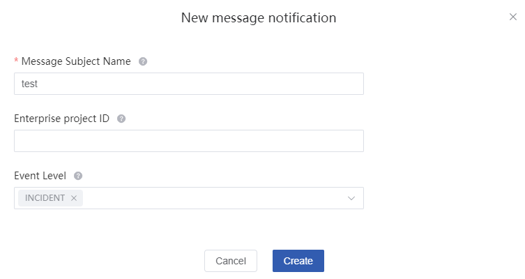

2\. After a topic is created, add subscribers. The email or SMS
notification mode is supported.

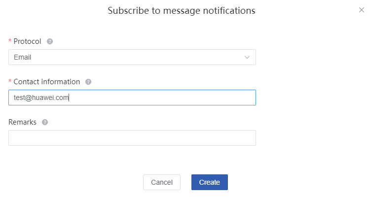

3\. After the subscription is successfully created, SMN will send a
confirmation email. Click the link in the email to confirm the
subscription.

4\. To delete a notification, click Unsubscribe.

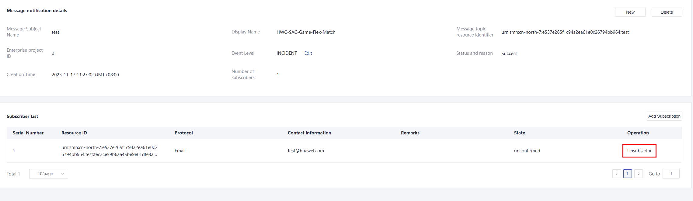

# API invoking

## Interface authentication

Authentication must be performed before all interfaces are invoked.

1\. Construct a login request. In the request, the password is encrypted
by RSA. The encrypted public key must be the same as the backend private
key deployed by FleetManager. For details about the encryption script,
see the /tools/cipher file.

POST URL: /v1/user/login

Request Body:

```json
{
    "username": "admin",
    "password": "cipher-password"
}
```

Response Body:

```json
{
    "username": "admin",
    "id": "63da950a-b3ea-11ed-bb27-fa163**********",
    "Auth-Token": "eyJhbGciO*************eXrA",
    "Activation": 1,
    "UserType": 9,
    "total_res_count": 1
}
```

2\. Add the Auth-Token field and its value in the request body header to
access the GameFlexMatch interface.

# FAQs

## Fleet and Application Package Creation

1.  How Do I Locate the Cause When Creating a Fleet Fails? During the
    creation of a fleet, the following steps are involved: synchronizing
    account information, synchronizing application package resources,
    creating a VPC, creating a subnet, creating a security group,
    creating an Scaling group, and waiting for application process
    reporting. If the creation fails, locate the fault in the following
    phase:

-   **Cause: Log in to the host where the Fleet Manager is located, open
    the /home/fleetmanager/bin/log/run/run.log file, search for the
    keyword creat_fleet, and locate the error.**

-   **Synchronize account information: Check whether the account
    information involved in GameFlexMatch is completely configured. For
    details, see the quick start.**

-   **If the application package resource synchronization fails, check
    whether the application package associated with the fleet is
    available. If the application package is unavailable, switch to an
    available one and create a new one.**

-   **Failed to create a VPC or subnet. If the VPC and subnet can be
    bound to the Fleet, check whether the bound VPC and subnet are
    available. If the bound VPC and subnet are not bound, a new VPC or
    subnet is created by default. In this case, locate the cause based
    on the returned error information in the logs.**

-   **Failed to create a security group. A security group is created by
    default during Fleet creation and can be bound to a security group.
    If the security group fails to be created, locate the fault based on
    the error information in the logs.**

-   **Failed to create the AS group. The AS component executes the AS
    group creation task. If an error occurs during this step, log in to
    the AS server and view the /home/aass/bin/log/run/run.log file to
    locate the error cause.**

-   **Waiting for application process reporting: This problem occurs
    because the application process is not reported. The main causes are
    as follows: The uniform host fails to be created (you can log in to
    the HUAWEI CLOUD console to view the creation), and the uniform host
    is created but the application fails to be started. (You need to log
    in to the uniform machine to check whether the application is
    started correctly.). The application is started normally but fails
    to be reported. (You can log in to the uniformed machine and view
    the auxproxy log in /etc/auxproxy/log/run.log to view the error
    cause.)**

2.  How can I locate the cause if the application package fails to be
    created? The application package creation process involves creating
    an ECS, pulling an application package, and creating an image. You
    need to log in to the FleetManager log to view the error cause and
    locate the fault.

-   Session creation

## Viewing Session Error Causes

1.  Session creation failures are classified into the following types:


-   **error for timeout:**

    Check whether the 60001 port is enabled for the appgateway address.
    If the 60001 port is enabled for the appgateway address in the
    security group corresponding to the appgateway address. If the 60001
    port is not enabled, You can manually modify the ports and addresses
    opened by the security group to the AppGateway (valid for the
    fleet), and modify internal_inbound_permissions in the
    /home/fleetmanager/configmap/service_config.json file of the
    fleetmanager. The modification takes effect for the new fleet. This
    problem usually occurs during new deployment. If the problem is not
    caused by configuration problems, the network is faulty. Contact
    HUAWEI CLOUD for emergency workarounds.

     If the problem occurs occasionally, view the
     /home/appgateway/log/run/run.log log of AppGateway and the run.log log
     of AuxProxy in /etc/auxproxy/log/, trace the session life process, and
     determine whether the problem is caused by the GameFlexMatch or the
     game service.

-   Error cause: Redis or MySQL: The MySQL or Redis specifications are
    low and need to be expanded in a timely manner.

-   Error cause: The number of handles of the appgateway machine is
    incorrectly set. You need to modify the configuration.

-   there is no available process in fleet: If the number of registered
    processes in fleet is insufficient, check whether a large number of
    processes exist. If yes, manually modify the minimum number of
    instances in fleet, manually expand the capacity of the host,
    restore services in time, and then trace the cause. If this problem
    occurs occasionally, the scaling speed does not meet the traffic
    increase speed. In this case, you need to adjust the minimum number
    of instances reserved in the Scaling policy and fleet.

## Version iteration

How to quickly and securely perform version iteration during peak hours?

GameFlexMatch can quickly update and iterate games based on alias
management. If iteration is performed during off-peak hours, you can
directly create a fleet, associate the new fleet with the alias, and
move the old fleet out of the alias. Resources can be reclaimed after
all sessions on the fleet of the old version are complete. During
version iteration during peak hours, services must not be affected. Two
update methods are available:

### Step by step traffic diversion 

1.  create a fleet with the same configuration as the fleet of the old
    version. The minimum number of instances in the fleet of the new
    version must be the same as that of the old version.

2.  Associate the fleet of the new version with the alias of the old
    version. Set the weight ratio based on the proportion of the current
    number of devices.

3.  Gradually increase the weight of the fleet of the new version based
    on the distribution situation.

4.  Gradually reduce the weight of the fleet of the old version. After
    the traffic is stable, disassociate the fleet of the old version
    from the alias.

5.  After the sessions of the fleet of the old version are complete,
    reclaim the fleet resources and complete the traffic diversion.

### Full traffic diversion

1.  Create a fleet with the same configuration as the fleet of the old
    version. Set the minimum number of instances of the new version
    fleet to the number of instances of the old version fleet.

2.  Enable auto scaling and associate the new version fleet with the
    alias of the old version fleet. Disassociate the fleet of the old
    version from the alias.

3.  After all sessions on the fleet of the old version are complete,
    change the minimum number of instances of the fleet of the new
    version to the minimum number of instances set by the fleet of the
    old version. Then, reclaim the resources of the fleet of the old
    version.

We recommend using the second change method because that can be
completed quickly and securely during peak hours.

### Other questions

1.  Is the CPU or memory abnormal on the uniform machine?

> Log in to the uniformed machine and check whether the number of game
> processes is abnormal. If yes, check whether a single game process
> occupies a large number of CPU or memory resources and adjust the
> number of processes started on a single machine.

2. Is the resource monitoring exception of GameFlexMatch?

> Check the current service traffic information. If the traffic
> increases sharply compared with the previous period, expand the
> capacity or increase the specifications of the nodes in a timely
> manner. If the traffic is normal but the CPU or memory alarm persists,
> check whether a large number of abnormal sessions are displayed on the
> console home page. If yes, rectify the fault based on the session
> creation failure type.
