# 目录
- [目录](#目录)
- [1. GameFlexMatch简介](#1-gameflexmatch简介)
  - [1.1. 组件功能](#11-组件功能)
    - [1.1.1. Fleetmanager组件功能：](#111-fleetmanager组件功能)
    - [1.1.2. AASS组件功能：](#112-aass组件功能)
    - [1.1.3. AppGateway组件功能：](#113-appgateway组件功能)
    - [1.1.4. AuxProxy组件功能](#114-auxproxy组件功能)
  - [1.2. Console界面](#12-console界面)
- [2. 首页](#2-首页)
  - [2.1. 简介](#21-简介)
  - [2.2. 操作](#22-操作)
- [3. 用户管理](#3-用户管理)
  - [3.1. 首次登录操作](#31-首次登录操作)
  - [3.2. 用户管理](#32-用户管理)
    - [3.2.1. 新建用户](#321-新建用户)
    - [3.2.2. 修改用户](#322-修改用户)
    - [3.2.3. 删除用户](#323-删除用户)
  - [3.3. 租户管理](#33-租户管理)
    - [3.3.1. 新建租户](#331-新建租户)
    - [3.3.2. 查询租户](#332-查询租户)
    - [3.3.3. 绑定租户](#333-绑定租户)
    - [3.3.4. 切换租户](#334-切换租户)
    - [3.3.5. 删除租户](#335-删除租户)
- [4. 应用包管理](#4-应用包管理)
  - [4.1. 创建应用包](#41-创建应用包)
    - [4.1.1. 操作场景](#411-操作场景)
    - [4.1.2. 创建须知](#412-创建须知)
    - [4.1.3. 操作步骤](#413-操作步骤)
  - [4.2. 修改应用包](#42-修改应用包)
    - [4.2.1. 操作场景](#421-操作场景)
    - [4.2.2. 操作步骤](#422-操作步骤)
  - [4.3. 删除应用包](#43-删除应用包)
    - [4.3.1. 操作场景](#431-操作场景)
    - [4.3.2. 删除须知](#432-删除须知)
    - [4.3.3. 操作步骤](#433-操作步骤)
- [5. 创建实例规格组](#5-创建实例规格组)
  - [5.1. 创建VM实例规格组](#51-创建vm实例规格组)
    - [5.1.1. 操作场景](#511-操作场景)
    - [5.1.2. 操作步骤](#512-操作步骤)
  - [5.2. 创建Pod实例规格组](#52-创建pod实例规格组)
    - [5.2.1. 操作场景](#521-操作场景)
    - [5.2.2. 操作步骤](#522-操作步骤)
- [6. 应用进程队列管理](#6-应用进程队列管理)
  - [6.1. 创建应用进程队列](#61-创建应用进程队列)
    - [6.1.1. 操作场景](#611-操作场景)
    - [6.1.2. 操作步骤](#612-操作步骤)
  - [6.2. 修改应用进程队列](#62-修改应用进程队列)
    - [6.2.1. 操作场景](#621-操作场景)
    - [6.2.2. 操作步骤](#622-操作步骤)
  - [6.3. 删除应用进程队列](#63-删除应用进程队列)
    - [6.3.1. 操作场景](#631-操作场景)
    - [6.3.2. 删除须知](#632-删除须知)
    - [6.3.3. 操作步骤](#633-操作步骤)
- [7. 弹性伸缩策略管理](#7-弹性伸缩策略管理)
  - [7.1. 创建弹性伸缩策略](#71-创建弹性伸缩策略)
    - [7.1.1. 操作场景](#711-操作场景)
    - [7.1.2. 操作步骤](#712-操作步骤)
  - [7.2. 修改弹性伸缩策略](#72-修改弹性伸缩策略)
    - [7.2.1. 操作场景](#721-操作场景)
    - [7.2.2. 操作步骤](#722-操作步骤)
  - [7.3. 删除弹性伸缩策略](#73-删除弹性伸缩策略)
    - [7.3.1. 操作场景](#731-操作场景)
    - [7.3.2. 操作步骤](#732-操作步骤)
- [8. 别名管理](#8-别名管理)
  - [8.1. 创建别名](#81-创建别名)
    - [8.1.1. 操作场景](#811-操作场景)
    - [8.1.2. 创建须知](#812-创建须知)
    - [8.1.3. 操作步骤](#813-操作步骤)
  - [8.2. 修改别名](#82-修改别名)
    - [8.2.1. 操作场景](#821-操作场景)
    - [8.2.2. 操作步骤](#822-操作步骤)
  - [8.3. 查询别名](#83-查询别名)
    - [8.3.1. 操作场景](#831-操作场景)
    - [8.3.2. 操作步骤](#832-操作步骤)
  - [8.4. 删除别名](#84-删除别名)
    - [8.4.1. 操作场景](#841-操作场景)
    - [8.4.2. 操作步骤](#842-操作步骤)
- [9. 日志管理](#9-日志管理)
  - [9.1. 创建日志接入](#91-创建日志接入)
    - [9.1.1. 操作场景](#911-操作场景)
    - [9.1.2. 操作步骤](#912-操作步骤)
  - [9.2. 创建日志转储](#92-创建日志转储)
    - [9.2.1. 操作场景](#921-操作场景)
    - [9.2.2. 操作步骤](#922-操作步骤)
  - [9.3. 删除日志接入与转储](#93-删除日志接入与转储)
    - [9.3.1. 操作背景](#931-操作背景)
    - [9.3.2. 操作步骤](#932-操作步骤)
- [10. 事件审计](#10-事件审计)
  - [10.1. 查看事件列表](#101-查看事件列表)
    - [10.1.1. 操作场景](#1011-操作场景)
    - [10.1.2. 操作步骤](#1012-操作步骤)
  - [10.2. 消息管理](#102-消息管理)
    - [10.2.1. 操作场景](#1021-操作场景)
    - [10.2.2. 操作步骤](#1022-操作步骤)
- [11. API调用](#11-api调用)
  - [11.1. 接口认证](#111-接口认证)
- [12. 会话管理](#12-会话管理)
  - [12.1. 创建服务端会话](#121-创建服务端会话)
    - [12.1.1. 操作场景](#1211-操作场景)
    - [12.1.2. 创建会话](#1212-创建会话)
- [13. 常见问题FAQ](#13-常见问题faq)
  - [13.1. Fleet与应用包创建](#131-fleet与应用包创建)
  - [13.2. 查看会话错误原因  ](#132-查看会话错误原因)
  - [13.3. 版本迭代](#133-版本迭代)
    - [13.3.1. 逐步引流：](#1331-逐步引流)
    - [13.3.2. 全量引流：](#1332-全量引流)
    - [13.3.3. 其他问题](#1333-其他问题)


# 1. GameFlexMatch简介

本服务共有四大组件：FleetManager、AppGateway、AASS和AuxProxy。其中FleetManager是全局组件，AppGateway组件和AASS组件为Region级组件，AuxProxy为VM级别组件。整体架构图如下：

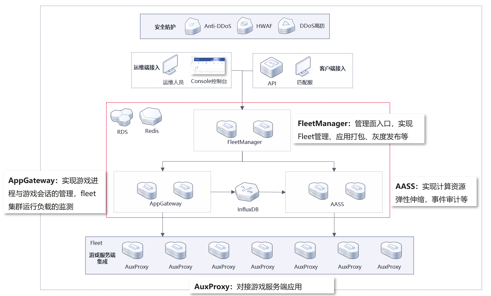

## 1.1. 组件功能

### 1.1.1. Fleetmanager组件功能：

负责应用进程的全局化动态部署及管理，支持配置动态部署策略。

### 1.1.2. AASS组件功能：

负责应用舰队弹性创建及伸缩策略管理及执行。

-   基于系统负载决策是否执行应用进程弹性。

-   基于业务请求量决策扩容/缩容进程及资源数量。

-   对接第三方资源管理系统，控制资源的申请与释放。

### 1.1.3. AppGateway组件功能：

-   负责会话（server session、client
    session）的对象存储和管理（创建、删除、变更、状态统计）、客户端请求的状态统计

-   负责region的进程管理（主要是统计与展示）

-   上报统计信息（包括进程、客户端会话、服务端会话、客户端请求的统计信息）

-   亲和性规则的管理（亲和性规则是client request与server
    session的对应关系，用于给gateway-proxy选择client
    request的应用进程对象）

### 1.1.4. AuxProxy组件功能

主机的管理面组件，每个虚机上都会启动一个，负责虚机上的应用进程管理。

-   负责应用进程的生命周期管理

-   监控应用进程，并上报应用进程、客户端会话和服务端会话状态信息

## 1.2. Console界面

本项目提供基于Vue开发的前端页面，便于用户操作与维护服务组件和云资源；

# 2. 首页

## 2.1. 简介

-   首页提供了展示对GameFlexMatch使用租户在某个region下的整体运行情况，包括Fleet、实例、进程与会话的总数量

-   提供了图表化展示每一个Fleet中实例、进程与会话的数量

-   提供了图表化显示每个Fleet中不同状态的实例、进程、会话的数量

## 2.2. 操作

• 点击首页查看总体运行情况

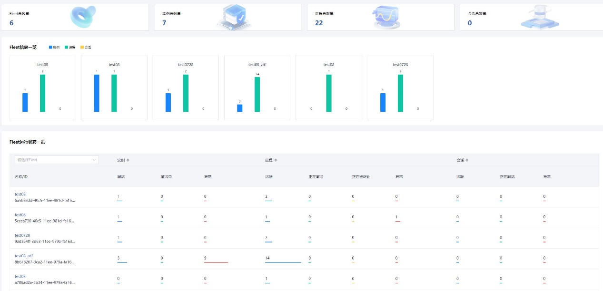

•
若需查看某几条Fleet的运行状态，可在首页-\>Fleet运行状态一览中选择想要查看的Fleet，支持多选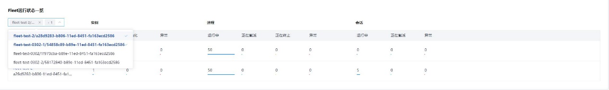

# 3. 用户管理

GameFlexMatch的用户管理模式为使用GameFlexMatch用户关联管理华为云租户的模式，通过关联租户对华为云资源进行管理，多个用户可关联至一个租户，一个用户也可以关联多个租户，并支持即时切换。

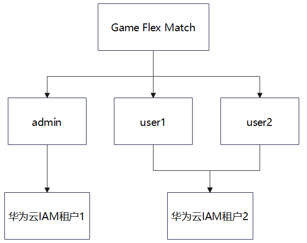{

## 3.1. 首次登录操作

1.  项目启动时会检查数据库中是否有账号，若无账号则初始化一个超级管理员账号，默认密码为Fleetmanager启动脚本文件fleetmanager_run.sh中"DEFAULT_LOGIN_PASSWORD"字段

2.  进入登录页面，输入账户名"admin"，输入密码；

3.  首次登录需要修改默认密码，修改成功会自动登出，重新登陆；

4.  登录成功后，返回响应数据中有Auth-Token，除了登录接口以外的所有接口，都需要在请求头中携带Auth-Token进行认证。

5.  说明：

    a.  基于JWT架构生成的Token，在环境变量中可以设置生成token的key以及过期时间，对应字段为"JWTKEY"，"JWT_TOKEN_LIFETIME"

    b.  一次登录操作为一个会话请求，会话过期时间可以设置脚本文件中"LOGIN_SESSION_LIFETIME"字段，登录后的会话过期讲不再续期，需要重新登录。

6.  冻结状态下的账号无法登录；

7.  登出后会删除当前的Cookies，且原Token无法继续使用。

用户类型Usertype说明

| **用户类型** | **值** |
| ------------ | ------ |
| 只读用户     | 0      |
| 普通用户     | 5      |
| 超级管理员   | 9      |


用户激活状态Activation说明

| **激活状态**                                  | **值** |
| --------------------------------------------- | ------ |
| 未激活，首次登录未修改密码                    | 0      |
| 已激活，已修改密码                            | 1      |
| 账号冻结，密码连续输错5次，需要管理员重置密码 | -1     |

## 3.2. 用户管理

### 3.2.1. 新建用户

管理员可以创建子用户来对平台进行管理，支持"普通用户"和"只读用户"，普通用户拥有平台对资源的修改权限，只读用户只能查看平台上的资源情况；

-   管理员新建用户NewUser

1.  管理员登录

2. 找到新增用户入口

>  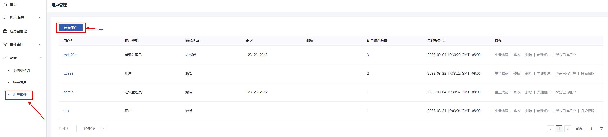

3.  新增普通用户，以NewUser为例

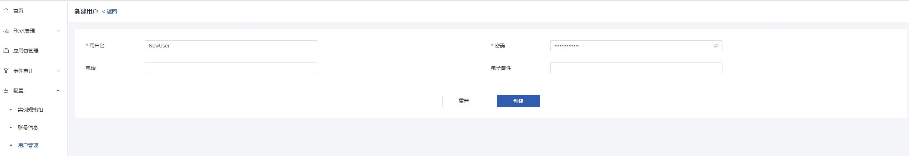

4.  管理员为NewUser关联资源租户

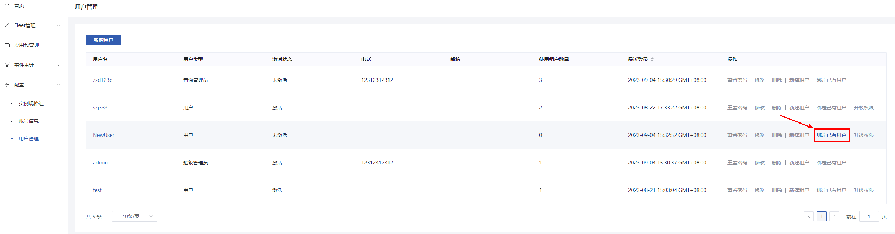

5.  查看用户NewUser详情

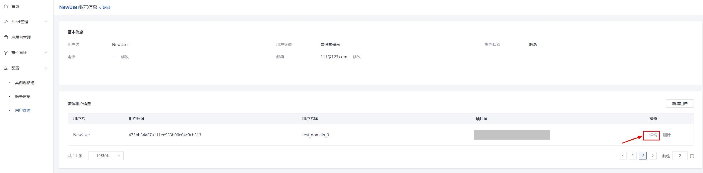{

6.  查看NewUser关联的资源租户信息

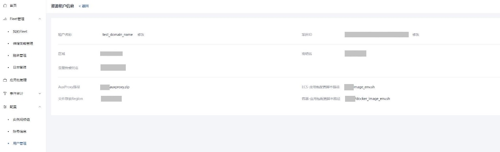

### 3.2.2. 修改用户

用户只能修改个人信息（邮箱，电话），超级管理员可以修改用户的个人信息、激活状态和用户类型，以及重置密码；

1\. 管理员登录控制台；

2\. 选择 配置-\>用户管理，选择需要修改的用户，点击"修改"或"重置密码"；

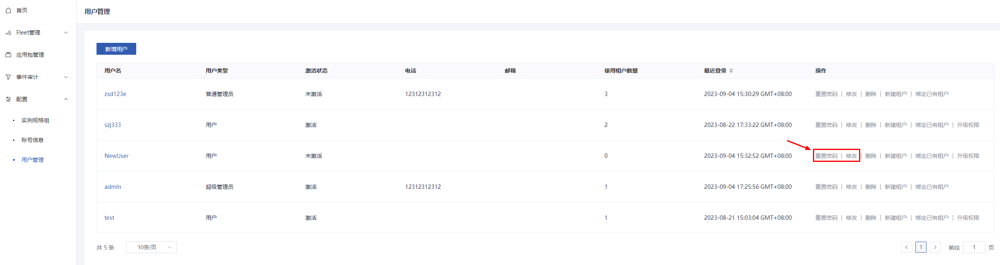

### 3.2.3. 删除用户

1.  管理员登录控制台；

2.  选择 配置-\>用户管理，选择需要删除的用户，点击"删除"

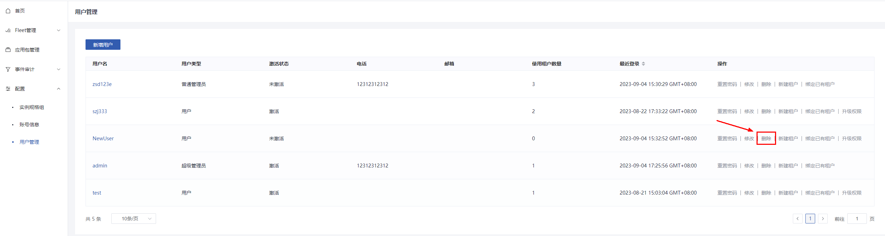

## 3.3. 租户管理

租户管理是GameFlexMatch中重要的一个部分，平台用户通过关联的华为云租户创建与管理华为云资源；

### 3.3.1. 新建租户

新建租户方式有三种：

-   管理员首次登录时；

-   管理员新增用户时；

-   管理员通过控制台为用户新增租户；

管理员新增租户操作步骤：

1.  在配置-\>用户管理，为目标用户新增租户

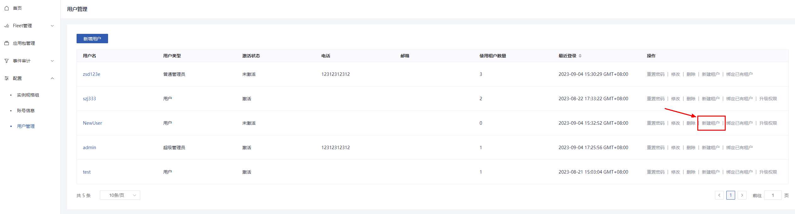

2.  新建租户参数如下：

使用租户信息：

-   **租户名称**: GameFlexMatch平台租户信息名称

-   **项目id**:
    用于GameFlexMatch创建资源资源的API项目id，可在华为云控制台-我的凭证-API凭证中获取

-   **Access Key**:
    用于GameFlexMatch访问API使用的密钥，可在华为云控制台-我的凭证-访问密钥中获取

-   **Secret Access Key**:
    用于GameFlexMatch访问API使用的密钥，可在华为云控制台-我的凭证-访问密钥中获取

-   **Region**: 资源租户用于创建GameFlexMatch资源的对应region

-   **密钥名**: GameFlexMatch弹性扩容虚机时的登录认证密钥

-   **云服务委托名**:
    目前用于打包镜像时安装ICAgent以及使用lts云日志服务的日志转储

应用包信息（可选，为空时使用默认参数）

-   **Auxproxy路径**: Auxproxy文件在OBS的存放路径

-   **ECS-应用包配置脚本路径**:
    用于创建ECS资源应用包的脚本文件在OBS的存放路径

-   **文件存放Region**: OBS桶所在的Region

-   **容器-应用包配置脚本路径**:
    用于创建容器资源应用包的脚本在OBS的存放路径；若使用容器，此项必填。

3.  点击"创建"完成创建流程

### 3.3.2. 查询租户

1.  管理员登录平台；

2.  通过配置-\>用户管理，选择指定用户；

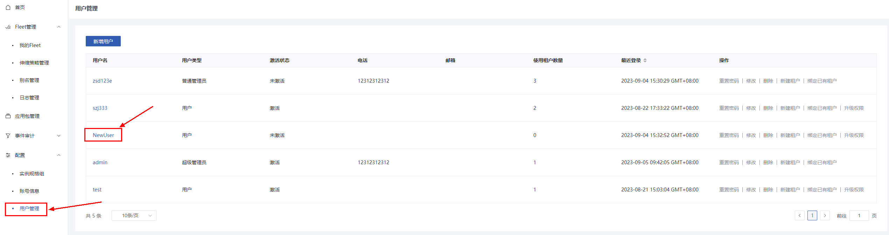

3.  点击资源租户信息的详情，即可查看；

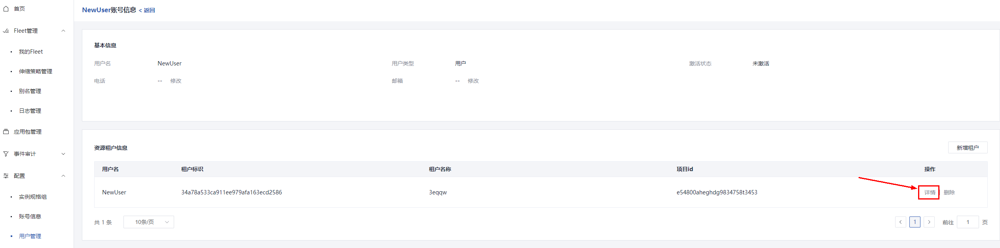

### 3.3.3. 绑定租户

管理员为用户绑定已有租户，实现租户信息的复用。

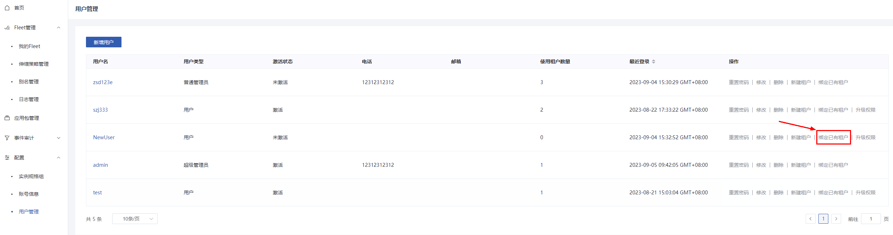

### 3.3.4. 切换租户

1.  登录GameFlexMatch控制台

2.  点击右上角切换至所关联的资源租户上

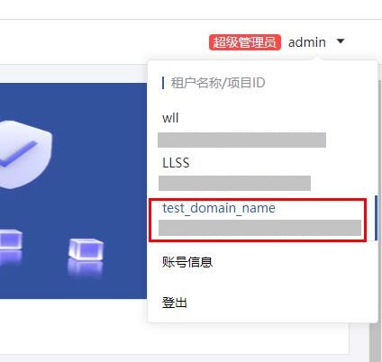

### 3.3.5. 删除租户

1.  管理员登录控制台；

2.  在用户管理中， 选择一个用户的详情，在账号信息中选择要删除的租户删除

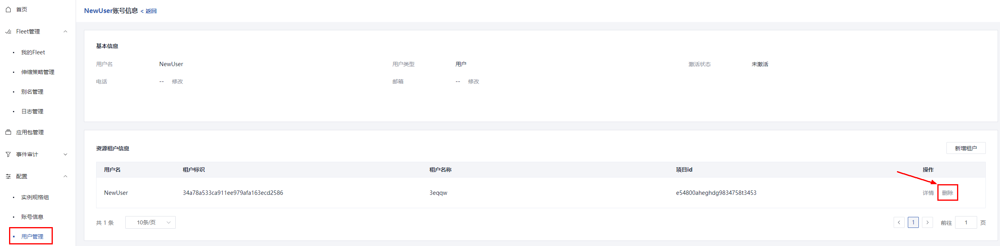

# 4. 应用包管理
**功能说明**

`FleetMange服务器组件`提供了应用包的全生命周期管理能力，并且基于应用包提供了镜像打包能力，用于`GameFlexMatch`平台扩容实例，应用包镜像主要集成了`Auxproxy`服务组件以及希望执行的服务端应用，同时集成了云日志服务LTS与云监控CES的插件以对应用状态进行掌握。

**使用说明**

1.将`Auxproxy`服务组件压缩包（zip或rar，请保证各文件在一级目录，不需要用auxproxy文件夹包含）、镜像打包环境构建脚本[image_env.sh](image_env.sh)、[docker_image_env.sh](v.sh)添加至管理账号的OBS桶中，分别为VM和POD的镜像构建脚本

2.将应用压缩包（zip或rar）添加至资源账号的OBS桶中

3.应用镜像中，应用默认在路径/local/app/{创建的应用包名}下进行解压，请根据该路径调整应用启动脚本，或修改环境构建脚本中的应用下载目标路径

4.`FleetMange服务器组件`启动脚本[fleetmanage_run.sh](feetmanager_run.sh)中添加参数，具体为DEFAULT_SCRIPT_PATH、DEFAULT_DOCKER_SCRIPT_PATH（环境构建脚本的OBS路径 VM及POD版）、DEFAULT_AUXPROXY_PATH（`Auxproxy`服务组件压缩包OBS路径），其余镜像创建相关参数也可以在启动脚本中修改

## 4.1. 创建应用包

### 4.1.1. 操作场景

您可以将需要托管的应用包上传至GameFlexMatch平台，自动化生成安装有监测、上报插件的应用包镜像，并用于fleet创建，支持VM和POD两种镜像打包模式。您也可以直接绑定华为云IMS或SWR中已有私有镜像，并快速构建fleet。

### 4.1.2. 创建须知

选择通过上传文件或通过OBS创建应用包前，请先在当前使用的资源租户下创建好所需的VPC和子网。

### 4.1.3. 操作步骤

1.  将以下文件上传至至管理账号的OBS桶中；

    a.  Auxproxy服务组件压缩包，支持zip或rar格式（请保证各文件在一级目录，不需要用auxproxy文件夹包含）；

    b.  镜像打包环境构建脚本image_env.sh（VM实例镜像）和docker_image_env.sh（Pod实例镜像）

    c.  应用压缩包（zip或rar）添加至资源账号的OBS桶中

2.  应用镜像中，应用默认在路径/local/app/{创建的应用包名}下进行解压，请根据该路径调整应用启动脚本，或修改环境构建脚本中的应用下载目标路径

3.  FleetManger服务器组件启动脚本fleetmanage_run.sh中添加参数:

> 环境构建脚本的OBS路径：
>
> #### export DEFAULT_AUXPROXY_PATH=桶名/auxproxy.zip
>
> Auxproxy服务组件压缩包OBS路径
>
> export DEFAULT_SCRIPT_PATH=桶名/image_env.sh

4.  登录GameFlexMatch管理控制台。

5.  选择"应用包管理 \> 创建应用包"。

6.  选择需要的创建方式，配置应用包名称、版本号等参数。重点配置参数说明如下表所示

| **参数**   | **解释**                                                     | **取值样例**     |
| ---------- | ------------------------------------------------------------ | ---------------- |
| 应用包名   | 创建的应用包的名称。名称(2~50个字符)，以英文字母开头，并由英文字母、数字、下划线和中划线组成。 | server           |
| 版本号     | 创建的应用包的版本号（1~50个字符）。                         | 1.0.0            |
| 应用包类型 | 创建的应用包类型，为POD时将制作SWR镜像，为VM时将制作IMS镜像  | VM               |
| VPC        | VPC的id，用于绑定制作镜像的ECS                               | -                |
| 子网       | 子网的id，用于绑定制作镜像的ECS                              | -                |
| 操作系统   | 应用包类型选择VM时为用于制作镜像的ECS底层操作系统，建议使用CentOS，可以在“华为云控制台>`IMS`>公共镜像中查看”。应用包类型选择POD时为容器内的底层操作系统。 | CentOS 7.2 64bit |
| OBS桶      | OBS桶名，用于存放应用包文件                                  | GameFlexMatch    |
| 存储路径   | OBS应用包文件路径，即对象名                                  | build/server.zip |

7.  参数配置完成后，单击"创建"。

8.  待应用包状态为"就绪"时，即可用于fleet的创建。

## 4.2. 修改应用包

### 4.2.1. 操作场景

在使用应用包管理的过程中，您可以根据需要修改应用包。应用包可以修改的参数有：名称、版本号、描述。

### 4.2.2. 操作步骤

1.  登录GameFlexMatch管理控制台。

2.  选择"应用包管理"。

3.  在应用包列表中，需修改的应用包所在行中，单击"详情"。

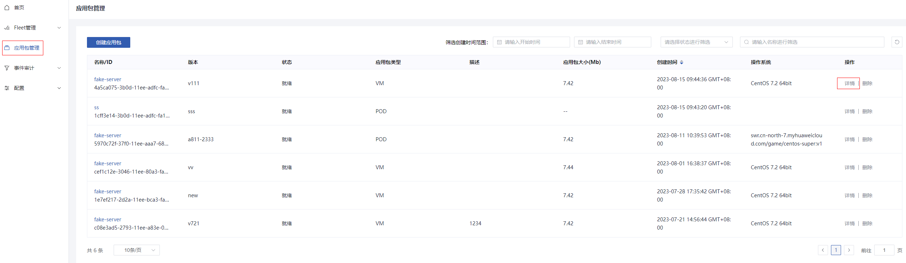

4.  单击参数后的"修改"，在输入框后输入需修改的内容。

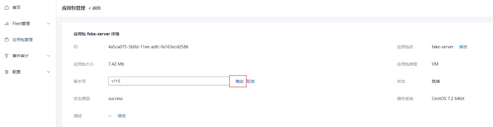

5.  单击"确定"完成修改。

## 4.3. 删除应用包

### 4.3.1. 操作场景

在您不再需要某个应用包时，可以删除该应用包。

### 4.3.2. 删除须知

删除前请确认该应用包是否关联有非终止状态的Fleet，若有关联则无法被删除。

### 4.3.3. 操作步骤

1.  登录GameFlexMatch管理控制台。

2.  选择"应用包管理"。

3.  在应用包列表中，需删除的应用包所在行中，单击"删除"。

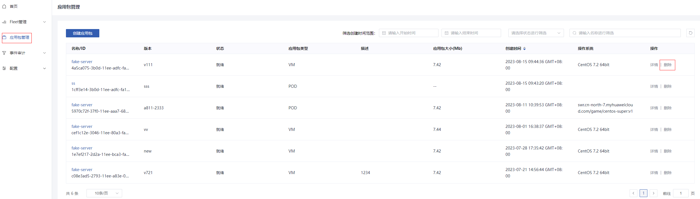

4.  在弹出的对话框中，单击"确定"。

# 5. 创建实例规格组

GameFlexMatch平台支持预先创建实例规格组模板，在创建fleet提供选择

## 5.1. 创建VM实例规格组

### 5.1.1. 操作场景

针对创建fleet为ECS类型的实例规格，相同规格下支持选择最多10种型号，创建fleet时会按照选择的规格优先顺序进行创建；

### 5.1.2. 操作步骤

1.  选择配置-\>实例规格组，单击"新建实例规格组"；

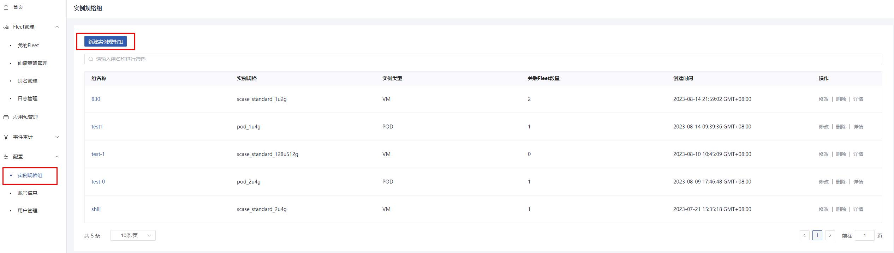

2.  选择VM类型实例，输入组名称，按顺序选择需要的实例规格，点击"确定"。


## 5.2. 创建Pod实例规格组

### 5.2.1. 操作场景

支持创建pod类型的规格组，支持选择VM类型的虚拟机类型，支持选择pod实例的CPU和内存大小

### 5.2.2. 操作步骤

1.  选择配置-\>实例规格组，单击"新建实例规格组"；

2.  选择VM类型实例，输入组名称，按顺序选择需要的实例规格，点击"确定"。

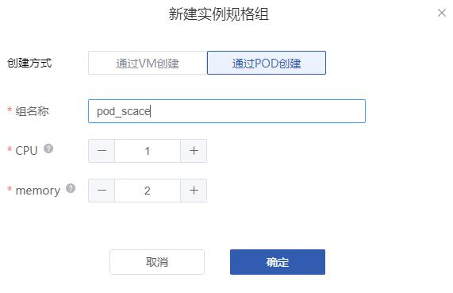

# 6. 应用进程队列管理

## 6.1. 创建应用进程队列

### 6.1.1. 操作场景

GameFlexMatch平台提供应用进程的全局化动态部署及管理，您可以通过创建应用进程队列承载您的服务应用并对外提供服务。支持创建VM类型实例或POD类型实例。

### 6.1.2. 操作步骤

1.  登录GameFlexMatch管理控制台。

2.  选择"Fleet管理 \> 我的Fleet \> 新建Fleet"。


3.  配置基本信息、资源信息等参数，您也可以通过json文件直接导入参数，或通过已填参数导出json文件。重点配置参数说明如下表所示

| **参数**                     | **解释**                                                     | **取值样例**           |
| ---------------------------- | ------------------------------------------------------------ | ---------------------- |
| **名称**                     | 应用进程队列的名称，可以不唯一                               | -                      |
| **应用包ID**                 | 应用包id，创建后不支持修改，可在“应用包管理”的列表页中获取   | -                      |
| **区域**                     | 应用进程队列所在的region                                     | 北京四                 |
| **实例类型**                 | 应用进程队列的实例类型，取值为VM或POD                        | VM                     |
| **VPC**   | VPC的名称。指定资源租户上的VPC创建fleet，若指定的VPC不存在则新建fleet失败在指定VPC创建Fleet时，会在指定的VPC上创建子网，并且会检查子网是否与已有子网冲突，若冲突则会再次随机子网，最多重复10次,需要保证指定的VPC网段包含部署时配置的VPC网段，否则可能导致创建fleet失败 | -                      |
| **主域名**                   | 访问集群实例时若使用域名访问则填写此项，会向华为云以该域名添加子域名的记录集解析到实例的IP(需要使用在华为云注册的域名服务) | GameFlexMatch.com      |
| **会话保护策略**             | 不保护：缩容时如果有会话在实例上运行，直接缩容；  限时保护：缩容时如果有会话在实例上运行，等待一定时间后缩容，等待时间由会话保护时间指定 | 限时保护               |
| **服务端会话激活时延**       | 下发创建服务会话请求到服务会话的状态变为可用状态的超时时间，默认600，单位秒 | 600                    |
| **单个进程最大服务端会话数** | 单进程最大并发服务会话数量，最大支持50                       | 10                     |
| **启动路径**                 | 应用进程启动程序路径，支持linux风格文件路径                  | /local/app/start_up.sh |

4.  参数配置完成后，单击"创建"。

5.  等待创建，当Fleet状态为"活跃"时，即成功完成了Fleet的创建，若状态为"异常"时，参考错误定位指导。

## 6.2. 修改应用进程队列

### 6.2.1. 操作场景

在管理应用进程队列的过程中，您可以根据需要修改应用进程队列的基本信息、入站规则、运行配置及容量信息。

### 6.2.2. 操作步骤

1.  登录GameFlexMatch管理控制台。

2.  选择"Fleet管理 \> 我的Fleet"。

3.  在Fleet列表中，需修改的Fleet所在行中，单击"详情"。

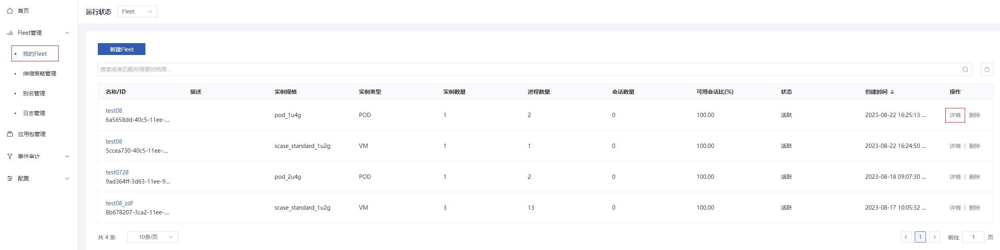

4.  单击参数栏后的"修改"，在侧弹窗中输入需修改的内容。

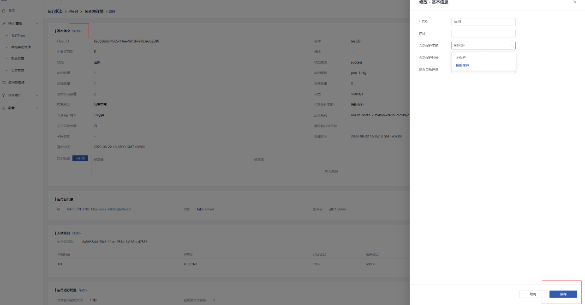

5.  单击"保存"完成修改。

## 6.3. 删除应用进程队列

### 6.3.1. 操作场景

在您不再需要某个应用进程队列时，可以删除该应用进程队列。

### 6.3.2. 删除须知

删除前请确认该Fleet是否关联有别名，若有关联则无法被删除。

### 6.3.3. 操作步骤

1.  登录GameFlexMatch管理控制台。

2.  选择"Fleet管理 \> 我的Fleet"。

3.  在Fleet列表中，需删除的Fleet所在行中，单击"删除"。

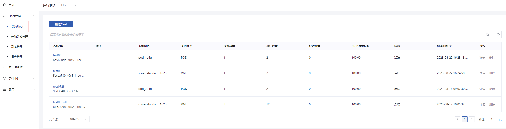

4.  在弹出的对话框中，单击"确定"。

# 7. 弹性伸缩策略管理

## 7.1. 创建弹性伸缩策略

### 7.1.1. 操作场景

在使用应用进程队列的过程中，您可以通过创建并绑定弹性伸缩策略，控制应用进程队列的扩缩容策略。

### 7.1.2. 操作步骤

1.  登录GameFlexMatch管理控制台。

2.  选择"Fleet管理 \> 伸缩策略管理 \> 新建伸缩策略"。


3.  配置名称，策略类型和指标等参数，重点配置参数说明如下表所示

  **参数**             **解释**                                     **取值样例**
-------------------- -------------------------------------------- ----------------
  名称                 创建的弹性伸缩策略名称                       \-
  策略类型             伸缩策略类型，当前支持基于目标的策略         基于目标的策略
  指标名称             策略需要控制的指标名称，当前支持可用会话比   可用会话比
  最大目标可用会话比   用于控制应用进程队列的缩容阈值               60
  最小目标可用会话比   用于控制应用进程队列的扩容阈值               30

4.参数配置完成后，单击"创建"。

## 7.2. 修改弹性伸缩策略

### 7.2.1. 操作场景

在管理应用进程队列的过程中，您可以修改该应用进程队列已经绑定的弹性伸缩策略。允许修改的参数包括名称、度量名以及目标值。

### 7.2.2. 操作步骤

1.  登录GameFlexMatch管理控制台。

2.  选择"Fleet管理 \> 伸缩策略管理"。

3.  在弹性伸缩策略列表中，需修改的弹性伸缩策略所在行中，单击" 详情"。

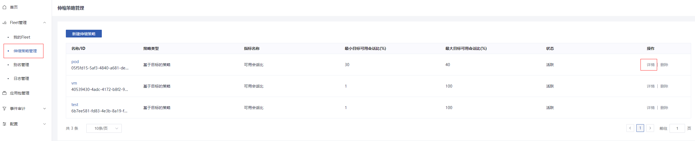

4.  在详情页中单击参数后的"修改"，输入修改后的内容，并单击"保存"完成修改。


## 7.3. 删除弹性伸缩策略

### 7.3.1. 操作场景

在您不再需要某个弹性伸缩策略时，可以删除该弹性伸缩策略。

### 7.3.2. 操作步骤

1.  登录GameFlexMatch管理控制台。

2.  选择"Fleet管理 \> 伸缩策略管理"。

3.  在弹性伸缩策略列表中，需删除的弹性伸缩策略所在行中，单击" 删除"。


4.  在弹出的对话框中单击"确认"完成删除。

# 8. 别名管理

## 8.1. 创建别名

### 8.1.1. 操作场景

可以为应用进程队列(fleet)创建别名(alias)，使用aliasId代替fleetId创建会话，以完成灰度发布的更新过程，并可以为不同的fleet配置不同的权重，加权分配不同的会话创建请求

### 8.1.2. 创建须知

需保证alias关联的fleet均为激活状态，每个fleet的权重为相对权重，取值范围\[0,100\]整数

### 8.1.3. 操作步骤

1.  登录GameFlexMatch管理控制台

2.  选择Fleet管理-\>别名管理-\>新建别名

3.  填写必要参数

| 参数          | 描述                                                         | 类型   |
| ------------- | ------------------------------------------------------------ | ------ |
| **別名名称**  | 别名名称(1~1024个字符)，以英文字母开头，并由英文字母、数字、下划线和中划线组成。 | string |
| **描述**      | 别名的描述(1~1024字符)                                       | string |
| **类型**      | 别名的类型(激活类型/停用类型)，激活类型的别名可以用于创建会话 | enum   |
| **消息**      | 别名消息，当使用停用类型的别名创建会话时，会返回该消息(1-1024字符) | string |
| **关联Fleet** | 选择alias所需要关联的fleet，以及设定该fleet的权重，最多关联10个 | array  |
| **Fleet ID**  | 关联的fleet的id，32位uuid                                    | string |
| **权重**      | 取值为0-100                                                  | int    |

4.  参数配置完成后，单击"创建"，即可完成创建

## 8.2. 修改别名

### 8.2.1. 操作场景

当需要对别名的名称、描述、类型、消息以及关联的fleet增删改操作的时，可对别名进行修改操作
当别名中关联的fleet状态改变不为激活状态，但需要将该别名类型修改为激活时，需要执行修改操作

### 8.2.2. 操作步骤

1.  登录GameFlexMatch控制台

2.  选择Fleet管理-\>别名管理，选择要修改的别名

3.  根据实际情况进行修改，修改关联fleet时，只支持修改权重

## 8.3. 查询别名

### 8.3.1. 操作场景

需要对别名进行筛选查询，现在支持通过别名名称、类型以及关联的fleet进行筛选

### 8.3.2. 操作步骤

1.  登录GameFlexMatch控制台

2.  选择Fleet管理-\>别名管理

3.  点击搜索框，出现按照fleet_id进行搜索、按照别名名称进行搜索、按照别名类型进行搜索，按照实际情况选择。

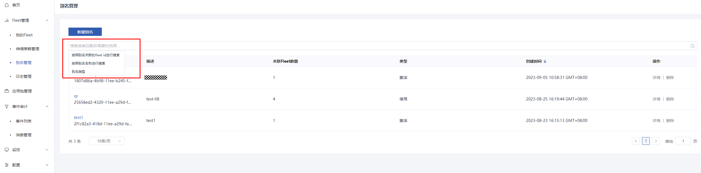

## 8.4. 删除别名

### 8.4.1. 操作场景

当某条别名不再使用时，需要进行删除操作

### 8.4.2. 操作步骤

1.  登录GameFlexMatch控制台

2.  选择Fleet管理-\>别名管理，选择要删除的别名，点击删除

3.  在弹出的确认对话框中，点击确定即可完成删除操作

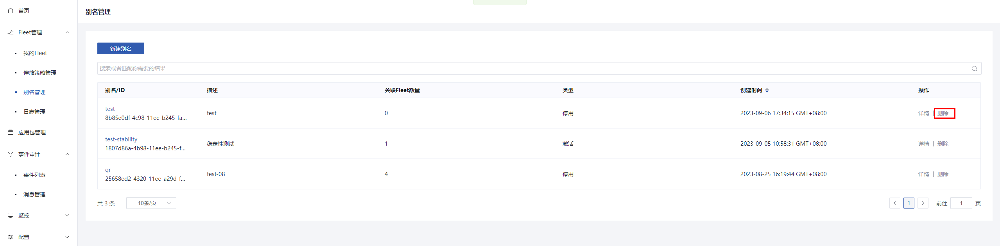

# 9. 日志管理

## 9.1. 创建日志接入

### 9.1.1. 操作场景

GameFlexMatch平台提供对应用进程队列中的实例接入日志自动化管理功能，您可以通过创建日志接入来记录和分析所有示例的日志内容。

### 9.1.2. 操作步骤

1.  登录GameFlexMatch管理控制台；

2.  选择"日志管理 \> 新建日志"；

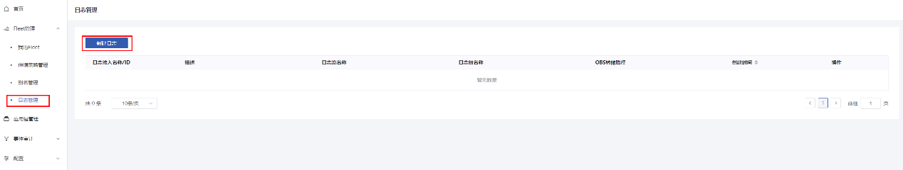

3.  填写日志接入参数，若无日志组，可点击"日志组名称"旁的"新建"；

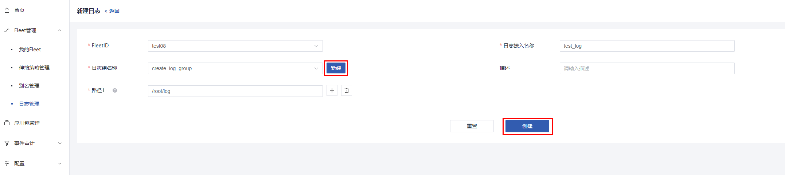

4.  新建日志接入参数详情如下：

| **参数**     | **解释**                                 | **取值样例**             |
| ------------ | ---------------------------------------- | ------------------------ |
| FleetId      | 创建日志接入所属的应用进程队列           | -                        |
| 日志接入名称 | 该日志接入的名称                         | -                        |
| 日志组名称   | 选择创建的日志接入的日志流所属的日志组   |                          |
| 路径         | 日志所在的路径或文件，支持多个接入路径， | /root/log或/root/log.txt |
| 描述         | 该日志接入的描述信息                     |                          |


创建日志组参数详情如下：

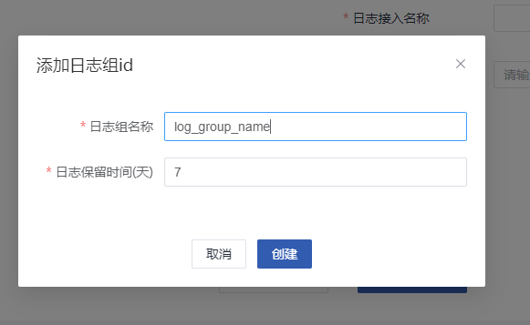

| **参数**           | **解释**                                      | **取值样例** |
| ------------------ | --------------------------------------------- | ------------ |
| 日志组名称         | 日志组的名称                                  | -            |
| 日志保留时间（天） | 日志在云日志服务平台中保留的时间，范围1~365天 | 7            |

5.  新建成功后会提示创建日志转储，选择"是"则跳转创建，选择"否"则跳过创建，进入日志接入详情页可以随时创建；


6.  注意，一个日志接入只能对应一个日志转储。

7.  创建日志接入后，需要10分钟左右才能在云日志服务中查看到详细日志信息

## 9.2. 创建日志转储

### 9.2.1. 操作场景

日志转储为在日志接入中暂存的日志进行永久转储到OBS桶内，配置完成后会按照参数进行自动转存。

### 9.2.2. 操作步骤

1.  登录GameFlexMatch管理控制台；

2.  选择"日志管理 \> 日志详情 \> 配置日志转储"；

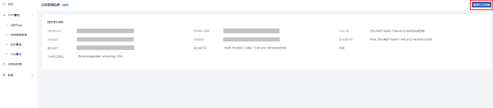

3.  填写创建日志转储的配置信息

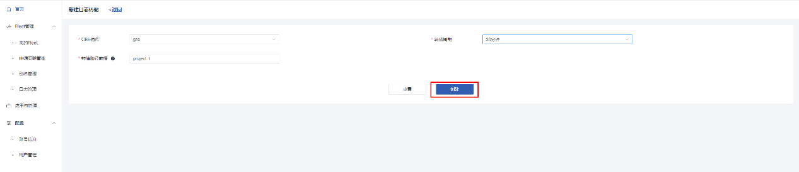

4.  配置参数信息如下：

| **参数**     | **解释**                                                     | **取值样例** |
| ------------ | ------------------------------------------------------------ | ------------ |
| OBS桶名      | 日志转储OBS桶的名称                                          | -            |
| 转储路径前缀 | 输入LTS-test，则日志转储路径为：OBS桶名/LogTanks/LTS-test/Y/M/D/ | -            |
| 转储周期     | 转储周期可选2分钟，5分钟，30分钟，1小时，3小时，6小时，12小时 | -            |

5.  创建成功后，列表页显示该日志接入的obs转储路径，未配置转储显示空，路径可链接到华为OBS云服务的桶对象列表页

## 9.3. 删除日志接入与转储

### 9.3.1. 操作背景

删除已配置的日志接入和日志转储。

### 9.3.2. 操作步骤

1.  删除日志接入（若已配置日志转储，则需要先删除日志转储），在日志接入的列表页，找到需要删除的日志接入项的删除按钮，点击即可删除

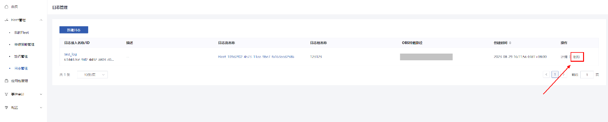

2.  删除日志转储，在日志接入的详情页面中，点击右上角"删除日志转储"即可删除。

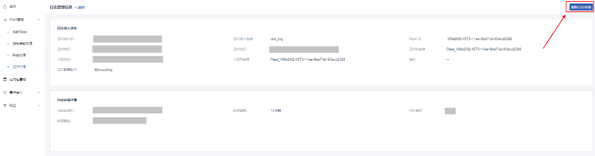

# 10. 事件审计

## 10.1. 查看事件列表

### 10.1.1. 操作场景

查看Game Flex
Match的事件，包括网络，实例，会话和应用包等类型，事件分级为正常，警告和事故三个等级，可以为事件等级配置通知。

### 10.1.2. 操作步骤

选择事件审计\>事件列表来查看事件，可以通过事件的资源类型，事件级别来进行筛选：

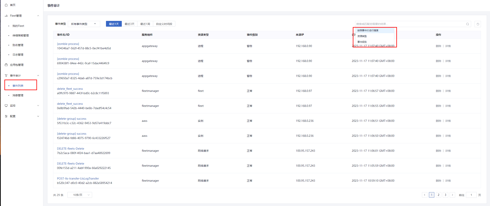

## 10.2. 消息管理

### 10.2.1. 操作场景

消息管理负责管理消息通知的订阅以及通过SMN服务发送消息通知给订阅者。

### 10.2.2. 操作步骤

1.  选择事件审计\>消息管理，先为事件添加主题，选择需要发送通知的事件等级：

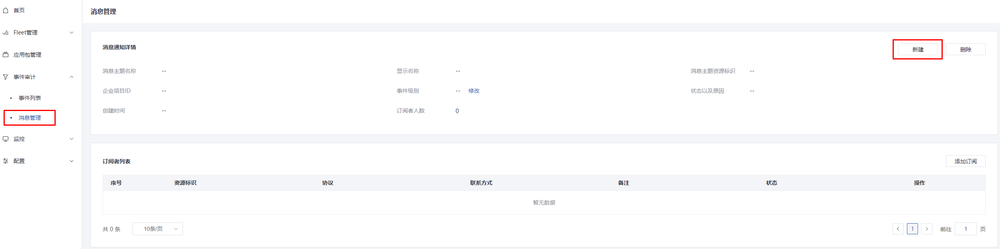

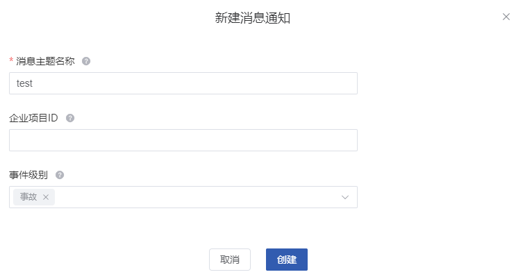{width="3.4232699037620296in"
height="1.852176290463692in"}

2.  创建主题后，添加订阅者，支持邮箱和短信两种通知方式。

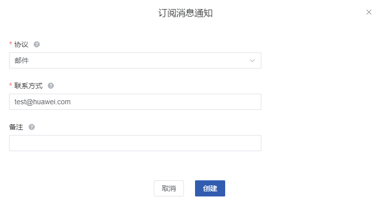

3.  创建成功后，SMN会发送确认订阅邮件，点击邮件中的链接即可确认该订阅信息。

4.  删除消息通知可点击"取消订阅"。

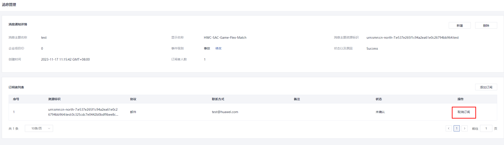

# 11. API调用

## 11.1. 接口认证

在调用所有的接口前，需要进行认证校验

1. 构造登录请求，其中密码为RSA加密后的密文，加密的公钥需与fleetmanager部署的后端私钥保持一致，加密脚本可使用下列命令进行加密：
    `./sac-gfm cipher --mode encode --method rsa --text {cipher-password}`

POST URL: /v1/user/login

Request Body:

```json
{
    "username": "admin",
    "password": "cipher-password"
}
```

Response Body:

```json
{
    "username": "admin",
    "id": "63da950a-b3ea-11ed-bb27-fa163**********",
    "Auth-Token": "eyJhbGciO*************eXrA",
    "Activation": 1,
    "UserType": 9,
    "total_res_count": 1
}
```

1. 将`Response`中的`Auth-Token`字段以及字段值加入到请求体header里，即可正常访问GameFlexMatch接口业务


# 12. 会话管理

## 12.1. 创建服务端会话

### 12.1.1. 操作场景

GameFlexMatch平台提供服务端会话分配的功能，在服务端应用就绪后，可向服务端程序创建服务端会话

### 12.1.2. 创建会话

创建会话需使用API调用Fleetmanager接口，以下示范通过接口调用工具postman演示

1. 登录Fleetmanager，获取Auth-Token

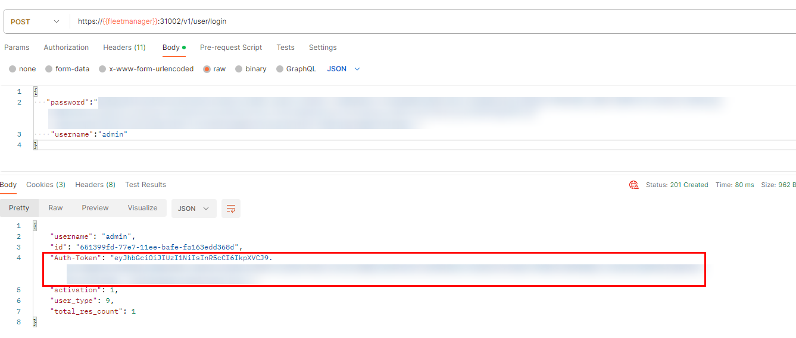

2. 选择一个fleet，使用该fleet_id创建一个server_session，在Header里粘贴Auth-Token，请求体中填写数据（详见[API文档](../api/FleetManager.yaml)-创建服务端会话）


创建会话成功

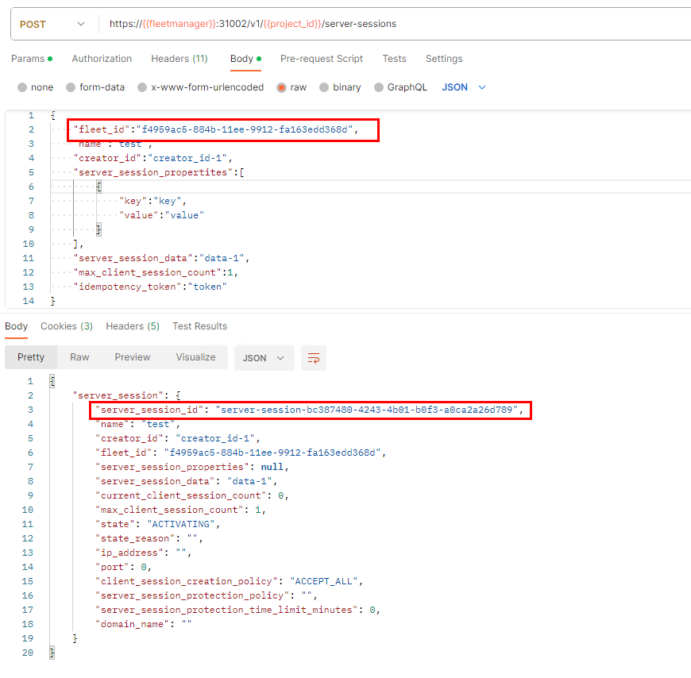

3. 创建成功后，获得server_session_id，调用API查询会话的激活状态


4. 当会话状态为ACTIVE，则说明当前会话状态已可用，响应体中返回该服务端会话所在ECS的IP地址，监听的端口；若创建fleet添加了域名，响应体中还会返回访问ECS的域名，域名格式为 **{随机字符串}.{主域名}**。

- 通过IP地址访问服务，格式为 **"{ip_address}:{port}"**

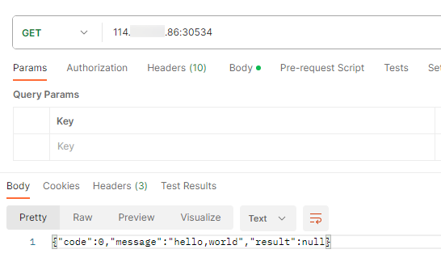

- 通过域名访问服务，该域名指向fleet中的一台ECS，格式为 **"{domain_name}:{port}"**


# 13. 常见问题FAQ

## 13.1. Fleet与应用包创建

1.  创建Fleet失败，如何排查原因？
    fleet创建的过程中涉及"同步账号信息"、"同步应用包资源"、"创建VPC"、"创建子网"、"创建安全组"、"创建弹性伸缩组"、"等待应用进程上报"等主要过程，创建失败时需要排查是哪一环节出现了问题：

-   **排查错误原因**:
    登录FleetManager所在机器，打开日志文件/home/fleetmanager/bin/log/run/run.log，搜索"creat_fleet"关键词，排查错误信息

-   **同步账号信息**：查看GameFlexMatch所涉及到的账号信息是否配置完全，详见快速入门

-   **同步应用包资源失败**：查看创建fleet所关联的应用包状态是否可用，若不可用，则切换成可用的应用包并重新创建

-   **创建VPC或子网失败**：创建Fleet支持绑定VPC与子网，若选择绑定VPC与子网，首先排查绑定的VPC与子网是否可用，若选择不绑定则默认新建，则需按照日志中返回的错误信息，排查原因

-   **创建安全组失败**：创建Fleet时默认创建一个安全组，同时支持绑定安全组，若创建安全组失败则需按照日志中返回的错误信息，排查原因

-   **创建弹性伸缩组失败**：后台aass组件执行创建弹性伸缩组的任务，若该步骤出现问题则需登录aass机器查看日志：/home/aass/bin/log/run/run.log，查看具体错误原因

-   **等待应用进程上报**：该问题主要是由于应用进程没有上报导致，原因主要分为对战服机器未成功创建(可登录华为云控制台查看)、对战服机器成功创建但应用未成功拉起(需登录对战服机器确认应用是否正确拉起)、应用正常拉起但未上报成功(可登陆对战服机器查看auxproxy日志:/etc/auxproxy/log/run.log，查看错误原因)

2.  创建应用包失败，如何排查原因?
    应用包创建过程涉及"创建ECS"、"拉取应用包"、"创建镜像"过程，需登录FleetManager日志查看具体报错原因后，进行排查


## 13.2. 查看会话错误原因  

会话创建失败分为多种情况：

1. error for timeout:

-   首先确定是否大量出现，若大量出现，则为对战服与appgateway的网络连接出现问题，首先排查对战服机器对应的安全组是否对appgateway地址开放60001端口，若未开放，可手动修改该安全组对appgateway开放端口与地址(对该fleet生效)，同时修改fleetmanager的/home/fleetmanager/configmap/service_config.json文件的internal_inbound_permissions，修改后对新fleet生效，该种情况一般在新部署时出现；若不为配置问题，则初步判断为网络问题，需联系华为云进行紧急规避。

> 若是偶尔出现，则需查看appgateway的日志/home/appgateway/log/run/run.log以及auxproxy的日志/etc/auxproxy/log/run.log,追溯会话生命流程，确认为GameFlexMatch问题还是游戏服务问题

2. 错误原因携带**Redis**或**MySQL**:
   mysql或redis规格较低，需要及时扩大规格

3. 错误原因携带**socket**或**file**:
   appgateway机器句柄数设置不合理，需修改配置

4. there is no available process in fleet :
   fleet中注册的进程不足，首先看是否大量出现：若大量出现则需要紧急规避：手动修改fleet的最小实例数，手动扩容机器，及时恢复业务后，回溯问题原因；若偶尔出现，则为弹性扩容速度未满足流量的上升速度，需调整弹性伸缩策略与fleet预留的最小实例数量

## 13.3. 版本迭代

-   如何快速安全的在业务高峰期进行版本迭代？ GameFlexMatch可基于别名管理进行快速的游戏不停服更新迭代，若在业务低峰期时进行迭代则可直接新建Fleet，将新fleet关联进别名，旧fleet从别名中移出去，等待旧版本fleet上会话全部结束后，即可回收资源，但业务高峰期进行版本迭代时，需要保证业务不受影响，有两种更新方式： 

### 13.3.1. 逐步引流： 

1.  新建一个与旧版本fleet配置相同的fleet，新版本fleet最小实例数保持与旧版本最小实例数一致

2.  将新版本fleet关联至旧版本fleet所在的别名，并按照当前的机器数量的比例设置权重比

3.  按照分流情况逐渐增加新版本fleet的权重，逐渐减少旧版本fleet的权重

4.  等待流量稳定后，将旧版本fleet直接从别名中取消关联

5.  等待旧版本fleet会话全部结束后，回收fleet资源，变更结束 

### 13.3.2. 全量引流： 

1. 新建一个与旧版本fleet配置相同的fleet，并将新版本fleet的最小实例数设置为当前旧版本fleet的实例数，开启弹性伸缩

2. 将新版本fleet关联进旧版本fleet所在的别名，将旧版本fleet从别名中取消关联

3. 等待旧版本fleet上会话全部结束后，将新版本fleet的最小实例数修改至旧版本fleet设置的最小实例数 +
   回收旧版本fleet的资源，变更结束 

> **推荐使用第二种变更方式**：可以在高峰期更加安全快速的完成版本的不停服更新

### 13.3.3. 其他问题

1. 对战服机器CPU或内存异常？

> 登录对战服机器，查看游戏进程数是否异常，若异常，则确认单个游戏进程是否占用较多CPU或内存资源，适当调整单台机器启动的进程数量

2. GameFlexMatch的资源监控出现异常？

> 首先确认当前业务流量信息，确认时候流量相比之前同期突增，若为突增，针对不同节点的异常，则及时对相应节点做扩容或升高规格操作；若流量正常，但cpu或内存依旧出现告警，则需排查控制台首页是否出现大量异常会话，若出现，按照会话创建失败类型错误处理
