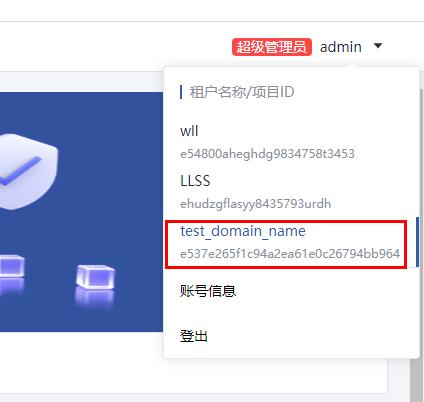

# 用户

## 简介
gamebounce的用户管理模式为使用gamebounce用户关联管理华为云租户的模式，一个gamebounce用户可以关联多个资源租户，并支持即时切换，详细的用户介绍见[doc/build/user-management.md](../../build/user-management.md)

## 操作
### 切换gamebounce用户关联的资源租户
+ 登录`gamebounce`控制台

+ 点击右上角切换至所关联的资源租户上